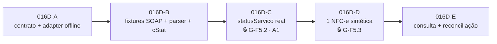

# FISCAL_GOAL_016D_SEFAZ_ADAPTER_PLAN — Plano do primeiro adapter SEFAZ-SP de homologação

| Campo | Valor |
|---|---|
| **GOAL** | `FISCAL-GOAL-016D-SEFAZ-ADAPTER-HOMOLOGACAO-PLAN-001` |
| **Tipo** | **Auditoria e planejamento.** Zero transporte, zero chamada SEFAZ, zero credencial, zero schema/migration |
| **Base** | `origin/main` = `0de82ab9318684ec59eed78728ce05df18a590b5` (merge do PR #33 — GOAL-016C) |
| **Branch / worktree** | `fiscal/goal-016d-sefaz-adapter-plan` · `C:\tmp\omni-gestao-fiscal-016d-sefaz-plan` |
| **Data da auditoria** | **2026-08-03** (toda consulta oficial desta página foi feita nesta data) |
| **Escopo do piloto** | Matriz RafaCell Assistec · Taguaí/SP · SEFAZ-SP · NFC-e modelo 65 · `HOMOLOGACAO` · `tpAmb=2` |
| **Decisões-mãe** | ADR-0015 (SEFAZ direta) · ADR-0016 (piloto SP) · ADR-0017 (estado incerto) · ADR-0018 (XML legal) · ADR-0014 (KMS) |
| **Estado** | 🟡 **PLANEJADO — NÃO INICIADO.** Nenhum slice implementado |

> **Regra deste documento.** Nenhuma afirmação regulatória por memória de modelo. Cada regra em §3
> tem **URL oficial + data de consulta**. Onde a fonte não pôde ser lida, está declarada como
> **pendência** — não preenchida por inferência, exemplo plausível ou fornecedor privado.

**Legenda:** 🟦 regra regulatória · 🟩 decisão de arquitetura · 🟨 procedimento de homologação ·
🟥 ação humana necessária · ⚠️ conflito/incerteza registrado

---

## 0. O que este GOAL é — e o que **não** é

| Faz | Não faz |
|---|---|
| Audita o código fiscal atual e mapeia a fronteira real | Não implementa transporte, SOAP, TLS ou adapter |
| Revalida parâmetros oficiais da SEFAZ-SP em fonte primária | Não chama nenhum Web Service da SEFAZ (nem `?wsdl`) |
| Define as decisões técnicas obrigatórias do adapter | Não usa certificado, CSC, senha ou credencial real |
| Consolida gates humanos e insumos pendentes | Não provisiona nada, não credencia, não gera CSC |
| Divide a execução futura em slices com critério de aceite | Não altera banco, `prisma/schema.prisma` ou migrations |
| Atualiza roadmap e plano mestre | Não liga `fiscalEnabled`, não abre produção, não emite |

**Diff deste GOAL: somente documentação.**

---

## 1. Pré-flight

```
git fetch origin --prune
git rev-parse origin/main   → 0de82ab9318684ec59eed78728ce05df18a590b5
git status --short           → limpo na worktree nova
```

A `main` **não avançou** desde o merge do PR #33 (GOAL-016C). O SHA base é o esperado pelo comando.

> ⚠️ **Nota operacional (não bloqueante).** A worktree primária `C:\Projetos\omni-gestao` tinha, no
> início desta sessão, modificações **não commitadas** em `docs/roadmaps/ROADMAP_FISCAL.md` e
> `docs/governance/MASTER_FISCAL_EXECUTION_PLAN.md` — os mesmos arquivos que este GOAL edita. Este
> GOAL trabalhou **exclusivamente** na worktree nova, a partir de `0de82ab`, e não leu nem herdou
> aquelas modificações. Se elas forem commitadas depois, haverá conflito de merge a resolver
> manualmente.

---

## 2. Auditoria do código atual (mapa real, `0de82ab`)

### 2.1 Contrato do provider — **existem DUAS superfícies, não uma**

Esta é a descoberta estruturante da auditoria. O repositório tem **dois** contratos de provider,
criados por GOALs diferentes, com semânticas diferentes:

| # | Contrato | Arquivo | Entrada | Papel real hoje |
|---|---|---|---|---|
| **P1** | `FiscalProvider` | [`lib/fiscal/provider/types.ts:211`](../../lib/fiscal/provider/types.ts) | **snapshot congelado** (`FiscalProviderRequest`) | Validação de configuração/snapshot, preparo, `statusServico`. Emissão **simulada** |
| **P2** | `UncertainStateFiscalProvider` | [`lib/fiscal/emission/uncertain-state.types.ts:108`](../../lib/fiscal/emission/uncertain-state.types.ts) | **bytes exatos** (`exactBytes` + `bytesSha256`) | Única superfície que o caminho seguro de transmissão realmente usa (ADR-0017) |

🟩 **Consequência de plano.** A ADR-0015 §2.2 pede que o contrato evolua para entregar ao transporte
um **envelope de XML assinado e validado**. Esse envelope **já existe** — é o **P2**, entregue pelo
GOAL-012. Portanto o `SefazDiretoProvider` **implementa P2 primeiro**, e **não** uma mutação de
`FiscalProvider.emitir`. `FiscalProvider` permanece como superfície de **configuração e status**.

**Lacunas de P2 contra o envelope da ADR-0015 §2.2:**

| Campo exigido pela ADR-0015 | Presente em `FiscalDocumentIdentity`? |
|---|---|
| `storeId`, `notaFiscalId`, `modelo`, `ambiente`, `chaveAcesso` | ✅ sim (`modelo`/`ambiente` são **tipos literais** `"NFCE"`/`"HOMOLOGACAO"` — fail-closed no compilador) |
| `xmlAssinadoValidado`, `hashDoXml` | ✅ sim, como `exactBytes` + `bytesSha256` no `transmit` |
| **`uf`** | ❌ **ausente** — o adapter precisa dela para resolver endpoint |
| **`idempotencyKey` / `correlationId`** | ❌ **ausente** — hoje só há `chaveAcesso` |

🟩 Fechar essas duas lacunas é escopo do slice **016D-A**, de forma **aditiva** (campos novos), sem
tocar schema.

### 2.2 Registry / resolver e `STUB_HOMOLOGACAO`

[`lib/fiscal/provider/resolver.ts:21`](../../lib/fiscal/provider/resolver.ts) — o `REGISTRY` tem
**uma única fábrica**:

```ts
const REGISTRY: Partial<Record<FiscalProviderTipo, () => FiscalProvider>> = {
  [FiscalProviderTipo.STUB_HOMOLOGACAO]: () => stubHomologacaoProvider,
}
```

`SEFAZ_DIRETO` **existe no enum** `FiscalProviderTipo` (`prisma/schema.prisma`) mas **não tem
fábrica** ⇒ `resolveFiscalProvider` devolve `provider_nao_implementado` (fail-closed honesto, sem
fallback). O resolver distingue corretamente "fora do enum" (`provider_desconhecido`) de "no enum sem
implementação" (`provider_nao_implementado`).

### 2.3 Entrada atual do provider

`FiscalProviderRequest = { contexto, snapshot }`. O `contexto` recebe `serie`/`numero` da alocação
atômica **antes** de `emitir` ([`emission-pipeline.ts:287-327`](../../lib/fiscal/emission/emission-pipeline.ts)).
O provider **nunca** relê `Produto`/`Venda` vivos.

### 2.4 Worker `FiscalEmissaoJob`

| Camada | Arquivo | Papel |
|---|---|---|
| Política pura | `lib/fiscal/queue/queue-worker.ts` | `drainFiscalQueue`, lease/heartbeat/backoff |
| Adapter Prisma | `lib/fiscal/queue/prisma-queue-worker.ts` | portas reais + `executeFiscalJob` |
| Executor seguro | `lib/fiscal/emission/uncertain-state-job-executor.ts` | roteia `EMISSAO`/`CONSULTA` para o coordenador ADR-0017 |
| Produtor | `lib/fiscal/queue/queue-producer.ts` | enfileira (sem caller produtivo de venda) |

Tipos de job: `EMISSAO · CANCELAMENTO · INUTILIZACAO · CONTINGENCIA_TRANSMISSAO · CONSULTA`.
Hoje o worker processa **somente `EMISSAO` e `CONSULTA`**.

### 2.5 Persistência pré-transmissão · `TRANSMITINDO` · estado incerto

[`uncertain-state-coordinator.ts`](../../lib/fiscal/emission/uncertain-state-coordinator.ts) +
[`prisma-uncertain-state-persistence.ts`](../../lib/fiscal/emission/prisma-uncertain-state-persistence.ts):

1. `persistBeforeTransmission` grava, em **uma transação**: `serie`, `numero`, `chaveAcesso`,
   `xmlAssinado` e `status = TRANSMITINDO`, e registra `bytesSha256` no **payload do job**.
2. `transmit` recebe **os bytes relidos do que foi persistido** — nunca bytes recém-gerados.
3. `UNCERTAIN` ⇒ nota **permanece** `TRANSMITINDO`, cria/reencontra job `CONSULTA`
   (`dedupeKey = fiscal:consulta:v1:nota:{id}`), **sem agendar retransmissão**.
4. Retomada com `status = TRANSMITINDO` e sem autorização de consulta ⇒ `CONSULTATION_REQUIRED`.
5. `reconcileUncertainDocument` é a **única** autoridade que resolve o incerto: `AUTHORIZED`,
   `REJECTED`, ou `NOT_FOUND` ⇒ `authorizeExactRetransmission` (autoriza **os mesmos bytes**).

⚠️ **Fragilidade registrada.** `xmlBytesSha256` **não é coluna** de `NotaFiscal` — vive em
`FiscalEmissaoJob.payload.document.bytesSha256`. A prova de byte-exatidão depende da sobrevivência do
payload do job. Isso **viabiliza** a restrição "zero schema" deste GOAL, mas é dependência a
declarar. Promover o hash a coluna é decisão futura, com ADR própria.

### 2.6 As cinco travas que impedem provider real — **e a rota que elas NÃO cobrem**

Defesa em profundidade já instalada **no caminho P2**. **Nenhum slice antes de 016D-D pode tocá-las.**

| # | Local | Trava | Protege |
|---|---|---|---|
| T1 | `uncertain-state.types.ts:109` | `readonly simulado: true` — **tipo literal**. Um provider real **não compila** contra a interface | **P2 apenas** |
| T2 | `uncertain-state-coordinator.ts:95` | `if (!provider.simulado)` ⇒ `blocked / REAL_PROVIDER_BLOCKED` | P2 |
| T3 | `uncertain-state-coordinator.ts:227` | `if (!provider.simulado)` ⇒ `throw` na consulta | P2 |
| T4 | `prisma-queue-worker.ts:303` | job só roda se `provider === "STUB_HOMOLOGACAO"` **e** `NFCE` **e** `HOMOLOGACAO` **e** `fiscalEnabled` | fila |
| T5 | `queue-worker.ts:206` · `prisma-queue-worker.ts:357` | `if (!execution.simulado)` ⇒ terminal `provider_real_bloqueado` | fila |

#### ⚠️ Achado da revisão independente — **a rota P1 direta não tem trava equivalente**

| Fato verificado | Evidência |
|---|---|
| `FiscalProvider.simulado` é `readonly simulado: **boolean**`, **não** o literal `true` | `lib/fiscal/provider/types.ts:214` |
| `emitirNotaFiscalVenda` é **exportada** e chamável **sem passar pela fila** | `lib/fiscal/emission/emission-service.ts:90` |
| Ela resolve o provider pelo **mesmo `REGISTRY` de P1** e chega a `provider.emitir` via `runEmissionPipeline` | `emission-service.ts:167` → `emission-pipeline.ts:340` |
| Esse caminho **não** tem T1 (tipo permissivo), **não** tem T2/T3 (vivem só no coordenador) e **não** tem T4/T5 (vivem só no laço da fila) | — |

🟩 **Leitura correta.** Um `SefazDiretoProvider implements FiscalProvider` com `simulado = false` e um
`emitir` real **compilaria** e transmitiria fora de toda a proteção da ADR-0017. Hoje isso é
**inofensivo** apenas porque o `REGISTRY` de P1 está vazio de providers reais — e o produtor grava
`payload.version = 2` (`queue-producer.ts:245`), desviando jobs novos para o executor seguro. **Nenhuma
dessas duas condições é uma trava de tipo.**

⛔ **Consequência normativa (ver D11).** Registrar `SEFAZ_DIRETO` no `REGISTRY` de P1 — passo que o
slice 016D-D previa — **é inseguro** enquanto o `emitir` de P1 desse provider não for **provadamente
inerte**. D11 fecha isso.

### 2.7 Consulta por chave de acesso

`UncertainStateFiscalProvider.consult({ document })` — recebe o documento com `chaveAcesso` (44
dígitos, validado por `/^\d{44}$/`). Resultados canônicos: `AUTHORIZED` · `NOT_FOUND` · `REJECTED`.
O `UncertainStateTestStub` devolve `cStat 217` no `NOT_FOUND` — coerente com a matriz oficial.

### 2.8 Storage de XML assinado e autorizado

- **Fonte primária obrigatória:** colunas `NotaFiscal.xmlAssinado` / `xmlAutorizado` (ADR-0018).
- **Espelho privado opcional:** `XmlStorageMirror` — hoje `active === false` (nada provisionado).
- **Imutabilidade:** `markAuthorized` levanta `AuthorizedDivergenceError` em três casos
  (`xml_autorizado_imutavel_diverge`, `protocolo_imutavel_diverge`, `metadados_autorizacao_divergem`)
  **antes** de qualquer escrita; reprocessar com os mesmos bytes converge sem escrever.

### 2.9 Resolução do certificado A1 — **elo faltante**

| Peça | Estado |
|---|---|
| `CertificadoDigital { blobRef, senhaRef, status, ativo, validoAte, fingerprint }` | ✅ existe (schema) |
| `ConfiguracaoFiscalLoja.certificadoAtivoId` | ✅ existe (schema) |
| Cofre `FiscalSecretVault` + `resolveFiscalSecretProvider` | ✅ existe — **EnvVault somente leitura** |
| Ponte cofre→assinatura `drySignNfceFromVault(params: DrySignParams)` — objeto único com `{ vault, storeId, blobRef, senhaRef, xml }` | ✅ existe |
| **Resolver `storeId → certificadoAtivoId → CertificadoDigital → {blobRef, senhaRef}` server-side** | ❌ **NÃO EXISTE** |

`certificadoAtivoId` só aparece hoje como campo **de leitura** em `fiscal-identity-service.ts` e nas
rotas de certificado. Nenhum código resolve o material do A1 a partir dele. Esse resolver é
**pré-requisito compartilhado** entre a assinatura (F4) e o mTLS do transporte (F5) — escopo do
slice **016D-A**.

### 2.10 Configuração fiscal por loja

`ConfiguracaoFiscalLoja` (único por `storeId`): `fiscalEnabled=false`, `ambiente=HOMOLOGACAO`,
`modeloFiscal=NFCE`, `provider=STUB_HOMOLOGACAO`, identidade completa, endereço estruturado com
`codigoMunicipioIbge`/`uf`, `crt`, `cscId` + `cscTokenRef` (**só referência**), `providerConfig`
(JSONB), `certificadoAtivoId`. **Nenhum `@default("loja-1")`.**

### 2.11 Catálogo atual de `cStat` e erros

- **Erros do provider:** `FiscalProviderErrorCode` — 11 códigos canônicos, todos **internos**
  (`config_ausente`, `snapshot_invalido`, `provider_nao_implementado`, …). **Nenhum é `cStat` da
  SEFAZ.**
- **`cStat` no código:** só literais do stub (`100`, `102`, `107`, `135`) e do stub de drill
  (`217`, `999`). **Não existe tabela/matriz de `cStat`** em `lib/fiscal/**`.
- **Persistência:** `NotaFiscal.cStat` e `xMotivo` são `String?` livres.

🟩 A matriz de `cStat` → desfecho canônico é **trabalho novo**, escopo do slice **016D-B**.

### 2.12 Artefatos oficiais presentes no repositório

| Artefato | Estado |
|---|---|
| Schemas XSD `PL_010e_v1.02` (`nfe_v4.00.xsd`, `leiauteNFe_v4.00.xsd`, `tiposBasico_v4.00.xsd`, `xmldsig-core-schema_v1.01.xsd`) | ✅ versionados em `lib/fiscal/xsd/schemas/` |
| Worker XSD containerizado + supply chain lock | ✅ `workers/fiscal-xsd/` |
| **WSDL de qualquer serviço NFC-e** | ❌ **ausente do repositório** |

### 2.13 Pontos ainda sem caller produtivo

Tax-engine · XML builder · chave de acesso · signer · EnvVault · provider stub · pipeline de emissão ·
numeração · fila (produtor e worker) · coordenador de estado incerto · storage reader. Banco fiscal
vazio; `fiscalEnabled = false` em todas as lojas; **zero transmissão SEFAZ**.
Os **guards** da state machine da venda são o único ponto com callers reais (seis rotas).

---

## 3. Revalidação oficial (fontes primárias, consultadas em 2026-08-03)

### 3.1 Endpoints NFC-e da SEFAZ-SP

🟦 **Fonte:** SEFAZ-SP — WebServices NFC-e ·
<https://portal.fazenda.sp.gov.br/servicos/nfce/Paginas/WebServices.aspx> · consultado **2026-08-03**

**Autorizador: a própria SEFAZ-SP.** Host da NFC-e (`nfce.fazenda.sp.gov.br`) é **distinto** do host
da NF-e (`nfe.fazenda.sp.gov.br`). **Versão publicada: 4.00 (NT2016.002).**

**Homologação (`tpAmb=2`) — a allow-list do piloto:**

| Serviço | URL |
|---|---|
| NFeAutorizacao4 | `https://homologacao.nfce.fazenda.sp.gov.br/ws/NFeAutorizacao4.asmx` |
| NFeRetAutorizacao4 | `https://homologacao.nfce.fazenda.sp.gov.br/ws/NFeRetAutorizacao4.asmx` |
| NFeConsultaProtocolo4 | `https://homologacao.nfce.fazenda.sp.gov.br/ws/NFeConsultaProtocolo4.asmx` |
| NFeStatusServico4 | `https://homologacao.nfce.fazenda.sp.gov.br/ws/NFeStatusServico4.asmx` |
| NFeInutilizacao4 | `https://homologacao.nfce.fazenda.sp.gov.br/ws/NFeInutilizacao4.asmx` |
| NFeRecepcaoEvento4 | `https://homologacao.nfce.fazenda.sp.gov.br/ws/NFeRecepcaoEvento4.asmx` |

**Produção (`tpAmb=1`) — registrada apenas para a allow-list NEGATIVA**, host `nfce.fazenda.sp.gov.br`
com os mesmos seis caminhos `/ws/*.asmx`. 🟩 **Existem no catálogo para serem NEGADOS** enquanto o
G-F12 não abrir.

**EPEC (contingência — fora do escopo do adapter):**
`https://homologacao.nfce.epec.fazenda.sp.gov.br/EPECws/RecepcaoEPEC.asm` (sem `x`) e
`.../EPECws/EPECStatusServico.asmx` (com `x`). ⚠️ A inconsistência `.asm`/`.asmx` **foi reconfirmada
hoje na página oficial** — permanece **H-6**, e é irrelevante para o 016D porque contingência está
fora de escopo.

**Confirmação:** os endpoints batem **exatamente** com o levantamento do GOAL-015
([`FISCAL_SEFAZ_DOSSIE_UF_001.md §1`](./FISCAL_SEFAZ_DOSSIE_UF_001.md)) — sem drift em 11 dias.

### 3.2 Padrão de comunicação — MOC 7.00

🟦 **Fonte:** Manual de Orientação do Contribuinte **7.00 — Visão Geral, novembro de 2020**, obtido
do portal oficial SVRS ·
<https://dfe-portal.svrs.rs.gov.br/NFE/DownloadArquivoEstatico/?sistema=NFE&tipoArquivo=1&nomeArquivo=moc7-visao-geral.pdf>
· índice em <https://dfe-portal.svrs.rs.gov.br/NFe/Documentos> · consultado **2026-08-03**

| Item | Regra oficial (verbatim quando citado) |
|---|---|
| Meio lógico | Web Services do Portal da Secretaria de Fazenda Estadual |
| **Protocolo** | *"TLS versão 1.2, com autenticação mútua através de certificados digitais."* ⇒ **mTLS é obrigatório** |
| **Troca de mensagens** | *"SOAP versão 1.2."*, Style/Encoding **Document/Literal**, modelo WS-I Basic Profile |
| **Parâmetro** | a mensagem XML viaja no parâmetro **`nfeDadosMsg`** |
| **SOAP Header no leiaute 4.00** | *"Na versão 4.0 do leiaute da NF-e foi eliminado o uso de variáveis no SOAP Header"*, com o exemplo rotulado *"Exemplo do SOAP Header que não será mais necessário"* (`nfeCabecMsg`/`versaoDados`/`cUF`) |
| **Namespace** | padrão `http://www.portalfiscal.inf.br/nfe/wsdl/<NomeDoWebService>` |
| **Compressão** | opcional, **a critério da empresa**: método `NfeAutorizacaoLoteZip`, **GZip** com resultado convertido para **Base64** |
| **Lote** | *"Conjunto de NF-e transmitidas (máximo de 50 NF-e)"* |
| **`indSinc`** | `0=Não` · `1=Empresa solicita processamento síncrono do Lote de NF-e (sem a geração de Recibo para consulta futura)`. Síncrono **só ocorre se** a empresa solicitar **e** houver **unicamente uma NF-e no lote** **e** a SEFAZ autorizadora implementar o processamento síncrono |
| **Espera antes de `RetAutorizacao`** | *"deve ser construído de forma a aguardar um tempo mínimo de 15 segundos entre o envio do Lote … e a consulta do resultado"*, evitando `105 Lote em Processamento` |
| **Loop de `StatusServico`** | *"devem aguardar um tempo mínimo de 3 minutos entre cada consulta"* |
| **SLA de processamento** | SEFAZ se compromete a processar lotes *"em até 3 minutos em no mínimo 95% do total do volume recebido no período de 24 horas"* |
| **Eventos do modelo 65** | Ajuste SINIEF 19/16, cl. 13ª: para a NFC-e modelo 65 *"somente o Cancelamento e o Evento Prévio de Emissão em Contingência"* |

🟩 A última linha **corrobora nacionalmente** a vedação da Carta de Correção já provada em SP pela
Portaria CAT 12/2015 art. 8º §1º (GOAL-015 §4). A vedação da CC-e para o modelo 65 tem, agora, base
**estadual e nacional**.

⚠️ **C-7 (novo) — SP publica MOC desatualizado.** A página de downloads da NFC-e da SEFAZ-SP
distribui `Manual_de_Orientacao_Contribuinte_v_6.pdf` — **MOC 6.0, setembro de 2015**, anterior ao
leiaute 4.00 e que ainda documenta o `nfeCabecMsg` como obrigatório. O MOC vigente é **7.00
(nov/2020)**. 🟩 **O nacional prevalece; não seguir o MOC 6.0 de SP para o padrão de comunicação.**
Mesmo padrão do conflito C-3 (manual de QR Code v4.1 × v6.0).

### 3.3 Pendências oficiais **declaradas** (não preenchidas por memória)

| # | Item | Por que não foi confirmado | Bloqueia o quê |
|---|---|---|---|
| **H-9** | **`SOAPAction` exato por serviço** | O MOC **não** define `SOAPAction` — ela vem do WSDL. Nenhum WSDL está no repositório e buscar `?wsdl` seria **chamar a SEFAZ**, vedado neste GOAL | Bloqueia **016D-B** (fixtures) e **016D-C**. Não bloqueia 016D-A |
| **H-10** | **WSDL oficial dos 6 serviços NFC-e 4.00 de SP** (binding, nome do método, envelope de resposta) | idem H-9 | idem H-9 |
| **H-11** | **SEFAZ-SP implementa `indSinc=1` para NFC-e?** | O MOC condiciona o síncrono a *"a SEFAZ Autorizadora implementar o processamento síncrono"*. Nenhuma página oficial de SP consultada afirma isso | Decide se o piloto usa 1 ou 2 chamadas. Resolve-se por **observação** em 016D-D |
| H-8 | Anexo completo de `cStat` do MOC vigente | herdada do GOAL-015; a matriz parcial cobre caminho feliz e reconciliação | Não bloqueia; limita 016D-B a rejeições genéricas |

> ⚠️ **Falha de acesso reproduzida.** As tentativas de ler PDFs oficiais em
> `www.nfe.fazenda.gov.br/portal/exibirArquivo.aspx?...` falharam hoje com **loop de
> redirecionamento** — exatamente o sintoma que o GOAL-015 registrou ao tentar o manual de QR Code
> (H-4). O portal **SVRS** (`dfe-portal.svrs.rs.gov.br`) é uma alternativa oficial que **funciona** e
> serviu de fonte para o MOC 7.00. 🟩 **Registrar SVRS como via oficial suplente** para GOALs futuros.

### 3.4 Matriz mínima de `cStat` (herdada do GOAL-015 §10, não reaberta)

Autorização `100` · cancelamento `101` · inutilização `102` · lote `103/104/105/106` ·
serviço `107/108/109` · denegação `110` · eventos `128/141` · **duplicidade `204`** ·
**não consta `217`** · **consumo indevido `656`** (limite de 20 consultas/hora, bloqueio do CNPJ por
1 hora ao exceder).

🟩 **O par (204, 217) é o coração da reconciliação** e já está implementado no GOAL-012:
`204` = "já existe, converge" · `217` = "não existe, pode retransmitir os mesmos bytes".

---

## 4. Decisões técnicas obrigatórias

### D1 · Entrada exata do `SefazDiretoProvider`

O adapter **só** aceita um documento **já persistido** em `TRANSMITINDO`, com XML **assinado e
validado** e hash conferido pelo coordenador:

```
transmit({ document: FiscalDocumentIdentity + uf + correlationId,
           exactBytes: Uint8Array,
           bytesSha256: string })
```

**Proibições absolutas dentro do adapter:** gerar ou alterar XML · assinar · calcular tributo ·
alocar numeração · calcular chave de acesso · ler `Produto`/`Venda` vivos · escrever no banco.
O adapter **traduz e transporta** — nada mais.

### D2 · Saída canônica

Cinco desfechos, mapeados nos tipos que já existem (ADR-0017):

| Desfecho | Tipo | Regra |
|---|---|---|
| **autorizado** | `AUTHORIZED` | exige `cStat=100` **e** protocolo **e** XML autorizado |
| **rejeitado** | `REJECTED` | rejeição **definitiva** por regra de validação; número consumido |
| **processamento** | `UNCERTAIN` code `PROCESSING` | `103/105` (lote recebido/em processamento) — **não** é falha |
| **timeout** | `UNCERTAIN` code `TIMEOUT` | rede/tempo excedido |
| **incerto** | `UNCERTAIN` code `CONNECTION_LOST`/`UNKNOWN` | resposta ilegível, HTTP inesperado, SOAP Fault não classificável |

🟩 **Regra de ouro:** na dúvida, **`UNCERTAIN`**. Só se classifica `REJECTED` com `cStat` de rejeição
lido e reconhecido na matriz. **Ausência de resposta nunca vira rejeição.**

### D3 · Allow-list

Catálogo **versionado, estático e imutável** em código, contendo **apenas** os seis hosts/caminhos de
**homologação** de §3.1. Regras:

- comparação por **host exato** (`homologacao.nfce.fazenda.sp.gov.br`), nunca por sufixo/regex;
- protocolo **fixo `https:`**;
- os endpoints de **produção** entram no catálogo **marcados como negados**, para que uma tentativa
  produza erro **explícito e auditado**, não um "endpoint desconhecido" genérico;
- URL **não** é construída por concatenação de entrada; é **selecionada** de um mapa fechado
  `(uf, ambiente, serviço, versão) → URL`;
- catálogo **sem `if` por UF** espalhado no domínio (ADR-0015 §2.3).

### D4 · Bloqueios **antes** da rede (fail-closed, ordem de avaliação)

| # | Condição de bloqueio | Código sugerido |
|---|---|---|
| 1 | `ambiente ≠ HOMOLOGACAO` | `ambiente_nao_permitido` |
| 2 | `tpAmb ≠ 2` (lido do **XML persistido**, não de config) | `tpamb_nao_permitido` |
| 3 | `modelo ≠ 65 / "NFCE"` | `modelo_nao_permitido` |
| 4 | `uf ≠ "SP"` | `uf_nao_permitida` |
| 5 | `storeId ≠` Store real da Matriz (resolvido do registro, **nunca literal**) | `loja_fora_do_piloto` |
| 6 | `ConfiguracaoFiscalLoja.provider ≠ SEFAZ_DIRETO` | `provider_divergente` |
| 7 | XML não assinado / sem `bytesSha256` / hash divergente | `bytes_nao_verificados` |
| 8 | XML não validado contra XSD oficial | `xsd_nao_validado` |
| 9 | endpoint fora da allow-list de homologação | `endpoint_nao_permitido` |
| 10 | certificado A1 ausente, inativo, expirado ou de outra loja | `certificado_indisponivel` |

🟩 **Cada bloqueio é testável offline.** Nenhum deles requer rede — é exatamente o que torna o slice
**016D-A** demonstrável sem SEFAZ. `tpAmb` lido do XML persistido (e não da configuração) fecha a
janela em que config e documento divergem.

### D5 · Transporte

| Aspecto | Decisão |
|---|---|
| Protocolo | HTTPS + **SOAP 1.2**, `Content-Type: application/soap+xml; charset=utf-8` |
| Envelope | `soap12:Envelope` **sem `soap12:Header`** — o leiaute 4.00 eliminou `nfeCabecMsg` (§3.2) |
| Corpo | `<nfeDadosMsg xmlns="http://www.portalfiscal.inf.br/nfe/wsdl/<Serviço>">` envolvendo o XML |
| `SOAPAction` | 🟥 **H-9** — extrair do WSDL oficial; **não inventar** |
| TLS | **TLS 1.2 no mínimo**, com **autenticação mútua** (certificado cliente A1) |
| Certificado cliente | resolvido do cofre **em memória**, contexto TLS **efêmero**, descartado após a chamada |
| Encoding | **UTF-8**; os `exactBytes` persistidos são transmitidos **sem re-serialização** |
| Compressão | **não usar** no piloto. GZip só existe no método `…LoteZip`; adotá-la troca o método e muda a superfície testada sem ganho para 1 NFC-e |
| Timeout | **connect ≤ 15 s**, **total ≤ 60 s**. Estouro ⇒ `UNCERTAIN/TIMEOUT`, **nunca** rejeição. ⚠️ Este `15 s` é **decisão de engenharia** e **não tem relação** com os `15 s` regulatórios de espera antes do `RetAutorizacao` (§3.2) — a coincidência de valor é acidental |
| Limite de resposta | corpo **≤ 2 MB**; excedeu ⇒ aborta e classifica `UNCERTAIN/UNKNOWN` |
| Redirecionamentos | **zero**. `maxRedirects = 0`; um 3xx é `UNCERTAIN`, não "siga o Location" |
| Modo | 🟩 **`indSinc=1` com lote de 1 NFC-e** como alvo — resposta e protocolo na mesma chamada, sem recibo. Condicionado a **H-11**; o fallback (`indSinc=0` + `NFeRetAutorizacao4` respeitando os **15 s mínimos**) fica desenhado mas **não implementado** no piloto |

### D6 · Segurança

1. **PFX e senha resolvidos somente no servidor**, pelo cofre, por referência (`blobRef`/`senhaRef`),
   escopados por `storeId`. Runtime **Node**, nunca Edge/browser.
2. **Zero segredo em log** — nem PFX, senha, CSC, `idCSC`, chave privada, PEM ou DEK. A disciplina do
   `FISCAL_SECURITY §4` (regras 1–6) vale integralmente para o transporte.
3. **Zero XML completo em erro.** Falhas carregam `chaveAcesso`, `bytesSha256`, `cStat`, `xMotivo` e
   códigos — **nunca** o corpo do documento nem o corpo bruto da resposta.
4. **Anti-SSRF:** host e protocolo **imutáveis** e vindos do catálogo fechado (D3); nenhuma URL
   derivada de entrada, config, banco ou resposta; redirecionamento proibido; sem proxy dinâmico.
5. **Sanitização de falhas de rede:** erro de socket/DNS/TLS vira mensagem **genérica** com código
   estável. Stack traces e mensagens do runtime **não** sobem para `FiscalLog`.
6. **Resposta nunca governa a state machine diretamente** — é normalizada primeiro (ADR-0015 §2.3).
7. **Isolamento por loja:** todo acesso a cofre, certificado, série e nota valida `storeId`. Nenhuma
   herança da Matriz para outra loja.

### D7 · Estado incerto

Reafirmação — o comportamento **já está implementado** (GOAL-012) e o adapter **não pode enfraquecê-lo**:

- **timeout ≠ rejeição**;
- **nenhuma retransmissão automática** após incerto;
- **consulta obrigatória** (`NFeConsultaProtocolo4` por chave) antes de qualquer novo envio;
- retransmissão **só** dos **mesmos bytes persistidos**, e só depois de `NOT_FOUND` (`cStat 217`);
- `204` (duplicidade) ⇒ **consultar e convergir**, jamais tratar como erro;
- `656` (consumo indevido) ⇒ **parar imediatamente** e alertar humano — retry agressivo bloqueia o
  CNPJ por 1 hora;
- respeitar os **15 s** mínimos antes de consultar o lote e os **3 min** entre consultas de status.

### D8 · Idempotência

Invariantes por tentativa: **mesma chave de acesso, mesma série, mesmo número, mesmos bytes, mesmo
hash**. **Nenhuma reconstrução de XML durante retry** — `transmitWithUncertainStateSafety` já relê
o persistido em vez de chamar o `preparer` na retomada. O `correlationId` (novo, D1) identifica a
**tentativa**; a `chaveAcesso` identifica o **documento**. Os dois nunca se confundem.

### D9 · Observabilidade

`FiscalLog` por tentativa, com **e somente com**:

| Campo | Exemplo |
|---|---|
| `duracaoMs` | `1843` |
| `endpointLogico` | `SP/HOMOLOGACAO/NFeAutorizacao4/4.00` — **rótulo lógico, nunca a URL** |
| `cStat` / `xMotivo` | `100` / `Autorizado o uso da NF-e` |
| `tentativa` | `1` |
| `timeout` | `false` |
| `consultaRealizada` | `false` |
| `bytesSha256` · `chaveAcesso` · `correlationId` | identificadores |
| `httpStatus` · `classificacao` | `200` · `AUTHORIZED` |

**Proibido no log:** segredo, PFX, senha, CSC, XML integral (enviado ou recebido), corpo SOAP bruto,
cabeçalhos de resposta, URL literal.

### D10 · Integração

O primeiro adapter **não** ativa venda, PDV nem `fiscalEnabled`:

- nenhum caller no fluxo de venda; nenhuma alteração em `finalizeSaleTransaction`;
- `fiscalEnabled` permanece `false` — ligar é **G-F7**, GOAL separado;
- o produtor da fila **não** passa a enfileirar automaticamente;
- em 016D-D, a única forma de disparar é um **acionamento administrativo explícito**, server-side,
  autenticado, para **uma** nota sintética da loja-piloto;
- as travas T1–T5 (§2.6) só são afrouxadas em 016D-D, **narrowly**, e nunca para o caminho de venda.

### D11 · Superfície dupla do `SefazDiretoProvider` e inércia obrigatória do `emitir` de P1

Decisão criada pela revisão independente, fechando o achado de §2.6.

`SefazDiretoProvider` implementa **as duas** interfaces, com papéis **estritamente separados**:

| Interface | Métodos implementados | Comportamento |
|---|---|---|
| **P2** `UncertainStateFiscalProvider` | `transmit` · `consult` | **Único** caminho que fala com a SEFAZ. Recebe bytes exatos, sempre sob o coordenador ADR-0017 |
| **P1** `FiscalProvider` | `validarConfiguracao` · `statusServico` | Configuração e disponibilidade. `statusServico` **só existe em P1** — é o que viabiliza o slice 016D-C |
| **P1** `FiscalProvider` | `emitir` · `consultar` · `cancelar` · `inutilizar` · `prepararEmissao` · `validarSnapshot` | ⛔ **INERTES.** Devolvem `resultado: "erro"` com código `operacao_nao_suportada`, **sem abrir socket** |

**Regras inegociáveis:**

1. O `emitir` de P1 **nunca** transmite. É um stub fail-closed cuja única função é satisfazer a
   interface — a emissão real entra **exclusivamente** por `transmit` (P2).
2. `SEFAZ_DIRETO` só entra no `REGISTRY` de P1 **depois** de existir teste provando que
   `emitir`/`cancelar`/`inutilizar` são inertes e **não importam** o cliente HTTP.
3. `simulado` de P1 permanece **`true`** neste provider — porque, na superfície P1, ele de fato não
   emite. Isso mantém T5 (`!execution.simulado`) coerente e evita que a rota
   `emitirNotaFiscalVenda` seja reclassificada como transmissão real.
4. 🟩 **Endurecimento sugerido (não obrigatório neste GOAL):** estreitar
   `FiscalProvider.simulado` de `boolean` para o literal `true` daria a P1 a mesma barreira de
   compilador que P2 já tem. É **mudança de contrato** e exige GOAL próprio — registrado como
   follow-up, não executado aqui.

### D12 · `cStat 656` (consumo indevido) — parada dura, **sem** agendar consulta

Decisão criada pela revisão independente. O comportamento exigido por D7/R5 (**"parar
imediatamente"**) **não é alcançável com o contrato atual**:

| Fato verificado | Evidência |
|---|---|
| O desfecho `UNCERTAIN` só admite `code: "TIMEOUT" \| "CONNECTION_LOST" \| "UNKNOWN"` | `uncertain-state.types.ts:43-46` |
| **Todo** `UNCERTAIN` cai em `recordUncertainAndEnsureConsultation`, que **cria/reativa um job `CONSULTA`** | `uncertain-state-coordinator.ts:197-210` |

⛔ Classificar `656` como `UNCERTAIN/UNKNOWN` — única opção hoje — **agenda mais uma consulta**,
exatamente contra o limite de 20 consultas/hora que o `656` sinaliza ter sido excedido, com risco de
**bloqueio do CNPJ por 1 hora**. É o oposto do comportamento exigido.

**Decisão:**

1. Ampliar o union de forma **aditiva** com um código `"THROTTLED"`.
2. Adicionar no coordenador um ramo que, para `THROTTLED`, **mantém a nota em `TRANSMITINDO`**,
   registra `FiscalLog` de nível `ERROR` e **NÃO** cria job `CONSULTA`.
3. A retomada passa a exigir **ação humana** — `656` não se resolve sozinho por backoff.
4. 🟩 **Dono:** slice **016D-B** (define tipo + ramo + testes). O slice **016D-E** apenas **prova**
   contra a SEFAZ. Sem D12 implementado, **016D-E não pode iniciar**.
5. Alteração é **aditiva** em tipos TypeScript — **sem schema, sem migration**.

### D13 · Divergência formal contra a ADR-0015 §2.2 — **pré-requisito documental de 016D-A**

A ADR-0015 §2.2 diz, **nomeando o método de P1**: *"a implementação futura deverá ajustar o contrato
atual […] para que **`emitir`** receba, no mínimo, um envelope equivalente a: storeId, notaFiscalId,
modelo, ambiente, uf, chaveAcesso, xmlAssinadoValidado, hashDoXml, idempotencyKey/correlationId"*.

Este plano decide o **oposto**: o envelope é entregue por `transmit` (**P2**), e o `emitir` de P1
fica **inerte** (D11). A **intenção** da ADR é preservada — envelope imutável, assinado, validado,
com hash e correlação — mas o **método nomeado** muda.

🟩 **Regra do projeto:** ADR aceita **não se reescreve** (mesma disciplina da ratificação da ADR-0015
em 2026-07-23, feita *"sem ADR nova e sem alteração do histórico"*). Portanto:

- ⛔ **este GOAL não altera a ADR-0015**;
- 🟥 **antes de 016D-A ser codificado**, é obrigatório abrir uma **ADR própria** (próximo número
  livre) registrando: envelope entregue por `UncertainStateFiscalProvider.transmit`; `emitir` de P1
  inerte; campos `uf` e `correlationId` adicionados de forma aditiva a `FiscalDocumentIdentity`;
- ⚠️ [`NFCE_ARCHITECTURE.md §3.1`](../architecture/NFCE_ARCHITECTURE.md) — doc vivo que rege
  `lib/fiscal/provider/*` — ainda descreve a evolução em termos do `FiscalProviderRequest`/snapshot
  e **não foi tocado por este GOAL** (fora do escopo declarado em §0). **Follow-up registrado**,
  a ser feito junto com a ADR acima.

---

## 5. Gates humanos e insumos

### 5.1 Estado real consolidado

| # | Insumo | Estado em 2026-08-03 | Fonte |
|---|---|---|---|
| **H-1** | **CNPJ** da loja-piloto | 🟥 **PENDENTE** — não consta em nenhum documento | GOAL-015 §12 |
| **H-2** | **CRT / regime tributário** | 🟥 **PENDENTE** — o motor suporta CSOSN 102/500, mas o CRT do piloto não está registrado | GOAL-015 §12 |
| **H-3** | **Credenciamento + CSC de homologação** (+ `idCSC`) | 🟥 **PENDENTE** — ação humana no portal SEFAZ-SP | GOAL-015 §12.1 |
| **H-4** | Manual de QR Code v6.0 (parâmetros do QR v3) | 🟥 pendente | GOAL-015 §2.2 |
| **H-5** | Método atual de emissão da RafaCell | 🟥 pendente (declaração direta) | GOAL-015 §5.2 |
| **H-9** | `SOAPAction` por serviço | 🟥 **NOVO** — §3.3 | este GOAL |
| **H-10** | WSDL oficial dos 6 serviços NFC-e 4.00 de SP | 🟥 **NOVO** — §3.3 | este GOAL |
| **H-11** | SEFAZ-SP implementa `indSinc=1` para NFC-e? | 🟥 **NOVO** — §3.3 | este GOAL |
| — | **Certificado A1 de homologação** | 🟥 **PENDENTE** — nenhum `.pfx` provisionado | GOAL-016C |
| — | **Senha do A1** | 🟥 **PENDENTE** | GOAL-016C |
| — | **IE** da loja-piloto | 🟥 **PENDENTE** | ADR-0016 |
| — | **Série fiscal** para `(storeId, 65, HOMOLOGACAO)` | 🟥 **PENDENTE** — nenhuma `SerieFiscal` criada | auditoria §2.13 |
| — | **`Store.id` real da Matriz** | 🟥 **PENDENTE** — jamais literal em doc/código/fixture | ADR-0016 |
| — | **Ambiente seguro de provisionamento** | 🟡 **PARCIAL** — EnvVault é **somente leitura**; escrita/rotação automáticas respondem 503 fail-closed. Provisionamento é **manual** por env de plataforma | GOAL-016C |

> ⛔ **Nenhum destes valores entra em documento, log, fixture ou variável versionada.** Ausente
> permanece ausente até declaração humana.

### 5.2 O que cada insumo bloqueia

| Etapa | Bloqueada por | Comentário |
|---|---|---|
| **Implementação offline** (016D-A, 016D-B) | **NADA** 🟢 | Contrato, guards, catálogo, parser e matriz de `cStat` são construíveis e testáveis **hoje**, com fixtures sintéticas. H-9/H-10 limitam apenas a **fidelidade** das fixtures SOAP |
| **`statusServico` em homologação** (016D-C) | **A1 + senha** · **H-9/H-10** | `NFeStatusServico4` **não** exige CSC nem credenciamento — só mTLS. É o **primeiro contato real possível** e o menor risco existente |
| **Transmitir uma NFC-e de homologação** (016D-D) | **H-1 · H-2 · H-3 · IE · série · `Store.id` · A1 + senha** | Todos obrigatórios. Sem credenciamento (H-3) não há teste real |
| **Obter `cStat 100`** (016D-D) | tudo acima **+ H-11** + XML válido no que **o ambiente de SP aceita** | ⚠️ SP declarou (23/10/2025) ambiente de teste em NT2025.002 **v1.30** enquanto a NT nacional está em **v1.50** — divergência é **esperada**, não bug (GOAL-015 §6.2) |

🟩 **Leitura estratégica.** Dois slices inteiros (016D-A e 016D-B) — o grosso do trabalho de
engenharia — **não dependem de nenhum insumo humano**. O caminho crítico humano é **H-3
(credenciamento) + A1**, e ele só morde a partir de 016D-C.

---

## 6. Plano de execução — slices

A divisão proposta pelo comando foi **mantida**, com um ajuste justificado: **016D-C move-se para
depois de 016D-B** e ganha o papel de **primeiro contato real**, porque `NFeStatusServico4` é o único
serviço que **não** depende de credenciamento nem de CSC — depende só do A1. Isso separa "provar o
transporte" de "provar o documento", que é a fronteira de risco correta.



---

### 016D-A — Contrato e adapter de transporte **offline**

| | |
|---|---|
| **Objetivo** | Criar `SefazDiretoProvider` que **não abre socket**: guards D4, catálogo D3, resolver de endpoint, resolver de certificado A1 e montagem do envelope SOAP — com o transporte **injetado** e, por padrão, um transporte que **recusa** qualquer chamada |
| **Arquivos prováveis** | `lib/fiscal/provider/sefaz/sefaz-endpoint-catalog.ts` · `sefaz-endpoint-resolver.ts` · `sefaz-envelope.ts` · `sefaz-direto-provider.ts` · `sefaz-transport.types.ts` · `lib/fiscal/certificate/resolve-active-certificate.ts` · extensão **aditiva** de `uncertain-state.types.ts` (`uf`, `correlationId`) |
| **Dependências** | Nenhuma humana. Zero rede. 🟥 **Bloqueante documental: a ADR exigida por D13** deve existir **antes** da primeira linha de código |
| **Testes** | Cada guard D4 (10 casos negativos) · allow-list rejeita produção, host parecido, `http:`, host de NF-e (`nfe.` em vez de `nfce.`) · envelope **sem** `soap12:Header` · namespace correto por serviço · resolver de certificado é fail-closed (ausente/inativo/expirado/outra loja) · transporte default **sempre** recusa · **`emitir`/`cancelar`/`inutilizar` de P1 são inertes (D11) e não importam cliente HTTP** |
| **Gate humano** | ❌ nenhum (a ADR do D13 é pré-requisito documental, não gate de execução) |
| **Risco** | 🟢 **baixo** — código novo, dormente, sem caller |
| **Critério de aceite** | `tsc` limpo · testes verdes · **zero** import de cliente HTTP no caminho default · travas T1–T5 **intactas** · `REGISTRY` **não** ganha `SEFAZ_DIRETO` ainda · inércia de P1 **provada por teste** |
| **Ponto de parada** | Adapter existe, é testável e **não consegue** falar com ninguém |

---

### 016D-B — Fixtures SOAP, parser e matriz de `cStat`

| | |
|---|---|
| **Objetivo** | Parser estrito de resposta SOAP → desfecho canônico (D2), com matriz de `cStat` versionada e fixtures cobrindo caminho feliz, rejeição, lote, indisponibilidade, denegação, duplicidade, não-consta e consumo indevido. **Inclui a implementação de D12** (`THROTTLED`) |
| **Arquivos prováveis** | `lib/fiscal/provider/sefaz/sefaz-cstat-matrix.ts` · `sefaz-response-parser.ts` · `__fixtures__/sefaz-soap-fixtures.ts` · **`lib/fiscal/emission/uncertain-state.types.ts`** (union `THROTTLED`, aditivo) · **`uncertain-state-coordinator.ts`** (ramo que não agenda `CONSULTA`) |
| **Dependências** | 🟥 **H-9 / H-10** para fidelidade do envelope de resposta e do `SOAPAction`. **Não bloqueia** começar: a matriz de `cStat` e a classificação são independentes do wire |
| **Testes** | `100`→AUTHORIZED (exige protocolo **e** XML) · `103/105`→UNCERTAIN/PROCESSING · `110`→REJECTED terminal · `204`→**consultar e convergir** · `217`→NOT_FOUND · **`656`→`THROTTLED`, e teste provando que NENHUM job `CONSULTA` é criado** · `108/109`→indisponível · **`cStat` desconhecido → `UNCERTAIN`, nunca REJECTED** · SOAP Fault → UNCERTAIN · XML malformado → UNCERTAIN · resposta sem `cStat` → UNCERTAIN |
| **Gate humano** | ❌ nenhum (H-9/H-10 são leitura documental, não decisão) |
| **Risco** | 🟡 **médio** — classificar errado um `cStat` é o defeito mais caro da frente. Mitigação: **default é UNCERTAIN** |
| **Critério de aceite** | Todo `cStat` fora da matriz cai em `UNCERTAIN` **por teste** · **D12 implementado e provado** · nenhuma fixture contém CNPJ, IE, CSC ou chave reais · parser nunca devolve XML no erro |
| **Ponto de parada** | Parser e matriz completos, exercitados **só** por fixtures |

---

### 016D-C — `statusServico` em homologação `[🔒 primeiro contato real]`

| | |
|---|---|
| **Objetivo** | Implementar o transporte HTTPS/mTLS real e provar **uma** chamada a `NFeStatusServico4` de homologação, esperando `cStat 107`. Usa `statusServico` — método que só existe em **P1** (D11) |
| **Arquivos prováveis** | `lib/fiscal/provider/sefaz/sefaz-soap-transport.ts` · acionamento administrativo server-side dedicado |
| **Dependências** | 🟥 **A1 de homologação + senha no cofre** · **H-9/H-10** · `Store.id` real. **Não** exige CNPJ, IE, CSC, série nem credenciamento |
| **Testes** | mTLS negociado · **timeout ⇒ UNCERTAIN**, nunca rejeição · resposta > 2 MB aborta · 3xx **não** é seguido · nenhum segredo no log (varredura automatizada) · guard de ambiente barra produção **antes** do socket |
| **Gate humano** | 🔒 **G-F5.2 (novo)** — *"primeira chamada externa"*. Autorização explícita para o **primeiro pacote de rede da história do projeto**. Também é o momento de honrar o **limite de 3 min entre consultas de status** |
| **Risco** | 🟡 **médio** — é rede real. Mas `statusServico` **não cria documento, não consome numeração e não tem efeito fiscal**. É o menor risco possível |
| **Critério de aceite** | `cStat 107` observado **ou** falha classificada corretamente · zero segredo em log · `fiscalEnabled` ainda `false` · nenhuma `NotaFiscal` criada ou alterada |
| **Ponto de parada** | Transporte provado. **Nenhum documento transmitido** |

---

### 016D-D — Autorização controlada de **uma** NFC-e sintética `[🔒 GATE FORTE]`

| | |
|---|---|
| **Objetivo** | Transmitir **um** documento de homologação pela esteira completa e persistir o desfecho. Alvo: `cStat 100` |
| **Arquivos prováveis** | afrouxamento **narrow** das travas T1–T5 (**apenas as de P2**) · registro de `SEFAZ_DIRETO` no `REGISTRY` de P1 — **permitido só porque D11 provou o `emitir` inerte** · acionamento administrativo de nota única |
| **Dependências** | 🟥 **TODAS**: H-1, H-2, H-3 (credenciamento + CSC), IE, CRT, série ativa, `Store.id`, A1 + senha, H-11. **+ D12 implementado** |
| **Testes** | Byte-exatidão preservada (o transmitido **é** o persistido) · timeout ⇒ `TRANSMITINDO` + job `CONSULTA`, **sem** retransmitir · rejeição ⇒ número consumido, `requiresInutilizacao` · `markAuthorized` imutável · **`emitirNotaFiscalVenda` continua sem transmitir** (regressão da rota P1) · **zero** efeito sobre venda/PDV/caixa |
| **Gate humano** | 🔒 **G-F5.3 (novo)** — *"primeira transmissão de documento"*. Distinto do G-F5 (decisão de provider), do G-F5.2 (primeira chamada externa) e do G-F7 (ligar a emissão) |
| **Risco** | 🔴 **alto** — cria documento em ambiente externo e consome numeração. Mitigações: um documento por vez, disparo manual, ambiente sem validade jurídica, kill-switch `provider → STUB` |
| **Critério de aceite** | `cStat 100` com protocolo e XML autorizado **imutáveis** persistidos, **ou** rejeição corretamente classificada e persistida. `fiscalEnabled` permanece `false`. Nenhuma venda real tocada |
| **Ponto de parada** | **Um** documento autorizado em homologação. **Não** ligar a fila; **não** ligar o PDV |

> ⚠️ Regra do destinatário em homologação: com `tpAmb=2` a razão social do destinatário deve ser
> exatamente `NF-E EMITIDA EM AMBIENTE DE HOMOLOGACAO - SEM VALOR FISCAL`. Em NFC-e o destinatário é
> frequentemente **ausente** — a interação entre as duas regras é **H-7** e é candidata a rejeição na
> primeira tentativa. **Rejeitar por H-7 é resultado esperado, não falha do slice.**

---

### 016D-E — Consulta e reconciliação de estado incerto

| | |
|---|---|
| **Objetivo** | Implementar `consult` real (`NFeConsultaProtocolo4`) e provar o ciclo incerto → consulta → desfecho contra a SEFAZ de homologação |
| **Arquivos prováveis** | `sefaz-direto-provider.ts` (`consult`) · parser de `retConsSitNFe` |
| **Dependências** | 016D-D concluído (é preciso ter um documento para consultar) · **D12 obrigatório — sem ele, 016D-E não pode iniciar** |
| **Testes** | `AUTHORIZED` por consulta ⇒ converge sem duplicar · `217` ⇒ retransmissão dos **mesmos bytes** autorizada · `204` na retransmissão ⇒ converge · **rate limit próprio** respeitando 20 consultas/hora e o mínimo de 3 min · `656` ⇒ `THROTTLED`, parada dura, **sem** novo job `CONSULTA` |
| **Gate humano** | 🟡 leve — reusa a autorização de G-F5.3 |
| **Risco** | 🟡 **médio** — o risco real é o **`656` por excesso de consulta**, que bloqueia o CNPJ por 1 hora |
| **Critério de aceite** | Ciclo incerto→consulta→desfecho observado ponta a ponta · nenhuma retransmissão sem consulta prévia · rate limit provado por teste |
| **Ponto de parada** | Reconciliação real provada. **F5 fechável.** F6–F12 seguem fechadas |

---

## 7. Riscos e mitigações

| # | Risco | Prob. | Impacto | Mitigação |
|---|---|---|---|---|
| R1 | **Transmissão acidental** durante slices offline | Baixa | Alto | Travas T1–T5 intactas até 016D-D · transporte default recusa · `REGISTRY` sem `SEFAZ_DIRETO` até 016D-D |
| **R1b** | **Transmissão pela rota P1 direta** (`emitirNotaFiscalVenda`), que não tem T1–T5 | Baixa | **Crítico** | **D11**: `emitir` de P1 **inerte** e provado por teste antes de qualquer registro no `REGISTRY` · `simulado` de P1 permanece `true` · teste de regressão em 016D-D |
| R2 | **Envio a produção** | Muito baixa | Crítico | Allow-list por host exato · produção **explicitamente negada** · `tpAmb` lido do XML · 10 guards antes do socket |
| R3 | **Timeout tratado como rejeição** ⇒ documento duplicado | Média | Crítico | D2/D7 · default `UNCERTAIN` · consulta obrigatória · bytes exatos · já implementado no GOAL-012 |
| R4 | **`cStat` desconhecido classificado como rejeição** | Média | Alto | Matriz com **default `UNCERTAIN`**, provado por teste (016D-B) |
| R5 | **Bloqueio do CNPJ por `656`** | Média | Alto | **D12** (`THROTTLED` que **não** agenda consulta) · rate limit próprio · 15 s antes do `RetAutorizacao` · 3 min entre `statusServico`. ⚠️ Sem D12 o contrato atual **agrava** o problema |
| R6 | **Segredo em log** | Baixa | Crítico | D6 · varredura automatizada nos testes · reuso de `secret-scan.ts` |
| R7 | **SSRF / redirecionamento** | Baixa | Alto | Catálogo fechado · `maxRedirects=0` · protocolo fixo · sem URL derivada de entrada |
| R8 | **Divergência de leiaute** (SP em NT2025.002 v1.30 × nacional v1.50) | **Alta** | Médio | Validar contra o que **SP aceita** · divergência é esperada · é o gatilho **T1** da ADR-0015 |
| R9 | **Fixtures SOAP inventadas** por falta de WSDL (H-9/H-10) | Média | Médio | Fixtures marcadas como **não-autoritativas** até o WSDL chegar · nenhum `SOAPAction` chutado |
| R10 | **Perda do `bytesSha256`** por payload de job (§2.5) | Baixa | Alto | Registrada como dependência · promover a coluna exige ADR e schema (fora deste GOAL) |
| R11 | Confundir host NFC-e com host NF-e | Média | Médio | Teste explícito em 016D-A rejeitando `nfe.fazenda.sp.gov.br` |

---

## 8. O que este plano **não** decide

- **QR Code / `idCSC` / CSC no documento** — depende de **H-4** (manual v6.0). GOAL de DANFCE/QR.
- **DANFCE** — fase F8, sobre o XML autorizado.
- **Contingência / EPEC** — GOAL-015 §7 decidiu: **fora** do primeiro adapter. Sem fallback automático.
- **Cancelamento (30 min) e inutilização (dia 10)** — eventos, fase F9.
- **Ativação por fila / `fiscalEnabled`** — G-F7, GOAL separado.
- **Produção / `tpAmb=1`** — G-F12.
- **Provider gravável do cofre** — os 6 pré-requisitos duros do GOAL-016C continuam valendo integralmente.
- **`"SEM GTIN"` em `cEAN`/`cEANTrib`** — lacuna real (GOAL-015 §9), pertence ao builder de XML, não ao adapter.

### 8.1 Follow-ups obrigatórios **antes** de 016D-A ser codificado

| # | Follow-up | Origem |
|---|---|---|
| **FU-1** | **ADR própria** registrando o envelope entregue por `transmit` (P2), o `emitir` de P1 inerte e os campos aditivos `uf`/`correlationId` | D13 |
| **FU-2** | Atualizar [`NFCE_ARCHITECTURE.md §3.1`](../architecture/NFCE_ARCHITECTURE.md), hoje redigido em termos de `FiscalProviderRequest`/snapshot | D13 |

### 8.2 Follow-ups recomendados (GOAL próprio, fora de 016D)

| # | Follow-up | Origem |
|---|---|---|
| FU-3 | Estreitar `FiscalProvider.simulado` de `boolean` para o literal `true`, dando a P1 a mesma barreira de compilador de P2 — **mudança de contrato** | D11 §4 |
| FU-4 | Promover `xmlBytesSha256` a coluna de `NotaFiscal` (hoje vive no payload do job) — exige ADR + migration | §2.5 |

---

## 9. Revisão independente

| Campo | Valor |
|---|---|
| **Autor do plano** | Claude Opus 5 |
| **Revisor** | Claude Sonnet 5 — **modelo distinto do autor**, coerente com a separação de papéis de `docs/governance/WORKFLOW_MULTI_IA.md` |
| **Nota** | O revisor de outra família (Fable 5) foi tentado primeiro e ficou **indisponível por falta de créditos**; a revisão foi refeita com Sonnet 5 |
| **Modo** | Read-only, com verificação `arquivo:linha` de cada afirmação factual do plano |
| **Parecer** | **APROVADO COM RESSALVAS** |

**Itens verificados:** transmissão acidental · fronteira do provider · timeout e duplicidade ·
isolamento por loja · uso do certificado · separação adapter/QR/DANFCE/ativação · gates humanos ·
aderência ao dossiê oficial · honestidade documental · inconsistências.

**Confirmados sem ressalva:** isolamento por loja (§4) · certificado e a inexistência do resolver
(§5) · separação de escopo (§6) · aderência ao dossiê — endpoints, 30 min, vedação da CC-e e matriz
de `cStat` (§8) · honestidade das pendências (§9).

**Três lacunas reais encontradas — todas corrigidas dentro deste GOAL:**

| # | Achado | Correção |
|---|---|---|
| 1 | A rota P1 direta (`emitirNotaFiscalVenda`) **não** tem barreira equivalente: `FiscalProvider.simulado` é `boolean`, não literal | §2.6 reescrita + **D11** |
| 2 | `cStat 656` não tinha mecanismo: o union `UNCERTAIN` não distingue throttle e **todo** incerto agenda `CONSULTA` — o oposto de "parar" | **D12**, com dono (016D-B) e teste de aceite |
| 3 | A divergência contra a ADR-0015 §2.2 (que nomeia `emitir`) não estava formalizada | **D13** + follow-ups FU-1/FU-2 |

**Correções menores aplicadas:** assinatura de `drySignNfceFromVault` (objeto único, não posicional);
gate próprio para 016D-C (**G-F5.2**), com renumeração do gate de 016D-D para **G-F5.3**; nota
distinguindo o timeout de conexão de 15 s do prazo regulatório homônimo.

---

## 10. Referências

**Oficiais** (consultadas em **2026-08-03**)
- SEFAZ-SP — WebServices NFC-e: <https://portal.fazenda.sp.gov.br/servicos/nfce/Paginas/WebServices.aspx>
- **MOC 7.00 — Visão Geral (nov/2020)**, via portal oficial SVRS:
  <https://dfe-portal.svrs.rs.gov.br/NFE/DownloadArquivoEstatico/?sistema=NFE&tipoArquivo=1&nomeArquivo=moc7-visao-geral.pdf>
- Índice de documentos oficiais SVRS: <https://dfe-portal.svrs.rs.gov.br/NFe/Documentos>

**Oficiais herdadas do GOAL-015** (consultadas em 2026-07-23)
- Portaria CAT 12/2015: <https://legislacao.fazenda.sp.gov.br/Paginas/pcat122015.aspx>
- SEFAZ-SP — Sobre a NFC-e: <https://portal.fazenda.sp.gov.br/servicos/nfce>
- Credenciamento (opção "só homologação"): <https://www.fazenda.sp.gov.br/nfe/credenciamento.asp>
- RC 32089/2025: <https://legislacao.fazenda.sp.gov.br/Paginas/RC32089_2025.aspx>

**Internas**
- [`ADR-0015`](../decisions/ADR-0015-sefaz-direta-homologacao-inicial.md) ·
  [`ADR-0016`](../decisions/ADR-0016-piloto-homologacao-sp-matriz-rafacell.md) ·
  [`ADR-0017`](../decisions/ADR-0017-estado-incerto-reconciliacao-por-chave.md) ·
  [`ADR-0018`](../decisions/ADR-0018-persistencia-legal-xml-e-protocolo.md) ·
  [`ADR-0014`](../decisions/ADR-0014-supabase-vault-backend-kms-fiscal.md)
- [`FISCAL_SEFAZ_DOSSIE_UF_001.md`](./FISCAL_SEFAZ_DOSSIE_UF_001.md) (GOAL-015) ·
  [`FISCAL_PROVIDER_DOSSIE_001.md`](./FISCAL_PROVIDER_DOSSIE_001.md) (GOAL-014) ·
  [`FISCAL_UNCERTAIN_DRILL_001.md`](./FISCAL_UNCERTAIN_DRILL_001.md) (GOAL-012)
- [`NFCE_ARCHITECTURE.md`](../architecture/NFCE_ARCHITECTURE.md) ·
  [`FISCAL_SECURITY.md`](../architecture/FISCAL_SECURITY.md)
- [`MASTER_FISCAL_EXECUTION_PLAN.md`](../governance/MASTER_FISCAL_EXECUTION_PLAN.md) ·
  [`ROADMAP_FISCAL.md`](../roadmaps/ROADMAP_FISCAL.md)

---

*Documento de planejamento. **Zero código, zero segredo, zero SEFAZ.** A implementação de qualquer
slice exige autorização humana própria.*
