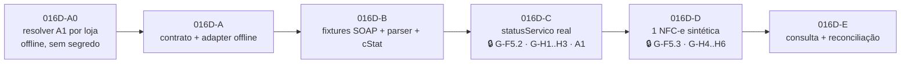

# FISCAL_GOAL_016D_SEFAZ_ADAPTER_PLAN — Plano do primeiro adapter SEFAZ-SP de homologação

| Campo | Valor |
|---|---|
| **GOAL** | `FISCAL-GOAL-016D-SEFAZ-ADAPTER-HOMOLOGACAO-PLAN-001` |
| **Tipo** | **Auditoria e planejamento.** Zero transporte, zero chamada SEFAZ, zero credencial, zero schema/migration |
| **Base** | `origin/main` = `0de82ab9318684ec59eed78728ce05df18a590b5` (merge do PR #33 — GOAL-016C) |
| **Branch / worktree** | `fiscal/goal-016d-sefaz-adapter-plan` · `C:\tmp\omni-gestao-fiscal-016d-sefaz-plan` |
| **Data da auditoria** | **2026-08-03** (toda consulta oficial desta página foi feita nesta data) |
| **Escopo do piloto** | Matriz RafaCell Assistec · Taguaí/SP · SEFAZ-SP · NFC-e modelo 65 · `HOMOLOGACAO` · `tpAmb=2` |
| **Decisões-mãe** | ADR-0015 (SEFAZ direta) · ADR-0016 (piloto SP) · ADR-0017 (estado incerto) · ADR-0018 (XML legal) · ADR-0014 (KMS) · **ADR-0020** (fronteira provider SEFAZ direto / P2-only) |
| **Estado** | 🟡 **PLANEJADO — NÃO INICIADO.** Nenhum slice implementado |
| **Revisões** | Sonnet 5 (independente, §9) · **revisão cruzada de outra família** (§9.1) — parecer **B**, dez achados **F-1…F-10** incorporados |
| **Slices** | **sete**: `016D-A0` · `016D-A` · `016D-B` · `016D-C0` · `016D-C` · `016D-D` · `016D-E` |

> **Regra deste documento.** Nenhuma afirmação regulatória por memória de modelo. Cada regra em §3
> tem **URL oficial + data de consulta**. Onde a fonte não pôde ser lida, está declarada como
> **pendência** — não preenchida por inferência, exemplo plausível ou fornecedor privado.

**Legenda:** 🟦 regra regulatória · 🟩 decisão de arquitetura · 🟨 procedimento de homologação ·
🟥 ação humana necessária · ⚠️ conflito/incerteza registrado

---

## 0. O que este GOAL é — e o que **não** é

| Faz | Não faz |
|---|---|
| Audita o código fiscal atual e mapeia a fronteira real | Não implementa transporte, SOAP, TLS ou adapter |
| Revalida parâmetros oficiais da SEFAZ-SP em fonte primária | Não chama nenhum Web Service da SEFAZ (nem `?wsdl`) |
| Define as decisões técnicas obrigatórias do adapter | Não usa certificado, CSC, senha ou credencial real |
| Consolida gates humanos e insumos pendentes | Não provisiona nada, não credencia, não gera CSC |
| Divide a execução futura em slices com critério de aceite | Não altera banco, `prisma/schema.prisma` ou migrations |
| Atualiza roadmap e plano mestre | Não liga `fiscalEnabled`, não abre produção, não emite |

**Diff deste GOAL: somente documentação.**

---

## 1. Pré-flight

```
git fetch origin --prune
git rev-parse origin/main   → 0de82ab9318684ec59eed78728ce05df18a590b5
git status --short           → limpo na worktree nova
```

No momento em que este plano foi escrito, a `main` **não havia avançado** desde o merge do PR #33
(GOAL-016C). O SHA base é o esperado pelo comando.

> 🔄 **Atualização do pré-flight (revisão cruzada, mesmo dia).** A `main` avançou para
> `9cef9112811c1d743ca6dff98576dbc1b058304a` com o merge do **PR #36**
> (`docs(governance)`: auditoria de autoridade de migrations em produção). Os commits novos tocam
> `docs/ai/CURRENT_STATUS.md`, `docs/ai/CURRENT_STATUS_OVERVIEW.md`, `docs/status/DIVIDA_TECNICA.md`
> e dois documentos novos em `docs/audits/` — **nenhum dos três arquivos deste PR**. Portanto **não
> há conflito**, e a auditoria de código desta página permanece válida: `lib/fiscal/**` não foi
> tocado entre `0de82ab` e `9cef911`.

> ⚠️ **Nota operacional (não bloqueante).** A worktree primária `C:\Projetos\omni-gestao` tinha, no
> início desta sessão, modificações **não commitadas** em `docs/roadmaps/ROADMAP_FISCAL.md` e
> `docs/governance/MASTER_FISCAL_EXECUTION_PLAN.md` — os mesmos arquivos que este GOAL edita. Este
> GOAL trabalhou **exclusivamente** na worktree nova, a partir de `0de82ab`, e não leu nem herdou
> aquelas modificações. Se elas forem commitadas depois, haverá conflito de merge a resolver
> manualmente.

---

## 2. Auditoria do código atual (mapa real, `0de82ab`)

### 2.1 Contrato do provider — **existem DUAS superfícies, não uma**

Esta é a descoberta estruturante da auditoria. O repositório tem **dois** contratos de provider,
criados por GOALs diferentes, com semânticas diferentes:

| # | Contrato | Arquivo | Entrada | Papel real hoje |
|---|---|---|---|---|
| **P1** | `FiscalProvider` | [`lib/fiscal/provider/types.ts:211`](../../lib/fiscal/provider/types.ts) | **snapshot congelado** (`FiscalProviderRequest`) | Validação de configuração/snapshot, preparo, `statusServico`. Emissão **simulada** |
| **P2** | `UncertainStateFiscalProvider` | [`lib/fiscal/emission/uncertain-state.types.ts:108`](../../lib/fiscal/emission/uncertain-state.types.ts) | **bytes exatos** (`exactBytes` + `bytesSha256`) | Única superfície que o caminho seguro de transmissão realmente usa (ADR-0017) |

🟩 **Consequência de plano.** A ADR-0015 §2.2 pede que o contrato evolua para entregar ao transporte
um **envelope de XML assinado e validado**. Esse envelope **já existe** — é o **P2**, entregue pelo
GOAL-012. Portanto o `SefazDiretoProvider` **implementa P2 primeiro**, e **não** uma mutação de
`FiscalProvider.emitir`. `FiscalProvider` permanece como superfície de **configuração e status**.

**Lacunas de P2 contra o envelope da ADR-0015 §2.2:**

| Campo exigido pela ADR-0015 | Presente em `FiscalDocumentIdentity`? |
|---|---|
| `storeId`, `notaFiscalId`, `modelo`, `ambiente`, `chaveAcesso` | ✅ sim (`modelo`/`ambiente` são **tipos literais** `"NFCE"`/`"HOMOLOGACAO"` — fail-closed no compilador) |
| `xmlAssinadoValidado`, `hashDoXml` | ✅ sim, como `exactBytes` + `bytesSha256` no `transmit` |
| **`uf`** | ❌ **ausente** — o adapter precisa dela para resolver endpoint |
| **`idempotencyKey` / `correlationId`** | ❌ **ausente** — hoje só há `chaveAcesso` |

🟩 Fechar essas duas lacunas é escopo do slice **016D-A**, de forma **aditiva** (campos novos), sem
tocar schema.

### 2.2 Registry / resolver e `STUB_HOMOLOGACAO`

[`lib/fiscal/provider/resolver.ts:21`](../../lib/fiscal/provider/resolver.ts) — o `REGISTRY` tem
**uma única fábrica**:

```ts
const REGISTRY: Partial<Record<FiscalProviderTipo, () => FiscalProvider>> = {
  [FiscalProviderTipo.STUB_HOMOLOGACAO]: () => stubHomologacaoProvider,
}
```

`SEFAZ_DIRETO` **existe no enum** `FiscalProviderTipo` (`prisma/schema.prisma`) mas **não tem
fábrica** ⇒ `resolveFiscalProvider` devolve `provider_nao_implementado` (fail-closed honesto, sem
fallback). O resolver distingue corretamente "fora do enum" (`provider_desconhecido`) de "no enum sem
implementação" (`provider_nao_implementado`).

### 2.3 Entrada atual do provider

`FiscalProviderRequest = { contexto, snapshot }`. O `contexto` recebe `serie`/`numero` da alocação
atômica **antes** de `emitir` ([`emission-pipeline.ts:287-327`](../../lib/fiscal/emission/emission-pipeline.ts)).
O provider **nunca** relê `Produto`/`Venda` vivos.

### 2.4 Worker `FiscalEmissaoJob`

| Camada | Arquivo | Papel |
|---|---|---|
| Política pura | `lib/fiscal/queue/queue-worker.ts` | `drainFiscalQueue`, lease/heartbeat/backoff |
| Adapter Prisma | `lib/fiscal/queue/prisma-queue-worker.ts` | portas reais + `executeFiscalJob` |
| Executor seguro | `lib/fiscal/emission/uncertain-state-job-executor.ts` | roteia `EMISSAO`/`CONSULTA` para o coordenador ADR-0017 |
| Produtor | `lib/fiscal/queue/queue-producer.ts` | enfileira (sem caller produtivo de venda) |

Tipos de job: `EMISSAO · CANCELAMENTO · INUTILIZACAO · CONTINGENCIA_TRANSMISSAO · CONSULTA`.
Hoje o worker processa **somente `EMISSAO` e `CONSULTA`**.

### 2.5 Persistência pré-transmissão · `TRANSMITINDO` · estado incerto

[`uncertain-state-coordinator.ts`](../../lib/fiscal/emission/uncertain-state-coordinator.ts) +
[`prisma-uncertain-state-persistence.ts`](../../lib/fiscal/emission/prisma-uncertain-state-persistence.ts):

1. `persistBeforeTransmission` grava, em **uma transação**: `serie`, `numero`, `chaveAcesso`,
   `xmlAssinado` e `status = TRANSMITINDO`, e registra `bytesSha256` no **payload do job**.
2. `transmit` recebe **os bytes relidos do que foi persistido** — nunca bytes recém-gerados.
3. `UNCERTAIN` ⇒ nota **permanece** `TRANSMITINDO`, cria/reencontra job `CONSULTA`
   (`dedupeKey = fiscal:consulta:v1:nota:{id}`), **sem agendar retransmissão**.
4. Retomada com `status = TRANSMITINDO` e sem autorização de consulta ⇒ `CONSULTATION_REQUIRED`.
5. `reconcileUncertainDocument` é a **única** autoridade que resolve o incerto: `AUTHORIZED`,
   `REJECTED`, ou `NOT_FOUND` ⇒ `authorizeExactRetransmission` (autoriza **os mesmos bytes**).

⚠️ **Fragilidade registrada.** `xmlBytesSha256` **não é coluna** de `NotaFiscal` — vive em
`FiscalEmissaoJob.payload.document.bytesSha256`. A prova de byte-exatidão depende da sobrevivência do
payload do job. Isso **viabiliza** a restrição "zero schema" deste GOAL, mas é dependência a
declarar. Promover o hash a coluna é decisão futura, com ADR própria.

### 2.6 As travas existentes — o que cada uma **realmente** impede

Defesa em profundidade instalada **no caminho P2**. **Nenhum slice antes de 016D-D pode tocá-las.**

⚠️ **Correção da revisão cruzada (F-1).** A redação anterior desta seção classificava `T1` como
*"barreira de compilador"* e afirmava que *"um provider real não compila contra a interface"*.
**Isso é factualmente incorreto** e a correção está detalhada logo abaixo da tabela. A tabela a
seguir descreve a natureza real de cada trava.

| # | Local | Trava | Natureza | Protege |
|---|---|---|---|---|
| T1 | `uncertain-state.types.ts:109` | `readonly simulado: true` — tipo literal | 🟨 **declaratória** — obriga o provider a *se declarar* simulado; **não** impede transmitir | P2 |
| T2 | `uncertain-state-coordinator.ts:95` | `if (!provider.simulado)` ⇒ `blocked / REAL_PROVIDER_BLOCKED` | 🟨 **declaratória** — depende de T1 ser honesta | P2 |
| T3 | `uncertain-state-coordinator.ts:227` | `if (!provider.simulado)` ⇒ `throw` na consulta | 🟨 **declaratória** — idem | P2 |
| **T4** | `prisma-queue-worker.ts:303` | job só roda se `provider === "STUB_HOMOLOGACAO"` **e** `NFCE` **e** `HOMOLOGACAO` **e** `fiscalEnabled` | 🟩 **mecânica** — compara o valor persistido em `ConfiguracaoFiscalLoja`, não uma autodeclaração | fila |
| T5 | `queue-worker.ts:206` · `prisma-queue-worker.ts:357` | `if (!execution.simulado)` ⇒ terminal `provider_real_bloqueado` | 🟥 **inerte no caminho v2** — ver F-2 abaixo | fila (só v1) |

#### ⚠️ F-1 — `readonly simulado: true` **não** é barreira de compilador

| Fato verificado | Evidência |
|---|---|
| A interface exige o literal `true`, e um provider real satisfaz isso escrevendo `readonly simulado = true as const` | `uncertain-state.types.ts:109`; o padrão já está em uso em `provider/uncertain-state-test-stub.ts:17` |
| Um `SefazDiretoProvider` que transmite de verdade e declara `simulado = true` **compila normalmente** | — |
| Com essa declaração, **T2 e T3 também passam**, porque ambas são `if (!provider.simulado)` | `uncertain-state-coordinator.ts:95` · `:227` |

🟩 **Leitura correta.** `T1` impede que um provider real se declare **honestamente** como real —
é um **ato revisável**, não um impedimento de execução. `simulado` é um **rótulo de trilha**, e
⛔ **não pode ser tratado como controle de segurança** em nenhum ponto deste plano.

🟩 **As proteções mecânicas efetivas hoje são, nesta ordem:**

1. **T4** — o worker compara o `provider` **persistido na configuração da loja** com o literal
   `"STUB_HOMOLOGACAO"`. Não há autodeclaração envolvida.
2. **`REGISTRY` sem `SEFAZ_DIRETO`** (`resolver.ts:21`) — nenhuma fábrica de provider real existe.
3. **Ausência de cliente HTTP real** em `lib/fiscal/**` — não há `fetch`, `node:https`, `axios` nem
   `undici` em nenhum arquivo do domínio fiscal.

Essas três — e não a contagem de cinco travas — são o que sustenta R1.

#### ⚠️ F-2 — `T5` está **inerte** no caminho `payload.version >= 2`

| Fato verificado | Evidência |
|---|---|
| `uncertain-state-job-executor.ts` devolve `simulado: true` **literal** em **todos** os 7 retornos | linhas 32, 55, 72, 97, 118, 131, 142 |
| O mesmo arquivo devolve `externalTransmissionAttempted: false` **literal** nos 7 retornos correspondentes | linhas 33, 56, 73, 98, 119, 132, 143 |
| Nenhum dos dois campos deriva do provider ou do desfecho — são constantes | — |
| Logo `queue-worker.ts:206` (`if (!execution.simulado)`) **nunca pode disparar** para jobs v2 | — |
| `prisma-queue-worker.ts:357` só é alcançado no caminho **v1 legado**: para `CONSULTA` ou `payloadVersion >= 2` a função retorna antes, em `return executeGoal012(job)` | `prisma-queue-worker.ts:335-348` |

⛔ **Duas consequências.**

1. `T5` **não precisa ser "afrouxada"** em 016D-D — ela já não protege o caminho que 016D-D vai usar.
   Contá-la como trava ativa **superestima** a defesa.
2. Mais grave: a partir do momento em que existir transmissão real, `externalTransmissionAttempted`
   reportará **`false` depois de uma chamada à SEFAZ**. Esse campo alimenta
   `queue-policy.ts:124` (`external`) — ou seja, **a trilha de auditoria registraria ativamente uma
   informação falsa** sobre a fronteira mais sensível do sistema.

🟩 **Correção normativa.** Antes de qualquer transmissão real, ambos os campos passam a **derivar da
execução**. Isso é **critério de aceite obrigatório** dos slices 016D-A/016D-B (§6) e não pode ser
adiado para 016D-D.

#### ⚠️ Achado da revisão independente — **a rota P1 direta não tem trava equivalente**

| Fato verificado | Evidência |
|---|---|
| `FiscalProvider.simulado` é `readonly simulado: **boolean**`, **não** o literal `true` | `lib/fiscal/provider/types.ts:214` |
| `emitirNotaFiscalVenda` é **exportada** e chamável **sem passar pela fila** | `lib/fiscal/emission/emission-service.ts:90` |
| Ela resolve o provider pelo **mesmo `REGISTRY` de P1** e chega a `provider.emitir` via `runEmissionPipeline` | `emission-service.ts:167` → `emission-pipeline.ts:340` |
| Esse caminho **não** tem T1 (tipo permissivo), **não** tem T2/T3 (vivem só no coordenador) e **não** tem T4/T5 (vivem só no laço da fila) | — |

🟩 **Leitura correta.** Um `SefazDiretoProvider implements FiscalProvider` com `simulado = false` e um
`emitir` real **compilaria** e transmitiria fora de toda a proteção da ADR-0017. Hoje isso é
**inofensivo** apenas porque o `REGISTRY` de P1 está vazio de providers reais — e o produtor grava
`payload.version = 2` (`queue-producer.ts:245`), desviando jobs novos para o executor seguro. **Nenhuma
dessas duas condições é uma trava de tipo.**

#### ⚠️ F-3 — "`emitir` inerte" **não** torna a rota P1 livre de efeitos colaterais

A revisão cruzada verificou que, se `SEFAZ_DIRETO` fosse registrado no `REGISTRY` de P1, o pipeline
executaria três efeitos **antes** de chegar ao `emitir` inerte:

| Ordem | Efeito | Evidência |
|---|---|---|
| passo **5b** | **`allocateNumero` consome série/número fiscal** | `emission-pipeline.ts:287-327` |
| passo **6** | grava `Venda.fiscalStatus = EMITINDO` (`prisma.venda.update`) | `emission-pipeline.ts:331` · porta em `emission-service.ts:176` |
| passo **7** | só então chama `provider.emitir` — que devolveria o erro inerte | `emission-pipeline.ts:340` |

| Fato adicional | Evidência |
|---|---|
| A rota P1 **não tem gate de `fiscalEnabled`** | `resolver.ts:63` — *"NÃO exige `fiscalEnabled`"*; `grep fiscalEnabled` em `emission-pipeline.ts` → zero |
| O gate de `fiscalEnabled` vive no **produtor da fila** e em T4, **não** no caminho P1 direto | `queue-producer.ts:182` · `prisma-queue-worker.ts:307` |

⛔ **Conclusão.** Inércia do `emitir` garante **ausência de rede**, mas **não** ausência de dano:
queima numeração fiscal e suja o `fiscalStatus` de uma venda real. E `fiscalEnabled = false`
**não protege** essa rota.

🟩 **Consequência normativa — decisão forte (ver D11).** Este plano **abandona** a ideia de registrar
`SEFAZ_DIRETO` no `REGISTRY` de P1 mediante prova de inércia. A decisão passa a ser:
**`SEFAZ_DIRETO` nunca é registrado no `REGISTRY` de `FiscalProvider`/P1** — em nenhum slice do
016D. Isso elimina o risco **por construção**, em vez de mitigá-lo por teste.

### 2.7 Consulta por chave de acesso

`UncertainStateFiscalProvider.consult({ document })` — recebe o documento com `chaveAcesso` (44
dígitos, validado por `/^\d{44}$/`). Resultados canônicos: `AUTHORIZED` · `NOT_FOUND` · `REJECTED`.
O `UncertainStateTestStub` devolve `cStat 217` no `NOT_FOUND` — coerente com a matriz oficial.

### 2.8 Storage de XML assinado e autorizado

- **Fonte primária obrigatória:** colunas `NotaFiscal.xmlAssinado` / `xmlAutorizado` (ADR-0018).
- **Espelho privado opcional:** `XmlStorageMirror` — hoje `active === false` (nada provisionado).
- **Imutabilidade:** `markAuthorized` levanta `AuthorizedDivergenceError` em três casos
  (`xml_autorizado_imutavel_diverge`, `protocolo_imutavel_diverge`, `metadados_autorizacao_divergem`)
  **antes** de qualquer escrita; reprocessar com os mesmos bytes converge sem escrever.

### 2.9 Resolução do certificado A1 — **elo faltante**

| Peça | Estado |
|---|---|
| `CertificadoDigital { blobRef, senhaRef, status, ativo, validoAte, fingerprint }` | ✅ existe (schema) |
| `ConfiguracaoFiscalLoja.certificadoAtivoId` | ✅ existe (schema) |
| Cofre `FiscalSecretVault` + `resolveFiscalSecretProvider` | ✅ existe — **EnvVault somente leitura** |
| Ponte cofre→assinatura `drySignNfceFromVault(params: DrySignParams)` — objeto único com `{ vault, storeId, blobRef, senhaRef, xml }` | ✅ existe |
| **Resolver `storeId → certificadoAtivoId → CertificadoDigital → {blobRef, senhaRef}` server-side** | ❌ **NÃO EXISTE** |

`certificadoAtivoId` só aparece hoje como campo **de leitura** em `fiscal-identity-service.ts` e nas
rotas de certificado. Nenhum código resolve o material do A1 a partir dele. Esse resolver é
**pré-requisito compartilhado** entre a assinatura (F4) e o mTLS do transporte (F5) — escopo do
slice **016D-A**.

### 2.10 Configuração fiscal por loja

`ConfiguracaoFiscalLoja` (único por `storeId`): `fiscalEnabled=false`, `ambiente=HOMOLOGACAO`,
`modeloFiscal=NFCE`, `provider=STUB_HOMOLOGACAO`, identidade completa, endereço estruturado com
`codigoMunicipioIbge`/`uf`, `crt`, `cscId` + `cscTokenRef` (**só referência**), `providerConfig`
(JSONB), `certificadoAtivoId`. **Nenhum `@default("loja-1")`.**

### 2.11 Catálogo atual de `cStat` e erros

- **Erros do provider:** `FiscalProviderErrorCode` — 11 códigos canônicos, todos **internos**
  (`config_ausente`, `snapshot_invalido`, `provider_nao_implementado`, …). **Nenhum é `cStat` da
  SEFAZ.**
- **`cStat` no código:** só literais do stub (`100`, `102`, `107`, `135`) e do stub de drill
  (`217`, `999`). **Não existe tabela/matriz de `cStat`** em `lib/fiscal/**`.
- **Persistência:** `NotaFiscal.cStat` e `xMotivo` são `String?` livres.

🟩 A matriz de `cStat` → desfecho canônico é **trabalho novo**, escopo do slice **016D-B**.

### 2.12 Artefatos oficiais presentes no repositório

| Artefato | Estado |
|---|---|
| Schemas XSD `PL_010e_v1.02` (`nfe_v4.00.xsd`, `leiauteNFe_v4.00.xsd`, `tiposBasico_v4.00.xsd`, `xmldsig-core-schema_v1.01.xsd`) | ✅ versionados em `lib/fiscal/xsd/schemas/` |
| Worker XSD containerizado + supply chain lock | ✅ `workers/fiscal-xsd/` |
| **WSDL de qualquer serviço NFC-e** | ❌ **ausente do repositório** |

### 2.13 Pontos ainda sem caller produtivo — **e o caller administrativo que existe**

Tax-engine · XML builder · chave de acesso · signer · EnvVault · provider stub · pipeline de emissão ·
numeração · coordenador de estado incerto · storage reader. Banco fiscal vazio;
`fiscalEnabled = false` em todas as lojas; **zero transmissão SEFAZ**.
Os **guards** da state machine da venda são o único ponto com callers reais no fluxo de venda
(seis rotas).

#### ⚠️ F-6 — a fila **tem** um caller administrativo já deployado

A redação anterior listava "fila (produtor e worker)" como sem caller produtivo. **Impreciso.**

| Fato verificado | Evidência |
|---|---|
| Existe rota HTTP deployada que executa `drainFiscalQueue` | [`app/api/internal/fiscal/queue/route.ts:87`](../../app/api/internal/fiscal/queue/route.ts) |
| Ela expõe também `pause`, `reprocess` (com `consultationAuthorizedRetry`) e `cancel` | `route.ts:96-135` |
| Ela **drena um lote**, não um documento — `batchSize` (default 10, clampado em `queue-worker.ts:332`) | `route.ts:88` |

🟩 **Por que hoje é seguro (fail-closed em três camadas):**

1. sem `FISCAL_QUEUE_INTERNAL_SECRET` no ambiente ⇒ **503 `fila_interna_indisponivel`**;
2. segredo ausente ou divergente ⇒ **401**, com comparação `timingSafeEqual` sobre hash;
3. ela chama `createPrismaFiscalQueueWorkerPorts()` **sem** o argumento `executeGoal012` ⇒ todo job
   `payload.version >= 2` morre em `goal012_executor_nao_configurado`
   (`prisma-queue-worker.ts:337-345`).

⛔ **Regra normativa para o piloto.**

- Esta rota **permanece sem wiring do `SefazDiretoProvider`** durante todo o 016D. A fábrica
  `createPrismaGoal012FiscalQueueWorkerPorts` (`prisma-queue-worker.ts:524`) **não** é ligada a ela.
- Ela **não serve** para a primeira nota controlada: drena lote e não permite escopo de documento
  único.
- **016D-D cria um caminho separado**, server-side, autenticado, de **nota única**, sem passar por
  esta rota.
- **Posse e uso do `FISCAL_QUEUE_INTERNAL_SECRET` são gate humano próprio** (§5.3, G-H4).

---

## 3. Revalidação oficial (fontes primárias, consultadas em 2026-08-03)

### 3.1 Endpoints NFC-e da SEFAZ-SP

🟦 **Fonte:** SEFAZ-SP — WebServices NFC-e ·
<https://portal.fazenda.sp.gov.br/servicos/nfce/Paginas/WebServices.aspx> · consultado **2026-08-03**

**Autorizador: a própria SEFAZ-SP.** Host da NFC-e (`nfce.fazenda.sp.gov.br`) é **distinto** do host
da NF-e (`nfe.fazenda.sp.gov.br`). **Versão publicada: 4.00 (NT2016.002).**

**Homologação (`tpAmb=2`) — a allow-list do piloto:**

| Serviço | URL |
|---|---|
| NFeAutorizacao4 | `https://homologacao.nfce.fazenda.sp.gov.br/ws/NFeAutorizacao4.asmx` |
| NFeRetAutorizacao4 | `https://homologacao.nfce.fazenda.sp.gov.br/ws/NFeRetAutorizacao4.asmx` |
| NFeConsultaProtocolo4 | `https://homologacao.nfce.fazenda.sp.gov.br/ws/NFeConsultaProtocolo4.asmx` |
| NFeStatusServico4 | `https://homologacao.nfce.fazenda.sp.gov.br/ws/NFeStatusServico4.asmx` |
| NFeInutilizacao4 | `https://homologacao.nfce.fazenda.sp.gov.br/ws/NFeInutilizacao4.asmx` |
| NFeRecepcaoEvento4 | `https://homologacao.nfce.fazenda.sp.gov.br/ws/NFeRecepcaoEvento4.asmx` |

**Produção (`tpAmb=1`) — registrada apenas para a allow-list NEGATIVA**, host `nfce.fazenda.sp.gov.br`
com os mesmos seis caminhos `/ws/*.asmx`. 🟩 **Existem no catálogo para serem NEGADOS** enquanto o
G-F12 não abrir.

**EPEC (contingência — fora do escopo do adapter):**
`https://homologacao.nfce.epec.fazenda.sp.gov.br/EPECws/RecepcaoEPEC.asm` (sem `x`) e
`.../EPECws/EPECStatusServico.asmx` (com `x`). ⚠️ A inconsistência `.asm`/`.asmx` **foi reconfirmada
hoje na página oficial** — permanece **H-6**, e é irrelevante para o 016D porque contingência está
fora de escopo.

**Confirmação:** os endpoints batem **exatamente** com o levantamento do GOAL-015
([`FISCAL_SEFAZ_DOSSIE_UF_001.md §1`](./FISCAL_SEFAZ_DOSSIE_UF_001.md)) — sem drift em 11 dias.

### 3.2 Padrão de comunicação — MOC 7.00

🟦 **Fonte:** Manual de Orientação do Contribuinte **7.00 — Visão Geral, novembro de 2020**, obtido
do portal oficial SVRS ·
<https://dfe-portal.svrs.rs.gov.br/NFE/DownloadArquivoEstatico/?sistema=NFE&tipoArquivo=1&nomeArquivo=moc7-visao-geral.pdf>
· índice em <https://dfe-portal.svrs.rs.gov.br/NFe/Documentos> · consultado **2026-08-03**

| Item | Regra oficial (verbatim quando citado) |
|---|---|
| Meio lógico | Web Services do Portal da Secretaria de Fazenda Estadual |
| **Protocolo** | *"TLS versão 1.2, com autenticação mútua através de certificados digitais."* ⇒ **mTLS é obrigatório** |
| **Troca de mensagens** | *"SOAP versão 1.2."*, Style/Encoding **Document/Literal**, modelo WS-I Basic Profile |
| **Parâmetro** | a mensagem XML viaja no parâmetro **`nfeDadosMsg`** |
| **SOAP Header no leiaute 4.00** | *"Na versão 4.0 do leiaute da NF-e foi eliminado o uso de variáveis no SOAP Header"*, com o exemplo rotulado *"Exemplo do SOAP Header que não será mais necessário"* (`nfeCabecMsg`/`versaoDados`/`cUF`) |
| **Namespace** | padrão `http://www.portalfiscal.inf.br/nfe/wsdl/<NomeDoWebService>` |
| **Compressão** | opcional, **a critério da empresa**: método `NfeAutorizacaoLoteZip`, **GZip** com resultado convertido para **Base64** |
| **Lote** | *"Conjunto de NF-e transmitidas (máximo de 50 NF-e)"* |
| **`indSinc`** | `0=Não` · `1=Empresa solicita processamento síncrono do Lote de NF-e (sem a geração de Recibo para consulta futura)`. Síncrono **só ocorre se** a empresa solicitar **e** houver **unicamente uma NF-e no lote** **e** a SEFAZ autorizadora implementar o processamento síncrono |
| **Espera antes de `RetAutorizacao`** | *"deve ser construído de forma a aguardar um tempo mínimo de 15 segundos entre o envio do Lote … e a consulta do resultado"*, evitando `105 Lote em Processamento` |
| **Loop de `StatusServico`** | *"devem aguardar um tempo mínimo de 3 minutos entre cada consulta"* |
| **SLA de processamento** | SEFAZ se compromete a processar lotes *"em até 3 minutos em no mínimo 95% do total do volume recebido no período de 24 horas"* |
| **Eventos do modelo 65** | Ajuste SINIEF 19/16, cl. 13ª: para a NFC-e modelo 65 *"somente o Cancelamento e o Evento Prévio de Emissão em Contingência"* |

🟩 A última linha **corrobora nacionalmente** a vedação da Carta de Correção já provada em SP pela
Portaria CAT 12/2015 art. 8º §1º (GOAL-015 §4). A vedação da CC-e para o modelo 65 tem, agora, base
**estadual e nacional**.

⚠️ **C-7 (novo) — SP publica MOC desatualizado.** A página de downloads da NFC-e da SEFAZ-SP
distribui `Manual_de_Orientacao_Contribuinte_v_6.pdf` — **MOC 6.0, setembro de 2015**, anterior ao
leiaute 4.00 e que ainda documenta o `nfeCabecMsg` como obrigatório. O MOC vigente é **7.00
(nov/2020)**. 🟩 **O nacional prevalece; não seguir o MOC 6.0 de SP para o padrão de comunicação.**
Mesmo padrão do conflito C-3 (manual de QR Code v4.1 × v6.0).

### 3.3 Pendências oficiais **declaradas** (não preenchidas por memória)

| # | Item | Por que não foi confirmado | Bloqueia o quê |
|---|---|---|---|
| **H-9** | **`SOAPAction` exato por serviço** | O MOC **não** define `SOAPAction` — ela vem do WSDL. Nenhum WSDL está no repositório e buscar `?wsdl` seria **chamar a SEFAZ**, vedado neste GOAL | Bloqueia **016D-B** (fixtures) e **016D-C**. Não bloqueia 016D-A |
| **H-10** | **WSDL oficial dos 6 serviços NFC-e 4.00 de SP** (binding, nome do método, envelope de resposta) | idem H-9 | idem H-9 |
| **H-11** | **SEFAZ-SP implementa `indSinc=1` para NFC-e?** | O MOC condiciona o síncrono a *"a SEFAZ Autorizadora implementar o processamento síncrono"*. Nenhuma página oficial de SP consultada afirma isso | Decide se o piloto usa 1 ou 2 chamadas. Resolve-se por **observação** em 016D-D |
| H-8 | Anexo completo de `cStat` do MOC vigente | herdada do GOAL-015; a matriz parcial cobre caminho feliz e reconciliação | Não bloqueia; limita 016D-B a rejeições genéricas |
| **H-12** | **Limite quantitativo de Consumo Indevido da SEFAZ-SP** (quantas consultas por hora; duração exata do bloqueio) | **NOVO — F-7.** O MOC 7.00 **não publica número algum**: declara que a SEFAZ *"a seu critério, poderá implantar as regras de validação de Consumo Indevido"* e que as tentativas excedentes são rejeitadas com `656`. Nenhuma página oficial de SP consultada quantifica o limite | **Não bloqueia** 016D-A/B/C/D. Impede fixar um número no rate limit de **016D-E** — que por isso nasce configurável e conservador |

> ⚠️ **Falha de acesso reproduzida.** As tentativas de ler PDFs oficiais em
> `www.nfe.fazenda.gov.br/portal/exibirArquivo.aspx?...` falharam hoje com **loop de
> redirecionamento** — exatamente o sintoma que o GOAL-015 registrou ao tentar o manual de QR Code
> (H-4). O portal **SVRS** (`dfe-portal.svrs.rs.gov.br`) é uma alternativa oficial que **funciona** e
> serviu de fonte para o MOC 7.00. 🟩 **Registrar SVRS como via oficial suplente** para GOALs futuros.

### 3.4 Matriz mínima de `cStat` (herdada do GOAL-015 §10, com uma correção)

Autorização `100` · cancelamento `101` · inutilização `102` · lote `103/104/105/106` ·
serviço `107/108/109` · denegação `110` · eventos `128/141` · **duplicidade `204`** ·
**não consta `217`** · **consumo indevido `656`**.

#### ⚠️ F-7 — o limite quantitativo do `656` **não** está confirmado em fonte primária

A redação anterior afirmava *"limite de 20 consultas/hora, bloqueio do CNPJ por 1 hora ao exceder"*.
A revalidação de hoje, **no próprio MOC 7.00 obtido por este GOAL**, não sustenta esses números:

| Verificação no MOC 7.00 | Resultado |
|---|---|
| Ocorrências de "20 consultas" ou limite numérico de consumo indevido | **nenhuma** |
| O que o MOC de fato diz | *"a Sefaz autorizadora, **a seu critério**, poderá implantar as regras de validação de Consumo Indevido"* — e *"As novas tentativas serão rejeitadas com o erro «656–Rejeição: Consumo Indevido»"* |
| Exemplos de consumo indevido (Tabela 4-9) | **qualitativos** — aplicação em *looping*, reenvio manual repetido. **Sem números** |
| A única regra de "uma hora" do MOC | pertence à **Distribuição DF-e (`consNSU`/`distDFe`)** quando não há mais documentos — **outro Web Service**, que o adapter não usa |

🟩 **Correção normativa.**

- ⛔ **"20 consultas/hora"** e **"bloqueio fixo de 1 hora"** deixam de ser tratados como regra
  confirmada. Viram a pendência **H-12** (§3.3).
- ✅ **Permanece confirmado e vinculante:** o **intervalo mínimo de 3 minutos** entre consultas de
  `StatusServico` (MOC 7.00, §5.7 — verbatim em §3.2) e os **15 s** mínimos antes do
  `RetAutorizacao`.
- ✅ **Permanece confirmado:** `656` existe, significa Consumo Indevido, e a causa documentada é
  **loop/reenvio repetido** — o que basta para justificar D12 sem depender de número algum.

🟩 **O par (204, 217) é o coração da reconciliação** e já está implementado no GOAL-012:
`204` = "já existe, converge" · `217` = "não existe, pode retransmitir os mesmos bytes".

---

## 4. Decisões técnicas obrigatórias

### D1 · Entrada exata do `SefazDiretoProvider`

O adapter **só** aceita um documento **já persistido** em `TRANSMITINDO`, com XML **assinado e
validado** e hash conferido pelo coordenador:

```
transmit({ document: FiscalDocumentIdentity + uf + correlationId,
           exactBytes: Uint8Array,
           bytesSha256: string })
```

**Proibições absolutas dentro do adapter:** gerar ou alterar XML · assinar · calcular tributo ·
alocar numeração · calcular chave de acesso · ler `Produto`/`Venda` vivos · escrever no banco.
O adapter **traduz e transporta** — nada mais.

### D2 · Saída canônica

Cinco desfechos, mapeados nos tipos que já existem (ADR-0017):

| Desfecho | Tipo | Regra |
|---|---|---|
| **autorizado** | `AUTHORIZED` | exige `cStat=100` **e** protocolo **e** XML autorizado |
| **rejeitado** | `REJECTED` | rejeição **definitiva** por regra de validação; número consumido |
| **processamento** | `UNCERTAIN` code **`PROCESSING`** 🆕 | `103/105` (lote recebido/em processamento) — **não** é falha. Código **aditivo**, ver D12 |
| **throttled** | `UNCERTAIN` code **`THROTTLED`** 🆕 | `656` consumo indevido — parada dura. Código **aditivo**, ver D12 |
| **timeout** | `UNCERTAIN` code `TIMEOUT` | rede/tempo excedido |
| **incerto** | `UNCERTAIN` code `CONNECTION_LOST`/`UNKNOWN` | resposta ilegível, HTTP inesperado, SOAP Fault não classificável |

⚠️ **F-4 — dois códigos são aditivos, não existentes.** O union atual é
`"TIMEOUT" | "CONNECTION_LOST" | "UNKNOWN"` (`uncertain-state.types.ts:43-46`). **Nem `PROCESSING`
nem `THROTTLED` existem hoje.** A redação anterior de D2 usava `PROCESSING` como se já existisse e
D12 declarava apenas `THROTTLED`, deixando `PROCESSING` **sem dono**. Os dois passam a ser escopo
explícito do slice **016D-B** (D12).

🟩 **Regra de ouro:** na dúvida, **`UNCERTAIN/UNKNOWN`**. Só se classifica `REJECTED` com `cStat` de
rejeição lido e reconhecido na matriz. **Ausência de resposta nunca vira rejeição.**

### D3 · Allow-list

Catálogo **versionado, estático e imutável** em código, contendo **apenas** os seis hosts/caminhos de
**homologação** de §3.1. Regras:

- comparação por **host exato** (`homologacao.nfce.fazenda.sp.gov.br`), nunca por sufixo/regex;
- protocolo **fixo `https:`**;
- os endpoints de **produção** entram no catálogo **marcados como negados**, para que uma tentativa
  produza erro **explícito e auditado**, não um "endpoint desconhecido" genérico;
- URL **não** é construída por concatenação de entrada; é **selecionada** de um mapa fechado
  `(uf, ambiente, serviço, versão) → URL`;
- catálogo **sem `if` por UF** espalhado no domínio (ADR-0015 §2.3).

### D4 · Bloqueios **antes** da rede (fail-closed, ordem de avaliação)

| # | Condição de bloqueio | Código sugerido |
|---|---|---|
| 1 | `ambiente ≠ HOMOLOGACAO` | `ambiente_nao_permitido` |
| 2 | `tpAmb ≠ 2` (lido do **XML persistido**, não de config) | `tpamb_nao_permitido` |
| 3 | `modelo ≠ 65 / "NFCE"` | `modelo_nao_permitido` |
| 4 | `uf ≠ "SP"` | `uf_nao_permitida` |
| 5 | `storeId ≠` Store real da Matriz (resolvido do registro, **nunca literal**) | `loja_fora_do_piloto` |
| 6 | `ConfiguracaoFiscalLoja.provider ≠ SEFAZ_DIRETO` | `provider_divergente` |
| 7 | XML não assinado / sem `bytesSha256` / hash divergente | `bytes_nao_verificados` |
| 8 | XML não validado contra XSD oficial | `xsd_nao_validado` |
| 9 | endpoint fora da allow-list de homologação | `endpoint_nao_permitido` |
| 10 | certificado A1 ausente, inativo, expirado ou de outra loja | `certificado_indisponivel` |

🟩 **Cada bloqueio é testável offline.** Nenhum deles requer rede — é exatamente o que torna o slice
**016D-A** demonstrável sem SEFAZ. `tpAmb` lido do XML persistido (e não da configuração) fecha a
janela em que config e documento divergem.

### D5 · Transporte

| Aspecto | Decisão |
|---|---|
| Protocolo | HTTPS + **SOAP 1.2**, `Content-Type: application/soap+xml; charset=utf-8` |
| Envelope | `soap12:Envelope` **sem `soap12:Header`** — o leiaute 4.00 eliminou `nfeCabecMsg` (§3.2) |
| Corpo | `<nfeDadosMsg xmlns="http://www.portalfiscal.inf.br/nfe/wsdl/<Serviço>">` envolvendo o XML |
| `SOAPAction` | 🟥 **H-9** — extrair do WSDL oficial; **não inventar** |
| TLS | **TLS 1.2 no mínimo**, com **autenticação mútua** (certificado cliente A1) |
| Certificado cliente | resolvido do cofre **em memória**, contexto TLS **efêmero**, descartado após a chamada |
| Encoding | **UTF-8**; os `exactBytes` persistidos são transmitidos **sem re-serialização** |
| Compressão | **não usar** no piloto. GZip só existe no método `…LoteZip`; adotá-la troca o método e muda a superfície testada sem ganho para 1 NFC-e |
| Timeout | **connect ≤ 15 s**, **total ≤ 60 s**. Estouro ⇒ `UNCERTAIN/TIMEOUT`, **nunca** rejeição. ⚠️ Este `15 s` é **decisão de engenharia** e **não tem relação** com os `15 s` regulatórios de espera antes do `RetAutorizacao` (§3.2) — a coincidência de valor é acidental |
| Limite de resposta | corpo **≤ 2 MB**; excedeu ⇒ aborta e classifica `UNCERTAIN/UNKNOWN` |
| Redirecionamentos | **zero**. `maxRedirects = 0`; um 3xx é `UNCERTAIN`, não "siga o Location" |
| Modo | 🟩 **`indSinc=1` com lote de 1 NFC-e** como alvo — resposta e protocolo na mesma chamada, sem recibo. Condicionado a **H-11**; o fallback (`indSinc=0` + `NFeRetAutorizacao4` respeitando os **15 s mínimos**) fica desenhado mas **não implementado** no piloto |

### D6 · Segurança

1. **PFX e senha resolvidos somente no servidor**, pelo cofre, por referência (`blobRef`/`senhaRef`),
   escopados por `storeId`. Runtime **Node**, nunca Edge/browser.
2. **Zero segredo em log** — nem PFX, senha, CSC, `idCSC`, chave privada, PEM ou DEK. A disciplina do
   `FISCAL_SECURITY §4` (regras 1–6) vale integralmente para o transporte.
3. **Zero XML completo em erro.** Falhas carregam `chaveAcesso`, `bytesSha256`, `cStat`, `xMotivo` e
   códigos — **nunca** o corpo do documento nem o corpo bruto da resposta.
4. **Anti-SSRF:** host e protocolo **imutáveis** e vindos do catálogo fechado (D3); nenhuma URL
   derivada de entrada, config, banco ou resposta; redirecionamento proibido; sem proxy dinâmico.
5. **Sanitização de falhas de rede:** erro de socket/DNS/TLS vira mensagem **genérica** com código
   estável. Stack traces e mensagens do runtime **não** sobem para `FiscalLog`.
6. **Resposta nunca governa a state machine diretamente** — é normalizada primeiro (ADR-0015 §2.3).
7. **Isolamento por loja:** todo acesso a cofre, certificado, série e nota valida `storeId`. Nenhuma
   herança da Matriz para outra loja.

### D7 · Estado incerto

Reafirmação — o comportamento **já está implementado** (GOAL-012) e o adapter **não pode enfraquecê-lo**:

- **timeout ≠ rejeição**;
- **nenhuma retransmissão automática** após incerto;
- **consulta obrigatória** (`NFeConsultaProtocolo4` por chave) antes de qualquer novo envio;
- retransmissão **só** dos **mesmos bytes persistidos**, e só depois de `NOT_FOUND` (`cStat 217`);
- `204` (duplicidade) ⇒ **consultar e convergir**, jamais tratar como erro;
- `656` (consumo indevido) ⇒ **parar imediatamente** e alertar humano — retry agressivo é a causa
  documentada do `656` (MOC 7.00, §3.4). ⚠️ **F-7:** a duração e o teto do bloqueio são **H-12**,
  não confirmados; a parada não depende de conhecer o número;
- respeitar os **15 s** mínimos antes de consultar o lote e os **3 min** entre consultas de status.

### D8 · Idempotência

Invariantes por tentativa: **mesma chave de acesso, mesma série, mesmo número, mesmos bytes, mesmo
hash**. **Nenhuma reconstrução de XML durante retry** — `transmitWithUncertainStateSafety` já relê
o persistido em vez de chamar o `preparer` na retomada. O `correlationId` (novo, D1) identifica a
**tentativa**; a `chaveAcesso` identifica o **documento**. Os dois nunca se confundem.

### D9 · Observabilidade

`FiscalLog` por tentativa, com **e somente com**:

| Campo | Exemplo |
|---|---|
| `duracaoMs` | `1843` |
| `endpointLogico` | `SP/HOMOLOGACAO/NFeAutorizacao4/4.00` — **rótulo lógico, nunca a URL** |
| `cStat` / `xMotivo` | `100` / `Autorizado o uso da NF-e` |
| `tentativa` | `1` |
| `timeout` | `false` |
| `consultaRealizada` | `false` |
| `bytesSha256` · `chaveAcesso` · `correlationId` | identificadores |
| `httpStatus` · `classificacao` | `200` · `AUTHORIZED` |

**Proibido no log:** segredo, PFX, senha, CSC, XML integral (enviado ou recebido), corpo SOAP bruto,
cabeçalhos de resposta, URL literal.

### D10 · Integração

O primeiro adapter **não** ativa venda, PDV nem `fiscalEnabled`:

- nenhum caller no fluxo de venda; nenhuma alteração em `finalizeSaleTransaction`;
- `fiscalEnabled` permanece `false` — ligar é **G-F7**, GOAL separado. ⚠️ **Correção F-3:**
  `fiscalEnabled = false` protege o **produtor da fila** (`queue-producer.ts:182`) e **T4**
  (`prisma-queue-worker.ts:307`), mas **não protege a rota P1 direta** — `runEmissionPipeline` não
  consulta esse campo (`resolver.ts:63`). Não invocar `fiscalEnabled` como defesa do caminho P1;
- o produtor da fila **não** passa a enfileirar automaticamente;
- em 016D-D, a única forma de disparar é um **acionamento administrativo dedicado**, server-side,
  autenticado, de **nota única**, criado pelo próprio slice. ⚠️ **Correção F-6:** ele é **distinto**
  de [`app/api/internal/fiscal/queue`](../../app/api/internal/fiscal/queue/route.ts), que já existe,
  drena **lote** e **permanece sem wiring** do `SefazDiretoProvider` durante todo o 016D (§2.13);
- **o caminho administrativo dedicado deve falhar antes de qualquer `allocateNumero`, antes de
  qualquer escrita em `Venda` e antes de qualquer consumo de série** — a validação de escopo
  (loja-piloto, ambiente, modelo, UF, provider) é a **primeira** coisa que ele executa;
- as travas do caminho **P2** só são afrouxadas em 016D-D, **narrowly**, e nunca para o caminho de
  venda. ⚠️ **Correção F-1/F-2:** `T1`/`T2`/`T3` são declaratórias e `T5` já é inerte no caminho v2 —
  o afrouxamento real recai sobre **T4**, a única trava mecânica da fila.

### D11 · Superfície dupla do `SefazDiretoProvider` — **`SEFAZ_DIRETO` nunca entra no `REGISTRY` de P1**

Decisão criada pela revisão independente e **endurecida pela revisão cruzada** (F-1/F-3).

> **Versão anterior de D11** admitia registrar `SEFAZ_DIRETO` no `REGISTRY` de P1 desde que um teste
> provasse o `emitir` inerte. A revisão cruzada mostrou que **isso não basta** (§2.6/F-3): o pipeline
> consome numeração e grava `fiscalStatus` **antes** de chegar ao `emitir`, e não há gate de
> `fiscalEnabled` nessa rota. A decisão foi substituída pela variante forte abaixo.

`SefazDiretoProvider` implementa **as duas** interfaces, com papéis **estritamente separados**:

| Interface | Métodos implementados | Comportamento |
|---|---|---|
| **P2** `UncertainStateFiscalProvider` | `transmit` · `consult` | **Único** caminho que transmite documento à SEFAZ. Recebe bytes exatos, sempre sob o coordenador ADR-0017 |
| **P1** `FiscalProvider` | `statusServico` · `validarConfiguracao` | Disponibilidade e configuração. `statusServico` **só existe em P1** — é o que viabiliza o slice 016D-C. Alcançado por **instanciação direta**, nunca pelo resolver |
| **P1** `FiscalProvider` | `emitir` · `consultar` · `cancelar` · `inutilizar` · `prepararEmissao` · `validarSnapshot` | ⛔ **INERTES.** Devolvem `resultado: "erro"` com código `operacao_nao_suportada` (código já existente em `FiscalProviderErrorCode`, `types.ts:54`), **sem abrir socket** |

**Regras inegociáveis:**

1. ⛔ **`SEFAZ_DIRETO` NUNCA é registrado no `REGISTRY` de `lib/fiscal/provider/resolver.ts`** —
   em nenhum slice do 016D. `resolveFiscalProvider` continua devolvendo `provider_nao_implementado`
   para esse tipo. Isso elimina a rota `emitirNotaFiscalVenda → provider.emitir` **por construção**:
   o provider real é **inalcançável** pelo pipeline de emissão P1.
2. `statusServico` e qualquer operação controlada usam **instanciação server-side direta e
   dedicada** do adapter — o módulo administrativo importa a classe e a constrói, sem passar pelo
   resolver, sem tocar `ConfiguracaoFiscalLoja.provider`.
3. O `emitir` de P1 **nunca** transmite. Continua inerte **por defesa em profundidade**, mesmo sendo
   inalcançável — a inércia é provada por teste, mas **não é mais a proteção primária**.
4. **O caminho administrativo dedicado valida escopo antes de qualquer efeito colateral**: nenhuma
   chamada a `allocateNumero`, nenhuma escrita em `Venda`, nenhum consumo de `SerieFiscal` pode
   ocorrer antes dos guards D4 passarem.
5. ⛔ **`simulado` não é controle de segurança.** Nem em P1 nem em P2. É rótulo de trilha. Nenhuma
   decisão de bloqueio deste plano pode se apoiar nele (F-1). Consequência prática: o valor que o
   `SefazDiretoProvider` declara em `simulado` é **irrelevante para a segurança** — o que importa é
   que ele não é alcançável pelo `REGISTRY` (regra 1) e que a auditoria derive da execução real
   (F-2, §6).
6. 🟩 **Follow-up registrado (FU-3), não executado aqui:** estreitar `FiscalProvider.simulado` de
   `boolean` para literal deixou de ser prioridade — com a regra 1, ele não é mais a linha de
   defesa. Permanece como higiene de contrato, com GOAL próprio.

### D12 · `cStat 656` (consumo indevido) — parada dura, **sem** agendar consulta

Decisão criada pela revisão independente. O comportamento exigido por D7/R5 (**"parar
imediatamente"**) **não é alcançável com o contrato atual**:

| Fato verificado | Evidência |
|---|---|
| O desfecho `UNCERTAIN` só admite `code: "TIMEOUT" \| "CONNECTION_LOST" \| "UNKNOWN"` | `uncertain-state.types.ts:43-46` |
| **Todo** `UNCERTAIN` cai em `recordUncertainAndEnsureConsultation`, que **cria/reativa um job `CONSULTA`** | `uncertain-state-coordinator.ts:197-210` |

⛔ Classificar `656` como `UNCERTAIN/UNKNOWN` — única opção hoje — **agenda mais uma consulta**,
alimentando exatamente o padrão de *looping* que o `656` sinaliza ter sido detectado. É o oposto do
comportamento exigido.

> ⚠️ **F-7 — a justificativa não depende de número.** A versão anterior deste parágrafo citava
> *"limite de 20 consultas/hora"* e *"bloqueio do CNPJ por 1 hora"*. Esses valores **não constam do
> MOC 7.00** e viraram a pendência **H-12** (§3.4). O argumento de D12 permanece integralmente
> válido sem eles: o MOC documenta que o `656` decorre de **reenvio em loop** e que a regra é
> aplicada **a critério de cada SEFAZ** — insistir após um `656` é, por construção, agravar a causa.
>
> ⚠️ **Fonte a corrigir fora deste PR:**
> [`FISCAL_SEFAZ_DOSSIE_UF_001.md §10`](./FISCAL_SEFAZ_DOSSIE_UF_001.md) ainda apresenta
> *"limite de 20 consultas por hora … bloqueio do CNPJ por 1 hora"* como fonte oficial. Corrigir
> aquele documento é **FU-5** — está **fora dos arquivos autorizados** deste PR.

**Decisão — dois códigos aditivos, não um** (F-4):

1. Ampliar o union de forma **aditiva** com **`"THROTTLED"`** e **`"PROCESSING"`**.
2. Alteração é **aditiva** em tipos TypeScript — **sem schema, sem migration**.
3. 🟩 **Dono dos dois:** slice **016D-B** (define tipos + ramos + testes). O slice **016D-E** apenas
   **prova** contra a SEFAZ. Sem D12 implementado, **016D-E não pode iniciar**.

#### D12.1 · `PROCESSING` — `cStat 103/105` (F-4)

| Aspecto | Regra |
|---|---|
| Origem | `103` (lote recebido) · `105` (lote em processamento) |
| **Não é** | **não** é rejeição · **não** é timeout genérico · **não** é falha |
| Ação | **agenda consulta do mesmo lote/recibo**, respeitando os **15 s** mínimos (§3.2) |
| Retransmissão | ⛔ **nunca** — o lote já está com a SEFAZ |
| Invariantes | preserva **os mesmos bytes, a mesma chave e o mesmo hash**; nenhuma reserialização |
| Estado da nota | permanece `TRANSMITINDO` |

#### D12.2 · `THROTTLED` — `cStat 656` (F-5)

| Aspecto | Regra |
|---|---|
| Origem | `656` — Rejeição: Consumo Indevido |
| Estado da nota | permanece **`TRANSMITINDO`** — o desfecho do documento continua **desconhecido** |
| Consulta automática | ⛔ **não cria** job `CONSULTA` — é exatamente o que agravaria o `656` |
| Retry | ⛔ **nenhum**, em nenhum nível (nem backoff da fila, nem retry do adapter) |
| **Pausa** | **pausa no escopo da loja/CNPJ**, por mecanismo equivalente a `setFiscalQueuePause({ scope: "store" })` (`lib/fiscal/queue`, já existente e exposto em `app/api/internal/fiscal/queue`) |
| Reprocessamento | ⛔ **proibido** o reprocessamento direto do job (`action: "reprocess"`) enquanto a pausa estiver ativa |
| Retomada | **somente por ação humana explícita, após diagnóstico** — `656` não se resolve por tempo |
| Auditoria | `FiscalLog` nível `ERROR` no bloqueio; **a pausa e a retomada são ambas registradas** com ator e motivo |

⛔ **Restrição de implementação (F-5).** O `THROTTLED` deve produzir um **resultado dedicado** no
contrato da fila. É **proibido** reutilizar um `kind` existente que provoque qualquer um dos três
comportamentos abaixo — todos verificados no código atual:

| `kind` reutilizado | Por que é proibido | Evidência |
|---|---|---|
| `"transient"` | a fila faz **retry com backoff** — exatamente o proibido | `queue-worker.ts:280+` |
| `"uncertain"` | estaciona em `waitForConsultation` esperando uma `CONSULTA` que D12 proíbe criar ⇒ **espera infinita** | `queue-worker.ts:243-263` |
| `"terminal"` | job vira falha **reprocessável** pela rota administrativa ⇒ retransmissão por operador desavisado | `queue-worker.ts:281` + `route.ts:117` |

🟩 **Rate limit associado (F-7).** O limitador de consultas de 016D-E é **configurável, conservador
e fail-closed**, **sem número fixo** até que **H-12** seja confirmado em fonte oficial. O único piso
regulatório provado é o **intervalo mínimo de 3 minutos** entre consultas de status (e **15 s** antes
do `RetAutorizacao`). Ao receber `656`, o limitador **pausa imediatamente** no escopo da loja.

### D13 · Divergência formal contra a ADR-0015 §2.2 — **pré-requisito documental de 016D-A0/016D-A**

A ADR-0015 §2.2 diz, **nomeando o método de P1**: *"a implementação futura deverá ajustar o contrato
atual […] para que **`emitir`** receba, no mínimo, um envelope equivalente a: storeId, notaFiscalId,
modelo, ambiente, uf, chaveAcesso, xmlAssinadoValidado, hashDoXml, idempotencyKey/correlationId"*.

Este plano decide o **oposto**: o envelope é entregue por `transmit` (**P2**), e o provider real
**nunca é alcançável** pelo `emitir` de P1 (D11 regra 1). A **intenção** da ADR é preservada —
envelope imutável, assinado, validado, com hash e correlação — mas o **método nomeado** muda.

🟩 **Regra do projeto:** ADR aceita **não se reescreve** (mesma disciplina da ratificação da ADR-0015
em 2026-07-23, feita *"sem ADR nova e sem alteração do histórico"*). Portanto:

- ⛔ **este plano e a ADR-0020 não alteram a ADR-0015**;
- ✅ **Pré-requisito documental cumprido (FU-1b + ADR-0020):** em 2026-08-04 o GOAL
  `FISCAL-GOAL-016D-ADR-PROVIDER-BOUNDARY-001` inventariou **somente** ADRs versionados em
  `origin/main` (`892f47e…`, maior ocupado = **0019**, **sem duplicata versionada**) e publicou
  [`ADR-0020-fronteira-provider-sefaz-direto-estado-incerto.md`](../decisions/ADR-0020-fronteira-provider-sefaz-direto-estado-incerto.md).
  WIPs untracked de outras worktrees **não** reservam número e **não** foram tocados.
- A ADR-0020 formaliza, no mínimo:
  1. o envelope assinado/validado é entregue por `UncertainStateFiscalProvider.transmit` (**P2**);
  2. **`SEFAZ_DIRETO` nunca é registrado no `REGISTRY` de `FiscalProvider`/P1**; `statusServico` é
     alcançado por instanciação direta (D11 regras 1–2);
  3. `uf` e `correlationId` são adicionados de forma **aditiva** a `FiscalDocumentIdentity`;
  4. `PROCESSING` e `THROTTLED` são adicionados de forma **aditiva** ao union `UNCERTAIN` (D12);
  5. `simulado` não é controle de segurança; trilha de auditoria reflete desfecho real;
  6. bytes/chave/hash imutáveis; produção/`tpAmb=1`/`fiscalEnabled`/DANFCE/cancelamento/
     inutilização/contingência fora de escopo.
- 🟥 **016D-A0/016D-A continuam bloqueados de código** até a ADR-0020 estar na `main` (merge humano
  do PR documental) e o slice respectivo ser autorizado — este GOAL **não** inicia implementação.
- ⚠️ [`NFCE_ARCHITECTURE.md §3.1`](../architecture/NFCE_ARCHITECTURE.md) — doc vivo que rege
  `lib/fiscal/provider/*` — ainda descreve a evolução em termos do `FiscalProviderRequest`/snapshot
  e **não foi tocado por este GOAL** (fora do escopo declarado em §0). **Follow-up registrado**
  para alinhamento posterior à ADR-0020.

---

## 5. Gates humanos e insumos

### 5.1 Estado real consolidado

| # | Insumo | Estado em 2026-08-03 | Fonte |
|---|---|---|---|
| **H-1** | **CNPJ** da loja-piloto | 🟥 **PENDENTE** — não consta em nenhum documento | GOAL-015 §12 |
| **H-2** | **CRT / regime tributário** | 🟥 **PENDENTE** — o motor suporta CSOSN 102/500, mas o CRT do piloto não está registrado | GOAL-015 §12 |
| **H-3** | **Credenciamento + CSC de homologação** (+ `idCSC`) | 🟥 **PENDENTE** — ação humana no portal SEFAZ-SP | GOAL-015 §12.1 |
| **H-4** | Manual de QR Code v6.0 (parâmetros do QR v3) | 🟥 pendente | GOAL-015 §2.2 |
| **H-5** | Método atual de emissão da RafaCell | 🟥 pendente (declaração direta) | GOAL-015 §5.2 |
| **H-6** | Sufixo real das URLs EPEC (`.asm` × `.asmx`) | 🟥 pendente — **reconfirmado hoje na página oficial** (§3.1) | GOAL-015 §12 |
| **H-7** | Comportamento do **destinatário em homologação** para NFC-e (razão social obrigatória × destinatário ausente) | 🟥 pendente — resolve-se por **observação** no primeiro teste real | GOAL-015 §12 |
| **H-8** | Anexo completo de `cStat` do MOC vigente | 🟥 pendente | GOAL-015 §12 |
| **H-9** | `SOAPAction` por serviço | 🟥 **NOVO** — §3.3. **Provado ausente do MOC 7.00**: `SOAPAction` não ocorre no manual; vem do WSDL | este GOAL |
| **H-10** | WSDL oficial dos 6 serviços NFC-e 4.00 de SP | 🟥 **NOVO** — §3.3 | este GOAL |
| **H-11** | SEFAZ-SP implementa `indSinc=1` para NFC-e? | 🟥 **NOVO** — §3.3 | este GOAL |
| **H-12** | **Limite quantitativo de Consumo Indevido** (`656`) da SEFAZ-SP | 🟥 **NOVO — F-7.** Não confirmado em fonte primária; o MOC 7.00 não publica número e deixa a regra a critério da SEFAZ | revisão cruzada |
| — | **Certificado A1 da empresa** — *o mesmo segredo usado pela empresa, tratado com rigor de produção mesmo em `tpAmb=2`* | 🟥 **PENDENTE** — nenhum `.pfx` provisionado. ⚠️ **F-10:** não existe "certificado A1 de homologação" na ICP-Brasil; é o **mesmo** A1 de produção, apenas apontado para o ambiente de teste | GOAL-016C |
| — | **Senha do A1** | 🟥 **PENDENTE** — segredo de produção | GOAL-016C |
| — | **IE** da loja-piloto | 🟥 **PENDENTE** | ADR-0016 |
| — | **Série fiscal** para `(storeId, 65, HOMOLOGACAO)` | 🟥 **PENDENTE** — nenhuma `SerieFiscal` criada | auditoria §2.13 |
| — | **`Store.id` real da Matriz** | 🟥 **PENDENTE** — jamais literal em doc/código/fixture | ADR-0016 |
| — | **Ambiente seguro de provisionamento** | 🟡 **PARCIAL** — EnvVault é **somente leitura**; escrita/rotação automáticas respondem 503 fail-closed. Provisionamento é **manual** por env de plataforma | GOAL-016C |

> ⛔ **Nenhum destes valores entra em documento, log, fixture ou variável versionada.** Ausente
> permanece ausente até declaração humana.

### 5.2 O que cada insumo bloqueia

| Etapa | Bloqueada por | Comentário |
|---|---|---|
| **Implementação offline** (016D-A0, 016D-A, 016D-B) | **NADA** 🟢 | Resolver de certificado, contrato, guards, catálogo, parser e matriz de `cStat` são construíveis e testáveis **hoje**, com fixtures sintéticas. H-9/H-10 limitam apenas a **fidelidade** das fixtures SOAP. **016D-A0 não lê material de certificado real** — testa só resolução e fail-closed |
| **`statusServico` em homologação** (016D-C) | **A1 + senha** · **H-9/H-10** · **G-H1/G-H2/G-H3** | `NFeStatusServico4` **não** exige CSC nem credenciamento — só mTLS. É o **primeiro contato real possível** e o menor risco existente |
| **Transmitir uma NFC-e de homologação** (016D-D) | **H-1 · H-2 · H-3 · IE · série · `Store.id` · A1 + senha** · **G-H4/G-H5/G-H6** | Todos obrigatórios. Sem credenciamento (H-3) não há teste real |
| **Obter `cStat 100`** (016D-D) | tudo acima **+ H-11 + H-7** + XML válido no que **o ambiente de SP aceita** | ⚠️ SP declarou (23/10/2025) ambiente de teste em NT2025.002 **v1.30** enquanto a NT nacional está em **v1.50** — divergência é **esperada**, não bug (GOAL-015 §6.2) |
| **Rate limit calibrado de consulta** (016D-E) | **H-12** | Não bloqueia o slice: o limitador nasce **configurável e conservador**, com piso nos 3 min provados (§3.4/F-7) |

🟩 **Leitura estratégica.** Três slices inteiros (016D-A0, 016D-A e 016D-B) — o grosso do trabalho de
engenharia — **não dependem de nenhum insumo humano**. O caminho crítico humano é **H-3
(credenciamento) + A1**, e ele só morde a partir de 016D-C.

### 5.3 Gates humanos adicionais criados pela revisão cruzada

Os gates `G-F5.2` (primeira chamada externa) e `G-F5.3` (primeira transmissão) permanecem. A revisão
cruzada identificou que **nenhum deles cobre onde, de onde e quantas vezes** — lacuna que os seis
gates abaixo fecham. Todos **nascem abertos**, sem histórico retroativo.

| # | Gate humano | O que precisa ser autorizado explicitamente | Slice |
|---|---|---|---|
| **G-H1** | **Origem autorizada da primeira chamada externa** | Quem dispara, com qual identidade, sob qual autorização nominal | 016D-C |
| **G-H2** | **Infraestrutura exata de onde o pacote sairá** | 🟥 Declarar se o primeiro pacote parte de **estação controlada** ou de **deploy de produção** (Vercel). Uma chamada à SEFAZ saindo da infra produtiva **com o A1 da empresa** é risco materialmente distinto e exige decisão explícita | 016D-C |
| **G-H3** | **Teto de tentativas e janela temporal do 016D-C** | Número máximo de chamadas a `NFeStatusServico4` e a janela em que podem ocorrer — o `656` pune loop, e o limite quantitativo é **H-12** | 016D-C |
| **G-H4** | **Posse e uso do `FISCAL_QUEUE_INTERNAL_SECRET`** | Quem detém o segredo da rota administrativa de fila (§2.13/F-6) durante o 016D, e sob que condições pode acioná-la | 016D-D |
| **G-H5** | **Teto de transmissões do 016D-D** | Quantos documentos podem ser transmitidos no total. O alvo declarado é **um**; qualquer número acima de um exige autorização nova | 016D-D |
| **G-H6** | **Autorização separada para cada repetição após falha** | ⛔ Uma rejeição **não** autoriza a tentativa seguinte. Cada repetição após falha exige **nova** autorização humana, com diagnóstico registrado. Vale para 016D-C, 016D-D e 016D-E | todos |

⛔ **Regra de composição.** `G-F5.2` autoriza *a existência* da primeira chamada; `G-H1`–`G-H3`
autorizam *as condições* dela. Ambos são necessários — nenhum substitui o outro.

---

## 6. Plano de execução — slices

A divisão proposta pelo comando foi **mantida**, com dois ajustes justificados:

1. **016D-C move-se para depois de 016D-B** e ganha o papel de **primeiro contato real**, porque
   `NFeStatusServico4` é o único serviço que **não** depende de credenciamento nem de CSC — depende
   só do A1. Isso separa "provar o transporte" de "provar o documento", que é a fronteira de risco
   correta.
2. 🆕 **Extração do slice `016D-A0`** (revisão cruzada). O resolver do certificado ativo era a única
   parte do 016D-A que toca o **perímetro do segredo**, tem modos de falha próprios e é
   **pré-requisito compartilhado** entre a assinatura (F4) e o mTLS do transporte (F5). Separá-lo
   permite revisá-lo com o rigor devido, sem o ruído do adapter. O 016D-A resultante **não toca
   segredo algum**.



---

### 016D-A0 — Resolver do certificado ativo por loja `[offline, sem contato com segredo]`

> ✅ **Implementado** (2026-08-04, branch `fiscal/goal-016d-a0-active-certificate-resolver`,
> GOAL `FISCAL-GOAL-016D-A0-ACTIVE-CERTIFICATE-RESOLVER-001`). `resolveActiveCertificate` em
> [`lib/fiscal/certificate/resolve-active-certificate.ts`](../../lib/fiscal/certificate/resolve-active-certificate.ts)
> fecha o elo com os dez códigos de erro fail-closed da tabela abaixo + `resolveFiscalSecretProvider`
> só para a checagem de disponibilidade (nunca `get`/`put`/`rotate`/`revoke`). Zero leitura de
> segredo, zero escrita Prisma, zero caller produtivo — consumido apenas pelo slice **016D-A**,
> que segue **não iniciado**. 36/36 testes focados aprovados, cobrindo os casos obrigatórios abaixo, isolamento por
> `storeId` sem existence oracle (certificado inexistente e de outra loja produzem o mesmo código)
> e ausência de vazamento de `blobRef`/`senhaRef` nas falhas.

| | |
|---|---|
| **Objetivo** | Fechar o **elo faltante** de §2.9: resolver `storeId → certificadoAtivoId → CertificadoDigital → {blobRef, senhaRef}`, **server-side**, fail-closed. Devolve **apenas referências opacas** — nunca material de certificado |
| **Arquivos prováveis** | `lib/fiscal/certificate/resolve-active-certificate.ts` + testes |
| **Dependências** | Nenhuma humana. Zero rede. Zero `.pfx`. 🟥 **Bloqueante documental: a ADR exigida por D13** |
| **Casos obrigatórios (todos fail-closed)** | certificado **ausente** · **inativo** · **revogado** · **expirado** (contra `validoAte`, com instante injetável) · **`blobRef`/`senhaRef` ausentes** · **certificado de outra loja** (isolamento por `storeId`) · **provider de cofre indisponível** (`resolveFiscalSecretProvider` → 503) |
| **Testes** | Um teste por caso acima · **zero exposição de segredo**: o resolver nunca devolve PFX, senha ou PEM, e a varredura `secret-scan` roda sobre a saída e sobre os logs · nenhuma leitura de `FiscalSecretVault` no caminho de resolução (a leitura de material é do **consumidor**, não do resolver) |
| **Gate humano** | ❌ nenhum |
| **Risco** | 🟢 **baixo** — código novo, dormente, sem caller. Toca o perímetro do segredo apenas por **referência** |
| **Critério de aceite** | `tsc` limpo · testes verdes · resolver devolve **só** `{blobRef, senhaRef}` opacos · **nenhum** `.pfx` ou senha em teste, fixture ou log · isolamento por `storeId` provado · nenhum caller produtivo |
| **Ponto de parada** | ✅ O elo existe e é fail-closed. **Nada o consome ainda** — 016D-A permanece não iniciado |

---

### 016D-A — Contrato e adapter de transporte **offline**

> ✅ **Implementado** (2026-08-04, branch `fiscal/goal-016d-a-sefaz-adapter-offline`, GOAL
> `FISCAL-GOAL-016D-A-SEFAZ-ADAPTER-OFFLINE-001`, base `origin/main` = `c6f2c89` — o 016D-A0
> entrou em `69fb419`, ancestral desta base).
> `SefazDiretoProvider` em [`lib/fiscal/provider/sefaz/`](../../lib/fiscal/provider/sefaz/):
> catálogo fechado D3 (host exato, `https:`, produção catalogada como **negada**), os dez
> guards D4 na ordem canônica, envelope SOAP 1.2 sem `Header`/`nfeCabecMsg` com **bytes
> fiscais preservados por concatenação**, e transporte **injetável** cujo default recusa sem
> abrir socket. `uf`/`correlationId` entram de forma **aditiva** e o adapter bloqueia quando
> ausentes. `simulado` passou a `boolean` (F-1: rótulo de trilha, nunca controle) — o adapter
> se declara **não simulado** e o coordenador o bloqueia antes de `transmit` (⚠️ o código de
> bloqueio virou `EXTERNAL_EXECUTION_NOT_AUTHORIZED` na **correção 002** abaixo, que removeu a
> dependência de `simulado`). F-2 fechado: `simulado`/`externalTransmissionAttempted`
> **derivam** de proveniência tipada; nenhum caminho deste slice produz tentativa externa.
> `SEFAZ_DIRETO`
> **continua fora do `REGISTRY`** de P1 (teste permanente). Dormente: zero caller produtivo,
> zero rede, zero segredo. Matriz de `cStat`, `PROCESSING` e `THROTTLED` seguem no **016D-B**.
>
> **Validação:** 319 testes focados verdes (`provider` + `emission` + `certificate` + `vault`),
> dos quais **79 novos** deste slice · `npm run typecheck` limpo · ESLint limpo ·
> `npm run build` com `MIGRATION_SKIPPED` (zero `migrate deploy`, zero baseline, zero banco).
>
> **Revisão independente** (modelo distinto, contexto frio) — parecer *APPROVE-WITH-FIXES*,
> seis achados, **todos os cinco acionáveis corrigidos dentro do escopo antes do commit**:
>
> | # | Sev. | Achado | Correção |
> |---|---|---|---|
> | 1 | MAJOR | `readTpAmbFromSignedXml` pegava a **primeira** ocorrência: um `<tpAmb>2</tpAmb>` em comentário/CDATA mascararia um `tpAmb` real `1` (produção) | Comentários e CDATA removidos da cópia antes da busca; valor só aceito com **exatamente uma** ocorrência — ambiguidade bloqueia |
> | 2 | MAJOR | Proveniência de rede em estado mutável de instância: sob reuso concorrente, uma execução offline podia **apagar** o registro de uma transmissão real (sub-reporte) | Flag tornada **monotônica** — ⚠️ **superada pela correção 002 (bloqueio 3)**: a monotonicidade continuava respondendo pela *instância*, não pela *execução*, e sobre-reportava. Hoje a proveniência é escopada por execução |
> | 3 | MINOR | Barreira estrutural do catálogo (`endpoint_invalido`) sem cobertura — passaria por `return true` | `sefazEndpointIntegro` exportada e exercitada com oito entradas malformadas |
> | 4 | MINOR | Nenhum teste ligava o adapter real ao executor real de fila | Teste ponta a ponta: `real_provider_blocked`, `transmit` nunca chamado, zero efeito colateral |
> | 5 | NIT | `throw` inalcançável após `Promise<never>` sem intenção documentada | Comentado como código morto **intencional**, com o ponto de extensão de 016D-B/C |
> | 6 | NIT | Casts `as never`/`as unknown as` — **somente em teste**, para simular entrada inválida | Aceito; zero cast inseguro em código de produção |
>
> ⚠️ **Herdado para o 016D-C:** o caminho de sucesso genuíno ainda precisa ser construído em
> `transmit`/`consult` (hoje `Promise<never>`).
>
> ---
>
> #### Correção 002 — bloqueios da revisão cruzada do PR #41
>
> ✅ **Aplicada** (2026-08-05, GOAL `FISCAL-PR41-CROSS-FAMILY-BLOCKERS-CORRECTION-002`, mesma
> branch). A revisão cruzada apontou **três bloqueios**; os três eram reais e foram corrigidos.
>
> **Bloqueio 1 — envelope XML mal-formado.** O envelope trazia declaração XML e os `exactBytes`
> de teste também. Diagnóstico do produtor canônico: `serializeXmlDocument`
> ([`lib/fiscal/xml/xml-writer.ts`](../../lib/fiscal/xml/xml-writer.ts)) emite
> `<?xml version="1.0" encoding="UTF-8"?>` **por default**, `omitDeclaration` **não tem nenhum
> caller** no repositório, e `signNfceXmlDetailed` preserva a string verbatim — logo o
> `xmlAssinado` de produção **carrega declaração**. Como removê-la no adapter alteraria bytes
> já persistidos e conferidos por hash (ADR-0017/0018) e quebraria a assinatura XMLDSig, o
> adapter **recusa** com código estável em vez de "consertar". Regra fail-closed: UTF-8 estrito
> obrigatório · BOM proibido · declaração XML embutida proibida · exatamente **um** elemento
> embutível · envelope completo verificado como XML bem-formado. 🟥 **Bloqueio de contrato
> registrado:** enquanto o produtor emitir declaração, o caminho real de emissão será recusado
> em `bytes_fiscais_com_declaracao_xml`; corrigir o produtor exige GOAL e autorização próprios e é
> **pré-requisito antes de 016D-C/016D-D**. ⚠️ Este bloqueio **não impede o início do 016D-B** —
> fixtures, parser e matriz de `cStat` são independentes dos bytes do produtor.
> ✅ **RESOLVIDO no slice 016D-C0** (`buildNfceXmlAssinavel` + `serializeXmlEmbeddable` + recusa
> pré-assinatura no signer). O guard do adapter permanece intacto — ver §016D-C0 abaixo.
>
> > 🔍 **Achado colateral relevante.** `@xmldom/xmldom` (0.8.x) **não é um parser validador**:
> > aceita silenciosamente um `<?xml ?>` embutido (vira PI de alvo reservado `xml`, ilegal por
> > XML 1.0 §2.6/§2.8) sem erro nem warning, e **repara** tags desbalanceadas reescrevendo o
> > documento. Portanto a recusa da declaração **não pode ser delegada ao parser** — nem à
> > contagem de elementos, já que PI não é elemento. O guard textual é o que de fato bloqueia.
>
> **Bloqueio 2 — `simulado` não pode autorizar nem bloquear.** Removido o acoplamento
> `if (!provider.simulado) → REAL_PROVIDER_BLOCKED`, que punha a autorização num rótulo
> autodeclarado: um provider real que mentisse `simulado: true` era **autorizado**, e um stub
> honesto que se declarasse real era barrado. No lugar, gate explícito e **fail-closed**:
> `FiscalExternalExecutionCapability` injetada por execução, que **nasce negada**
> (`EXTERNAL_EXECUTION_DENIED`); dispensa apenas quem carrega a marca estrutural
> `IN_MEMORY_ONLY_FISCAL_PROVIDER`, controlada por símbolo de módulo. Novo código de bloqueio:
> `EXTERNAL_EXECUTION_NOT_AUTHORIZED`. Nenhum caller deste PR recebe autorização; o desbloqueio
> pertence ao **016D-D**. `simulado` permanece **apenas** como rótulo de trilha.
>
> **Bloqueio 3 — proveniência por execução.** A monotonicidade adotada na primeira rodada
> respondia "alguma execução **desta instância** já tentou rede?", que não é a pergunta da
> auditoria. Substituída por coletor **escopado por execução** (closure criada por chamada,
> repassada ao provider em `transmit`/`consult`): dois jobs concorrentes na mesma instância não
> compartilham estado, uma execução que reporta `true` não contamina a seguinte, o atalho
> idempotente permanece não-invocado, e **o erro propagado carrega a proveniência daquela
> tentativa** (`fiscalExecutionProvenanceOf`). `SefazTransportOutcome`/`SefazAdapterBlockedError`
> passaram de literal `false` a `boolean` — um canal incapaz de exprimir `true` seria o próprio
> F-2 reescrito no sistema de tipos; o `false` do slice vem de o **único** transporte existente
> recusar antes de abrir socket, não do tipo.
>
> **Efeito colateral honesto:** `consult` deixou de "chegar ao transporte" com bytes vazios e
> passa a recusar em `consulta_sem_payload_neste_slice` — o construtor de `consSitNFe` pertence
> ao 016D-B, e envelopar vazio produziria requisição sem conteúdo fiscal. Os guards D4 seguem
> rodando **antes** dessa recusa.
>
> **Validação:** **681** testes de `lib/fiscal` verdes · `typecheck` limpo · ESLint limpo ·
> `git diff --check` limpo · `npm run build` com `MIGRATION_SKIPPED`. Cada fix foi validado por
> **mutação** — revertê-lo quebra exatamente os testes que o cobrem (3, 3, 5 e 5).
>
> 🟥 **BLOCKER encontrado na revisão independente desta correção — e corrigido.** O guard de
> declaração nasceu ancorado (`/^\s*<\?xml/i`) e **falhava ABERTA** sob entrada adversarial:
> bastava um decoy antes da declaração (`<!--x--><?xml …?><NFe/>`) ou aninhá-la dentro do
> elemento raiz (`<NFe><?xml …?><infNFe/></NFe>`) para atravessar. As outras duas defesas não
> compensavam — o parser aceita a PI em silêncio e `childElements` não conta PI nem comentário,
> de modo que "exatamente um elemento filho" seguia verdadeiro. Reproduzido por PoC executando
> o código real antes de corrigir. Busca agora **não ancorada**, com cinco chamarizes cobertos
> por teste. **Terceira ocorrência da mesma família** (após o chamariz de `tpAmb` e o
> `Invalid Date` do 016D-A0): verificação que parece fail-closed mas falha aberta na entrada
> adversarial — sinal de que checagem de segurança ancorada/posicional deve ser tratada como
> suspeita por padrão neste código.
>
> Achado MINOR da mesma revisão também aplicado: `runConsultation` avaliava
> `assertPersistedDocument` **antes** do gate de autorização; ordem invertida para espelhar
> `runTransmission` — execução não autorizada não revela sequer se o documento existe.
>
> ✅ **Revisão cruzada pós-correção concluída (2026-08-05)** por **família diferente** da autora e
> da revisora da correção — veredito **APROVADO TECNICAMENTE, sem bloqueio de código**. Estado
> consolidado do slice: **681 testes fiscais verdes** · gate de execução externa **independente de
> `simulado`** (capability negada por padrão) · proveniência **isolada por execução** · bloqueio
> **fail-closed** de declaração XML/BOM/UTF-8 · produtor atual emite declaração XML e **permanece
> incompatível** (pré-requisito antes de 016D-C/016D-D; não bloqueia o início do 016D-B).
> ✅ **Estado superado em 016D-C0:** o produtor passou a ter contrato embutível explícito.

| | |
|---|---|
| **Objetivo** | Criar `SefazDiretoProvider` que **não abre socket**: guards D4, catálogo D3, resolver de endpoint e montagem do envelope SOAP — com o transporte **injetado** e, por padrão, um transporte que **recusa** qualquer chamada. **Consome** o resolver de certificado entregue pelo 016D-A0 |
| **Arquivos prováveis** | `lib/fiscal/provider/sefaz/sefaz-endpoint-catalog.ts` · `sefaz-endpoint-resolver.ts` · `sefaz-envelope.ts` · `sefaz-direto-provider.ts` · `sefaz-transport.types.ts` · extensão **aditiva** de `uncertain-state.types.ts` (`uf`, `correlationId`) · **`uncertain-state-job-executor.ts`** (derivação de auditoria — F-2) |
| **Dependências** | **016D-A0 concluído.** Nenhuma humana. Zero rede. 🟥 **Bloqueante documental: a ADR exigida por D13** deve existir **antes** da primeira linha de código |
| **Testes** | Cada guard D4 (10 casos negativos) · allow-list rejeita produção, host parecido, `http:`, host de NF-e (`nfe.` em vez de `nfce.`) · envelope **sem** `soap12:Header` · namespace correto por serviço · transporte default **sempre** recusa · **`emitir`/`cancelar`/`inutilizar` de P1 são inertes (D11) e não importam cliente HTTP** · 🆕 **F-2:** teste provando que **execução offline nunca é auditada como externa** — `externalTransmissionAttempted` é `false` porque a execução foi offline, **não** porque é literal |
| **Gate humano** | ❌ nenhum (a ADR do D13 é pré-requisito documental, não gate de execução) |
| **Risco** | 🟢 **baixo** — código novo, dormente, sem caller |
| **Critério de aceite** | `tsc` limpo · testes verdes · **zero** import de cliente HTTP no caminho default · **T4 intacta** · ⛔ **`REGISTRY` de P1 não ganha `SEFAZ_DIRETO` — nem neste slice nem em nenhum outro (D11 regra 1)** · inércia de P1 provada por teste · 🆕 **F-2 obrigatório:** `simulado` e `externalTransmissionAttempted` do `FiscalQueueExecutionResult` **derivam do provider/desfecho real**; deixam de ser literais em `uncertain-state-job-executor.ts` |
| **Ponto de parada** | ✅ Adapter existe, é testável e **não consegue** falar com ninguém — 016D-B não iniciado |

---

### 016D-B — Fixtures SOAP, parser e matriz de `cStat`

| | |
|---|---|
| **Objetivo** | Parser estrito de resposta SOAP → desfecho canônico (D2), com matriz de `cStat` versionada e fixtures cobrindo caminho feliz, rejeição, lote, indisponibilidade, denegação, duplicidade, não-consta e consumo indevido. **Inclui a implementação integral de D12** — os **dois** códigos aditivos `PROCESSING` **e** `THROTTLED` |
| **Arquivos prováveis** | `lib/fiscal/provider/sefaz/sefaz-cstat-matrix.ts` · `sefaz-response-parser.ts` · `__fixtures__/sefaz-soap-fixtures.ts` · **`lib/fiscal/emission/uncertain-state.types.ts`** (union `PROCESSING` + `THROTTLED`, aditivos) · **`uncertain-state-coordinator.ts`** (ramo `THROTTLED` que não agenda `CONSULTA`; ramo `PROCESSING` que agenda consulta do mesmo lote) · **`queue.types.ts`/`queue-worker.ts`** (resultado dedicado do `THROTTLED` — F-5) |
| **Dependências** | **016D-A concluído.** 🟥 **H-9 / H-10** para fidelidade do envelope de resposta e do `SOAPAction`. **Não bloqueia** começar: a matriz de `cStat` e a classificação são independentes do wire |
| **Testes** | `100`→AUTHORIZED (exige protocolo **e** XML) · **`103/105`→`UNCERTAIN/PROCESSING`, com teste provando que agenda consulta do mesmo lote/recibo e NÃO retransmite** · `110`→REJECTED terminal · `204`→**consultar e convergir** · `217`→NOT_FOUND · **`656`→`THROTTLED`**, com **três** testes: (a) nenhum job `CONSULTA` é criado, (b) nenhum retry/backoff é agendado, (c) a pausa de loja é acionada · `108/109`→indisponível · **`cStat` desconhecido → `UNCERTAIN/UNKNOWN`, nunca REJECTED** · SOAP Fault → UNCERTAIN · XML malformado → UNCERTAIN · resposta sem `cStat` → UNCERTAIN |
| **Gate humano** | ❌ nenhum (H-9/H-10 são leitura documental, não decisão) |
| **Risco** | 🟡 **médio** — classificar errado um `cStat` é o defeito mais caro da frente. Mitigação: **default é UNCERTAIN** |
| **Critério de aceite** | Todo `cStat` fora da matriz cai em `UNCERTAIN` **por teste** · **D12 implementado e provado nos dois códigos** · `THROTTLED` possui **resultado dedicado** que não é `transient`, `uncertain` nem `terminal` (F-5) · nenhuma fixture contém CNPJ, IE, CSC ou chave reais · parser nunca devolve XML no erro · 🆕 **F-2 obrigatório:** teste provando que **uma chamada externa nunca é auditada como simulada** — `simulado`/`externalTransmissionAttempted` refletem a execução real |
| **Ponto de parada** | Parser e matriz completos, exercitados **só** por fixtures |

> #### ✅ 016D-B entregue — parser SOAP, matriz de `cStat`, `PROCESSING` e `THROTTLED`
>
> **Base:** `9d4d485` (merge do PR #41 / 016D-A). Branch `fiscal/goal-016d-b-soap-parser-cstat`.
>
> **Matriz** — [`sefaz-cstat-matrix.ts`](../../lib/fiscal/provider/sefaz/sefaz-cstat-matrix.ts),
> versão `016D-B.1`: mapa estático congelado com `100 · 103 · 104 · 105 · 108 · 109 · 110 · 204 ·
> 217 · 656`, **sem faixa numérica e sem fallback para rejeição**. Cada entrada declara as quatro
> consequências fiscais (terminalidade · consumo de número · inutilização · consulta) e os
> serviços em que o código é legítimo — `217` só existe em consulta. ⚠️ **`110` é terminal e
> consome o número, porém `requiresInutilizacao: false`**: denegada já está registrada na SEFAZ, e
> pedir inutilização seria ação destrutiva indevida. Nenhuma entrada da matriz exige inutilização
> (teste permanente); o literal `true` do coordenador virou default HISTÓRICO explícito, alcançado
> apenas por produtores sem matriz (stub GOAL-012, drills).
>
> **Parser** — [`sefaz-response-parser.ts`](../../lib/fiscal/provider/sefaz/sefaz-response-parser.ts):
> UTF-8 estrito · BOM recusado · DTD/ENTITY recusados · **CDATA recusada por completo** · teto de
> 2 MB · exatamente um `Envelope`/`Body` SOAP 1.2 · SOAP Fault identificado **antes** do wrapper ·
> wrapper `nfeResultMsg` e namespace conferidos contra o **serviço informado pelo chamador**,
> nunca inferido da resposta. O `cStat` é lido em **caminho estrutural namespace-qualificado**,
> exigindo unicidade; `104` **desce** determinística a `protNFe/infProt`. Chamariz, comentário,
> namespace falso e tag duplicada não alteram classificação. `100` exige protocolo **e** XML
> autorizado extraído **verbatim** — o parser **não monta `nfeProc`**; faltando qualquer um,
> `UNCERTAIN/INCOMPLETE_AUTHORIZATION`. ⚠️ Consequência honesta: como nenhum WS do piloto devolve
> `nfeProc`, um `100` real classifica hoje como incompleto — a montagem pertence a 016D-C/016D-D.
>
> **D12 implementado nos dois códigos.** `PROCESSING` (`103/105`) mantém `TRANSMITINDO`, persiste
> o `nRec` no payload existente (**sem schema, sem migration**) e reencontra a MESMA consulta
> deduplicada; **nunca retransmite**. `THROTTLED` (`656`) tem `kind` **dedicado** na fila — não
> `transient`, não `uncertain`, não `terminal` —, **pausa a loja antes de liberar o lock**,
> estaciona o job em estado inerte (não elegível pelo worker, não reprocessável pela rota
> administrativa), **não cria `CONSULTA`, não calcula backoff e não tem auto-unpause**. Pausa que
> não persiste ⇒ **fail-closed**: lock não liberado e drenagem abortada.
>
> **Correção de fail-open encontrada no caminho:** `runConsultation` tratava "não é `AUTHORIZED`
> nem `REJECTED`" como `NOT_FOUND` e chamava `authorizeExactRetransmission`. Com o contrato
> ampliado, um SOAP Fault — ou o próprio `THROTTLED` — liberaria retransmissão sem que a SEFAZ
> tivesse dito que o documento não existe. Todo desfecho passou a ser tratado explicitamente.
>
> **F-2 reforçado:** o freio `if (!execution.simulado)` do `queue-worker` reescrevia a trilha para
> `simulado: true`, ou seja, auditava uma execução REAL como simulada. Passa a preservar
> `simulado: false`, e **não rebaixa `throttled` a `terminal`** (rebaixar tornaria o `656`
> reprocessável ⇒ retransmissão por operador).
>
> **Invariantes preservados:** transporte default offline · zero caller produtivo do
> `SefazDiretoProvider` · capability externa negada · `SEFAZ_DIRETO` fora do `REGISTRY` P1 ·
> produtor de XML inalterado · `fiscalEnabled` inalterado · zero socket, zero segredo, zero
> migration. Fixtures 100% sintéticas (CNPJ `999…` inválido, `nProt`/`nRec` com prefixo `999`,
> apenas `tpAmb=2`).
>
> ⚠️ **H-9/H-10 seguem abertas** e limitam a **fidelidade de wire** das fixtures (nome do wrapper
> e `SOAPAction` viriam do WSDL, cuja consulta é vedada neste GOAL) — não a lógica de
> classificação. ⚠️ O bloqueio de contrato do **produtor de XML** (declaração `<?xml?>` em
> `serializeXmlDocument`) **não foi tocado**: continua pré-requisito de 016D-C/016D-D.
> ✅ **Fechado depois, pelo slice 016D-C0.**
>
> **Validação:** `npx vitest run lib/fiscal` — **785 verdes / 16 skip**, dos quais **51 novos**
> deste slice · `npm run typecheck` limpo · ESLint limpo em `provider/sefaz`, `emission` e
> `queue` · `npm run build` com `MIGRATION_SKIPPED` (zero `migrate deploy`, zero baseline, zero
> conexão com banco) · `git diff --check` limpo.
>
> **Revisão independente** (contexto frio, modelo distinto) — parecer *REQUEST-CHANGES*, quatro
> achados. ⚠️ A família Fable estava **indisponível por falta de crédito** (5ª ocorrência
> consecutiva nesta frente fiscal); a revisão foi feita por outro modelo, com contexto frio e o
> diff integral. **Os três achados acionáveis foram corrigidos antes do commit:**
>
> | # | Sev. | Achado | Correção |
> |---|---|---|---|
> | 1 | 🔴 **BLOQUEANTE** | `extrairNfeProcVerbatim` varria o **texto inteiro** atrás de `<nfeProc>` e o devolvia sem conferir a quem pertencia. Uma resposta com `cStat=100`/`nProt` do documento **A** carregando o `nfeProc` do documento **B** produzia `AUTHORIZED` com o XML de B — que `markAuthorized` grava de forma **imutável** na nota de A. **Reproduzido por teste antes de corrigir** | O `nfeProc` passou a ser localizado por **caminho estrutural** (filho direto do payload) e só é aceito com `nProt`, `chNFe` e `cStat` internos **iguais aos já lidos**, e `infNFe/@Id` = `NFe` + chave. Divergência ⇒ `INCOMPLETE_AUTHORIZATION`. Duas chaves na mesma resposta ⇒ `AMBIGUOUS_RESPONSE`. Novo `chaveAcessoEsperada` **opcional** no contexto recusa resposta de outro documento (`DOCUMENT_MISMATCH`) |
> | 2 | 🟡 MAJOR | `nProt`/`nRec` não eram validados: entidades XML decodificam antes do parser, então `999&lt;x&gt;1` virava `999<x>1` e seria gravado em `NotaFiscal.protocolo` — coluna **imutável** — e nos logs | Validação estrita `^\d{1,20}$` (o leiaute 4.00 define ambos como numéricos). Formato inesperado ⇒ desfecho cai fechado, em vez de persistir lixo irreversível |
> | 3 | 🟢 MINOR | `markRejected` gravava "Inutilização futura no GOAL-019" mesmo quando `requiresInutilizacao === false`, contradizendo o `detalhe` do próprio evento | Mensagem passou a acompanhar a decisão da matriz |
> | 4 | ⚪ NIT | Dependência implícita do `uncertain-reconciler` receber snapshot de pausa fresco | **Não corrigido** — arquivo fora do diff e do escopo deste GOAL; registrado para quando o reconciler ganhar cron real |
>
> O revisor confirmou por leitura de código: `REGISTRY` de P1 sem `SEFAZ_DIRETO`; a única rota
> produtiva (`app/api/internal/fiscal/queue`) chama `createPrismaFiscalQueueWorkerPorts()` **sem**
> `executeGoal012`, tornando todo este slice comprovadamente inalcançável; `pauseStoreForThrottling`
> grava com a **mesma** `acao`/`detalhe` que `readFiscalQueuePauseSnapshot` lê (a pausa **não** é
> decorativa); `parkThrottled` produz estado inelegível em `eligibleWhere` e irreprocessável em
> `reprocessFailedFiscalJob`.
>
> ---
>
> #### Correção 002 — bloqueios da revisão cruzada do PR #44
>
> ✅ **Aplicada** (GOAL `FISCAL-PR44-CROSS-FAMILY-BLOCKERS-CORRECTION-002`, mesma branch). Quatro
> bloqueios apontados; os quatro eram reais.
>
> **Bloqueio 1 — `PROCESSING` em CONSULTA ficava inerte.** Um job `CONSULTA` que recebia
> `103/105` era classificado `uncertain`, ia para `waitForConsultation` e virava
> `AGUARDANDO_RETRY` com **`proximaTentativaEm: null`** — que `eligibleWhere` nunca readquire.
> **A consulta passava a esperar por si mesma** e o documento morria em `TRANSMITINDO`, sem
> autorização, sem rejeição e sem alarme. Corrigido com `kind: "processing"` dedicado + porta
> `rescheduleProcessingConsultation`: o MESMO job volta a `AGUARDANDO_RETRY` com
> `proximaTentativaEm ≥ now + 15 s` (piso do MOC 7.00 §5.7, aplicado no worker para que porta
> alguma possa antecipá-lo), preservando `dedupeKey` e `nRec`, numa única escrita CAS pelo mesmo
> `lockOwner`. Porta ausente ou escrita não confirmada ⇒ lock preservado e drenagem abortada. A
> primeira resposta `103` da **EMISSAO** segue inalterada.
>
> **Bloqueio 2 — exceção após contato externo perdia a proveniência.** Erros lançados por
> `transmit`/`consult` subiam ao `catch` genérico do worker, que fabricava `simulado: true`,
> `externalTransmissionAttempted: false` e `kind: "transient"` — ou seja, **retry automático** de
> um documento possivelmente entregue. O executor passa a ler `fiscalExecutionProvenanceOf` e a
> devolver `uncertain` com as flags reais. ⚠️ Só quando `providerInvoked === true`: o coordenador
> anexa proveniência a qualquer erro seu, inclusive a falhas de banco anteriores a qualquer
> chamada — ali não há ambiguidade, e estacionar transformaria indisponibilidade momentânea em
> intervenção manual. Mensagens ganham redação extra de identificadores longos.
>
> **Bloqueio 3 — teto de 2 MB só valia para `Uint8Array`.** Entrada `string` ia direto ao parser,
> e `string.length` não substitui bytes: 1,5 milhão de caracteres CJK ocupam ~4,5 MB em UTF-8.
> Medição agora é em bytes UTF-8, **antes** do parse, com atalhos que evitam codificar corpos
> absurdos. Provado por teste que `parseXml` não é chamado acima do teto.
>
> **Bloqueio 4 — `chaveAcessoEsperada` era opcional.** Passa a ser **obrigatória** e validada em
> runtime (44 dígitos). Ausente/inválida ⇒ `MISSING_DOCUMENT_CONTEXT`; divergente ⇒
> `DOCUMENT_MISMATCH`. A chave declarada pela resposta **nunca** é autoridade de escopo: é apenas
> conferida contra a do chamador, que é também a usada para validar o vínculo do `nfeProc`.
>
> **Freio do GOAL-011 ajustado:** deixa de rebaixar a `terminal` os desfechos que já são MAIS
> restritivos que ele — `throttled`, `processing` e `uncertain` com tentativa externa registrada.
> Rebaixar produzia `FALHA`, que a rota administrativa reprocessa: o freio estaria *abrindo* um
> caminho de retransmissão.
>
> **Revisão independente da correção 002** (contexto frio, modelo distinto) — parecer
> *REQUEST-CHANGES*, dois achados, **ambos corrigidos antes do commit**. ⚠️ Fable indisponível
> por falta de crédito pela **6ª** vez consecutiva nesta frente.
>
> | # | Sev. | Achado | Correção |
> |---|---|---|---|
> | 1 | 🔴 **BLOQUEANTE** | O caminho de exceção devolvia `uncertain` **sem nunca garantir o job `CONSULTA`** — a única função do coordenador a fazê-lo. O worker estacionava o job com `proximaTentativaEm: null` e não restava autoridade alguma: nem consulta, nem retry, nem rota administrativa (que só alcança `FALHA`). A nota ficava presa em `TRANSMITINDO` **para sempre**, justamente no cenário de documento possivelmente entregue. `reconcileAgedTransmittingNotes`, que varreria isso, **não tem caller produtivo** | O `catch` em torno de `provider.transmit` passa a garantir a consulta deduplicada antes de propagar, e marca no erro se conseguiu. O executor expõe `detalhe.consultationEnsured` — `false` é condição de alarme, não de silêncio |
> | 2 | 🟢 MINOR | `attachProvenance` só marcava erros que fossem objeto: um provider que fizesse `throw "socket closed"` após tocar a rede perdia a proveniência e caía no fallback `transient` ⇒ **retry automático** | Valor primitivo é normalizado para `Error` antes de receber marca e proveniência |
>
> ⚠️ **Assimetria deliberada descoberta na correção do achado 1:** exceção em job **`EMISSAO`**
> produz `uncertain` (repetir pode duplicar o documento; a `CONSULTA` garantida resolve);
> exceção em job **`CONSULTA`** produz `transient` (consultar é leitura — repetir é seguro e é o
> que se quer). Classificar a consulta como `uncertain` a mandaria para `waitForConsultation`,
> ou seja, ela ficaria **esperando por si mesma** — o defeito do bloqueio 1 reencenado, e uma
> regressão frente ao comportamento anterior. O que a correção muda no caminho `CONSULTA` não é
> o `kind`, é a **honestidade das flags**.
>
> **Validação da correção 002:** `vitest lib/fiscal` **834 verdes / 16 skip** (49 novos) ·
> typecheck limpo · ESLint limpo · `npm run build` com `MIGRATION_SKIPPED` (zero
> `migrate deploy`, zero baseline, zero conexão com banco) · `git diff --check` limpo.
>
> **Residual conhecido, não corrigido aqui:** um job `CONSULTA` que esgote `maxTentativas` (10)
> termina em `FALHA` e exige reprocessamento humano — fail-closed, sem retransmissão, porém não
> auto-recuperável. Uma cadência mais larga entre reconsultas e o rate limit pertencem ao
> **016D-E**.
>
> ---
>
> #### Correção 003 — recuperação de consultas inconclusivas
>
> ✅ **Aplicada** (GOAL `FISCAL-PR44-CONSULTATION-RECOVERY-CORRECTION-003`, mesma branch). Três
> resíduos apontados pela revisão cruzada da correção 002; os três eram reais.
>
> **O padrão comum.** `waitForConsultation` grava `AGUARDANDO_RETRY` + `proximaTentativaEm:
> null`, e `eligibleWhere` exige `not: null` **e** vencido para readquirir nesse status — logo o
> estado é **absorvente**, e `reprocessFailedFiscalJob` só alcança `FALHA`. Quem cai ali não roda
> nunca mais e não dispara alarme. A correção 002 fechou uma porta de entrada (`103/105`); esta
> fecha as outras duas, e trata o caso oposto.
>
> **Resíduo 1 — exceção em `CONSULTA` era rebaixada a `terminal`.** O executor já devolvia
> `transient` com proveniência real, mas o freio do GOAL-011 (`!execution.simulado`) o convertia
> em `terminal` ⇒ `FALHA`, e a nota ficava `TRANSMITINDO` sem ninguém consultando. O freio passa
> a preservar a repetição quando `job.tipo === "CONSULTA"` **e** `providerInvoked === true` —
> flag agora **tipada** em `FiscalQueueExecutionResult`, derivada da proveniência, não de
> `detalhe`. ⛔ A liberação **não** vale para `EMISSAO`.
>
> **Resíduo 2 — consulta inconclusiva esperava por si mesma.** SOAP Fault, XML ilegível,
> `108/109` e `UNKNOWN` saíam como `uncertain` e caíam no estado absorvente. Passam a `transient`
> com o backoff existente: repetir uma **leitura** não duplica documento, não consome numeração e
> é a única forma de o desfecho aparecer. ⛔ Não autoriza retransmissão — só `NOT_FOUND`
> explícito chama `authorizeExactRetransmission`. `PROCESSING`, `THROTTLED`, `NOT_FOUND`,
> `AUTHORIZED` e `REJECTED` permanecem exatamente como estavam.
>
> **Resíduo 3 — `consultationEnsured: false` usava o caminho genérico.** O estacionamento comum
> afirma, em log e em semântica, que se aguarda uma consulta deduplicada; sem consulta alguma
> existindo, essa frase é o que faz o documento sumir em silêncio — o operador lê "aguardando
> consulta" e supõe processo em curso. Novo `kind: "unresolved"` + porta
> `parkUnresolvedTransmission`: mesmo estado inerte (não elegível, não reprocessável), auditoria
> **`ERROR`** dizendo exatamente o que faltou, status `sem_consulta` e contador
> `unresolvedWithoutConsultation` no relatório, e **drenagem interrompida** em seguida. Falha ao
> estacionar ⇒ lock preservado e `unresolvedParkFailed`. A frase *"até consulta deduplicada"*
> nunca é usada nesse caminho. `withExecutionResult` marca `uncertainAt` também para
> `unresolved`, de modo que `canStartFiscalTransmission` continue bloqueando novo envio.
>
> **Validação da correção 003:** `vitest lib/fiscal` **853 verdes / 16 skip** (19 novos) ·
> typecheck limpo · ESLint limpo · `npm run build` com `MIGRATION_SKIPPED` (zero
> `migrate deploy`, zero baseline, zero conexão com banco) · `git diff --check` limpo · zero
> schema, zero migration, zero rede, zero segredo, zero caller produtivo novo.

---

### 016D-C0 — contrato do produtor de XML embutível `[offline · pré-requisito de 016D-C]`

> ✅ **Aplicado** (2026-08-05, GOAL `FISCAL-GOAL-016D-C0-XML-PRODUCER-EMBEDDABLE-CONTRACT-001`,
> branch `fiscal/goal-016d-c0-xml-producer-embeddable`, base `9e0d0b8`). Fecha o **bloqueio de
> contrato** aberto na correção 002 do 016D-A e reafirmado no 016D-B. Zero rede, zero segredo,
> zero schema, zero migration, zero SEFAZ.
>
> **O bloqueio.** O produtor canônico emitia `<?xml version="1.0" encoding="UTF-8"?>` por default;
> `signNfceXmlDetailed` preservava a string verbatim; logo o `xmlAssinado` que chegaria ao
> `nfeDadosMsg` carregava uma declaração — legal só na posição 0 de um documento (XML 1.0 §2.8) —
> e o adapter o recusaria em `bytes_fiscais_com_declaracao_xml`. Corrigir **depois** da assinatura
> é impossível: alterar bytes quebra o XMLDSig e diverge do hash conferido (ADR-0017/0018).
>
> **A correção — na ORIGEM, não no adapter.** Dois contratos passam a ser explícitos e distintos:
>
> | Contrato | Produtor | Bytes | Destino |
> |---|---|---|---|
> | **DOCUMENTO standalone** | `serializeXmlDocument` · `buildNfceXml` | **com** declaração | arquivo/prova; **nunca** transmitido |
> | **FRAGMENTO embutível** | `serializeXmlEmbeddable` · **`buildNfceXmlAssinavel`** | **sem** declaração, sem BOM | assinatura → hash → `NotaFiscal.xmlAssinado` → `nfeDadosMsg` |
>
> `serializeXmlEmbeddable` **prova** o contrato antes de devolver (`assertEmbeddableXml`): zero
> BOM · UTF-8 válido (recusa surrogate solto, que `TextEncoder` trocaria por U+FFFD em silêncio) ·
> zero `<?xml` em **qualquer** posição (busca não ancorada, mesma razão do guard do envelope) ·
> zero espaço fora da raiz · abertura em elemento · **fecho exatamente no QName da raiz**. A
> declaração **nunca é escrita** — não há remoção por regex nem por substring, nem antes nem
> depois da assinatura.
>
> 🟩 **Fechamento do "caller esquecido".** `signNfceXmlDetailed` passa a **recusar por default**
> (`xml_nao_embutivel`) qualquer entrada com declaração, BOM ou espaço fora da raiz, **antes** de
> assinar — o único ponto em que corrigir ainda é legítimo. Isso é necessário porque `parseXml`
> não cobre nenhum dos dois casos: ele descarta o BOM só na **cópia** que parseia (o BOM
> sobreviveria em `working`, que é o que vai para `insertSignatureIntoNFe`) e o `@xmldom/xmldom`
> aceita `<?xml ?>` embutido em silêncio. A escotilha `permitirDocumentoStandalone` existe para
> **um** caller — a prova de integridade do GOAL-005B, cujos bytes nunca são persistidos nem
> transmitidos e cujo manifesto golden está selado. Nenhum caminho de emissão pode ligá-la.
>
> ⛔ **O guard do adapter NÃO foi enfraquecido.** `bytes_fiscais_com_declaracao_xml` continua
> recusando exatamente o que recusava; há teste dedicado fixando isso. O guard é a última
> barreira, não a correção.
>
> **Mudanças de comportamento.** `serializeXmlDocument` e `buildNfceXml` seguem idênticos
> (standalone, com declaração). `omitDeclaration` — que continua sem caller — passa a rotear pelo
> produtor embutível, de modo que **nenhum** caminho gera NFC-e sem declaração sem a prova de
> contrato. O `dry-run` passa a usar `buildNfceXmlAssinavel`: ele precisa exercitar os bytes que a
> emissão real assinaria, não bytes que nunca seriam transmitidos.
>
> **Testes.** Novo `lib/fiscal/xml/nfce-embeddable-contract.test.ts` com regressão ponta a ponta
> **offline**: snapshot sintético → XML embutível → assinatura com certificado de teste → SHA-256
> → guards D4 → envelope SOAP → `extractFiscalBytes` **byte-idêntico** ao assinado. Prova também
> que o assinado é o produzido com `<Signature>` enxertada e **nada removido**, que digest e
> `SignatureValue` continuam verificáveis, e que o mesmo documento em contrato standalone é
> recusado nas duas portas. Nenhum certificado, CNPJ, IE ou chave real.
>
> 🟥 **BLOCKER encontrado na revisão independente — e corrigido antes do commit.** O contrato
> nasceu **fail-OPEN** para lixo colado DEPOIS da raiz que não contivesse `<?xml`:
> `<NFe>…</NFe><!--x-->`, `<NFe>…</NFe><?pi d?>` e `<NFe/><NFe2/>` começam em elemento, terminam
> em `>`, não têm BOM e não deixam espaço nas bordas — as seis checagens originais devolviam
> `null`. Pior, o comentário do código **afirmava** que o backstop do envelope provaria "exatamente
> uma raiz" com parser real; isso é **falso**, porque `childElements` conta só elementos e a AST de
> `c14n.toAst` descarta comentário e PI. PoC executando o código real do repositório confirmou a
> cadeia inteira: signer **aceitava** → `insertSignatureIntoNFe` (que insere por
> `lastIndexOf("</NFe>")`) **preservava** o lixo → envelope **aceitava** → o lixo chegava intacto
> ao `nfeDadosMsg` (`extractFiscalBytes` confirmou). É a mesma família "chamariz" que o 016D-A
> tratou como ameaça séria, só que **sem** `<?xml` — variante que nenhum teste cobria.
> **Correção:** nova violação `conteudo_fora_da_raiz` — o documento precisa terminar no fecho do
> QName da própria raiz (parser-free; `<NFe/>` isolado é o caso self-closing). Fecha as três
> famílias de uma vez. O comentário passou a declarar honestamente que isso é condição
> **necessária**, não prova de boa-formação: quem prova é o parser a jusante.
>
> 🟥 **Resíduo pré-existente, relatado e NÃO corrigido aqui.** O backstop do adapter
> (`verificarEnvelope`) segue aceitando esse mesmo lixo — defeito anterior a este GOAL, em
> `sefaz-envelope.ts` + `c14n.toAst`. Não é alcançável hoje, porque nenhum produtor consegue mais
> gerar tais bytes, mas é defesa-em-profundidade ausente. Fechá-lo exige contar comentário/PI na
> AST de canonicalização — **núcleo do XMLDSig**, que pede GOAL e autorização próprios. Registrado
> em bloco `🟥` no cabeçalho de `sefaz-envelope.ts`.
> ✅ **Resíduo FECHADO pelo slice 016D-C1** — e sem tocar a AST de canonicalização: a via foi um
> varredor parser-free no próprio adapter. Ver §016D-C1 abaixo.
>
> ⚠️ **Fable indisponível por falta de crédito pela 7ª vez** nesta frente; a revisão independente
> rodou em contexto frio com modelo distinto (não-Fable). Achado menor sobre o tipo de exceção
> (`XmlEmbeddableContractError` vs `NfceXmlError`) foi **avaliado e não acatado**: deixar a
> exceção de contrato de bytes escapar de um `catch (e instanceof NfceXmlError)` é o lado
> fail-closed; colapsá-la em `NfceXmlError` faria um caller tratar violação de bytes como
> "snapshot inválido".
>
> **Validação:** `npx vitest run lib/fiscal` — **904 verdes / 16 skip** (51 novos) · suíte
> completa **336 arquivos verdes**, 1 falho **pré-existente e ambiental**
> (`tools/fiscal-dry-run-integrity-proof/proof.test.ts` exige JDK 17; a máquina tem JRE 8 —
> reproduzido idêntico no commit-base `9e0d0b8` com o trabalho em stash) · `npm run typecheck`
> limpo · ESLint limpo nos 14 arquivos alterados · `npm run build` com `MIGRATION_SKIPPED` (zero
> `migrate deploy`, zero baseline, zero conexão com banco) · `git diff --check` limpo.
>
> 🟩 **Pré-requisito de 016D-C/016D-D SATISFEITO.** O caminho real de emissão deixa de nascer
> incompatível com o envelope.

---

### 016D-C1 — backstop de fronteira da raiz no envelope `[offline · defesa-em-profundidade]`

> ✅ **Aplicado** (2026-08-06, GOAL `FISCAL-GOAL-016D-C1-SEFAZ-ENVELOPE-BACKSTOP-HARDENING-001`,
> branch `fiscal/goal-016d-c1-envelope-backstop`, base `e6cd1d9`).
>
> **Objetivo:** fazer o adapter recusar SOZINHO qualquer conteúdo fora do único elemento raiz,
> sem depender do produtor (016D-C0) nem do signer para essa garantia.
>
> **Causa mecânica (medida, não suposta).** Duas propriedades se somavam:
> 1. `verificarEnvelope` prova a estrutura com `childElements`, que roda sobre a AST de
>    `c14n.toAst` — e essa AST materializa **apenas elemento e texto**. Comentário, PI e CDATA
>    fora da raiz simplesmente não existiam para a contagem, então "exatamente um elemento filho"
>    seguia verdadeiro;
> 2. o `@xmldom/xmldom` **repara e não valida**. Um fecho órfão após raiz vazia (`<NFe/></NFe>`)
>    era **descartado em silêncio** — sem erro, sem warning — e o DOM resultante ficava
>    indistinguível do legítimo. O mesmo valia para aninhamento cruzado (`<NFe><a></NFe></a>`).
>
> **Medição no commit-base `e6cd1d9`:** de 15 payloads adversariais, **11 eram ACEITOS**, incluindo
> os dois casos do item 2 — que o bloco `🟥` de 016D-C0 **não** listava (ele previa só comentário e
> PI colados após a raiz). Sondagem registrada antes de qualquer edição.
>
> **Correção:** `violacaoDeFronteiraDaRaiz` em `sefaz-envelope.ts` — varredura **parser-free**,
> executada **antes** da montagem, que prova que o conteúdo é exatamente um elemento raiz e termina
> no fecho dele. Lê comentário/PI/CDATA como **token único** (por isso `<![CDATA[</NFe><evil/>]]>`
> e `<!-- </NFe> -->` não movem a fronteira), respeita aspas ao varrer tags de abertura (por isso
> `<NFe a="/><evil ">` não é partido) e é **name-aware**: cada fecho precisa casar com o abre
> correspondente, o que fecha as duas famílias que o parser reparava em silêncio.
>
> 🟩 **`c14n.ts` NÃO foi tocado.** A hipótese de 016D-C0 — de que fechar isto exigiria contar
> comentário/PI em `toAst`, mexendo no núcleo de canonicalização do XMLDSig — **não se
> confirmou**. Canonicalização, namespaces, digest, `SignatureValue` e ordem de atributos ficaram
> intactos, e o GOAL não precisou ser ampliado.
>
> **Preservação de bytes:** o varredor só LÊ. Nada é removido, normalizado ou reserializado; os
> bytes de `nfeDadosMsg` continuam byte-idênticos aos assinados (ADR-0017/0018).
>
> **Códigos de recusa:** sem ampliação do contrato público. Conteúdo fora da raiz →
> `bytes_fiscais_nao_embutiveis`; markup inconsistente → `envelope_mal_formado`. A ordem dos guards
> foi preservada (declaração e BOM continuam com seus códigos próprios).
>
> **Testes:** 15 payloads externos recusados (comentário/PI/texto/whitespace/CDATA antes e depois,
> segunda raiz, fecho órfão, DOCTYPE/ENTITY) · 14 chamarizes legítimos **aceitos** com bytes
> intactos (marcação escapada, comentário/CDATA contendo o fecho da raiz, decoys em atributo,
> raiz com prefixo) · aninhamento cruzado e divergência de caixa recusados · regressão ponta a
> ponta offline `snapshot → XML embutível → assinatura de teste → backstop → envelope → extração
> de nfeDadosMsg → comparação byte a byte`, com `nfeDadosMsg` recortado **pelas marcas do
> envelope** (não por `fiscalBytesOffset`, para não auto-confirmar) · digest e `SignatureValue`
> verificáveis **depois** do envelope · prova de que anexar conteúdo externo a um XML já assinado
> mantém o XMLDSig "válido" — ou seja, o backstop é mesmo a única defesa contra esse cenário ·
> zero rede · nenhum caller produtivo novo (varredura de `lib/` + `app/`).
>
> **Revisão independente** (família distinta do executor — ⚠️ **Fable indisponível por falta de
> crédito pela 8ª vez** nesta frente; rodou em contexto frio com modelo distinto não-Fable):
> **nenhum BLOCKER**. ~35 payloads adversariais, incluindo DOCTYPE com subset interno entre aspas,
> decoys de `<`/`>`/`-->`/`]]>` dentro de valor de atributo, aspas aninhadas, prefixo e caixa
> divergentes no fecho, e aninhamento cruzado — todos recusados. A revisão confirmou o argumento
> estrutural: cada byte é consumido por exatamente um token (`i = token.fim`), e os terminadores
> usam `indexOf`, que só pode **subestimar** o fim do token — nunca engolir bytes à frente. Sobra
> sempre é re-tokenizada e cai no catch-all de "conteúdo depois da raiz".
>
> **Achado NÃO-bloqueante acatado:** `</NFe x=">` era aceito — atributo em tag de fecho é ilegal e
> o xmldom o repara em silêncio. Não smugglava conteúdo externo, mas despacharia marcação quebrada
> para o parser estrito da SEFAZ (onde uma rejeição evitável custa tentativa sob **H-12/G-H3**).
> Corrigido em `lerMarcacao`: depois do nome de um fecho só se admite espaço até o `>`.
>
> **Achado NÃO-bloqueante NÃO acatado (fora de escopo, relatado):** o guard **pré-existente**
> `/<\?xml/i` (016D-A correção 002) é não-ancorado e recusaria conteúdo inerte que apenas *cite* o
> texto `<?xml` dentro de comentário/CDATA, ou um PI legítimo `<?xml-stylesheet?>`. É falso-
> positivo que apenas BLOQUEIA — o lado seguro da assimetria, como o próprio comentário do guard
> já declara — e nenhum XML NFC-e real o dispara. Mexer nele não pertence a este GOAL.
>
> **Escopo intocado:** parser SOAP/cStat · fila fiscal · provider registry · transporte/mTLS ·
> certificado/vault · produtor NFC-e · signer · `app/api/**` · `prisma/**` · `fiscalEnabled` ·
> `c14n.ts`.
>
> **Validação:** `npx vitest run lib/fiscal/provider/sefaz` **230 verdes** ·
> `npx vitest run lib/fiscal/signing` **46 verdes / 16 skip** (skip pré-existente) ·
> `npx vitest run lib/fiscal` **947 verdes / 16 skip** (43 novos) · `npm run typecheck` limpo ·
> ESLint limpo · `npm run build` com `MIGRATION_SKIPPED` (zero `migrate deploy`, zero baseline,
> zero `db push`, zero conexão com banco) · `git diff --check` limpo.

#### Correção 002 — start-tag lexicalmente inválida (GOAL `…-START-TAG-LEXICAL-FAIL-CLOSED-CORRECTION-002`)

> ✅ **Aplicada** sobre `399d0e4`. O varredor da correção anterior era **name-aware mas não
> léxico**: rastreava aspas apenas para localizar o `>` de fecho e, enquanto houvesse aspas
> abertas, **ignorava qualquer `<`**. `AttValue ::= '"' ([^<&"] | Reference)* '"'` (XML 1.0 §3.1)
> proíbe `<` cru justamente para que nenhum valor de atributo possa abrir marcação.
>
> 🟥 **O teste positivo `<NFe a="/><evil ">` congelava o defeito como contrato** — ele afirmava
> que um `<` cru entre aspas era legítimo. Estar entre aspas não torna `<` legal; o payload era
> XML malformado. Substituído por `<NFe a="/>&lt;evil ">`, que preserva o chamariz idêntico em
> intenção (`>` e `/` crus dentro das aspas) na única forma bem-formada de escrevê-lo.
>
> **Matriz adversarial medida sobre `399d0e4`, antes de qualquer edição** (25 payloads):
> - **ACEITOS pelo backstop inteiro (defeito real):** `<NFe a="x<y"/>` · `<NFe a='x<y'/>` ·
>   `<NFe a="<NFe"/>` · `<NFe//>` · `<NFe><infNFe a="x<y"/></NFe>`. O `@xmldom/xmldom` **repara os
>   cinco sem erro nem warning**, então `parseXml` também não os pegava;
> - **recusados APENAS pela camada a jusante — varredor cego:** atributo sem aspas, sem `=`, sem
>   valor, duplicado (inclusive qualificado), sem whitespace de separação, `=` sem nome, QName com
>   dois `:`, nome vazio, nome/atributo começando com dígito. A recusa existia, mas vinha de um
>   parser que REPARA — ou seja, **o backstop não era independente ali**, que é a tese do 016D-C1.
>
> **Correção:** `lerTagDeAbertura` substitui a varredura ingênua por tokenização léxica de
> `'<' QName (S Attribute)* S? ('>' | '/>')`, com `Attribute ::= QName S? '=' S? AttValue`. Exige
> QName válido (NCName XML 1.0 §2.3, no máximo um `:`, nenhuma parte vazia), whitespace XML antes
> de cada atributo, valor obrigatoriamente entre aspas, **nenhum `<` cru no valor**, nenhum nome
> de atributo repetido ("Unique Att Spec") e `/` apenas colado ao `>`. Deliberadamente léxico:
> não valida entidades, não resolve namespace, não substitui o XSD. `c14n.ts`, signer e produtor
> **não foram tocados**; o código de recusa continua `envelope_mal_formado`, sem ampliar o contrato.
>
> **Preservados como válidos:** `>` e `/` crus dentro de aspas · `&lt;` e demais referências ·
> aspas trocadas dentro do valor · espaços ao redor do `=` · `xmlns`/`xmlns:prefixo` · QName com
> prefixo em elemento e atributo · tag vazia e fecho correspondente · a fixture assinada.
>
> **Testes:** 22 start-tags malformadas recusadas · 17 formas legítimas aceitas com bytes
> byte-idênticos · prova explícita de **independência** (6 payloads que `parseXml` ACEITA e o
> backstop recusa) · `&lt;` preservado escapado, sem expansão · nenhuma mensagem de recusa
> carrega conteúdo fiscal. Suíte do envelope + e2e: **72 → 114**, nenhum teste anterior perdido.
>
> **Revisão independente** (contexto frio, família distinta — ⚠️ **Fable indisponível por falta de
> crédito pela 9ª vez** nesta frente): **APROVADO, nenhum BLOCKER**. ~87 ataques executados:
> nenhuma evasão, nenhum falso positivo (fixture NFC-e 4.00 realista com `CDATA`, bloco
> `Signature` completo, acentos e `&amp;` aceita byte-idêntica), nenhuma alteração de bytes,
> nenhum loop (payloads de 5000 chars e 2000 atributos terminam em ≤1ms). Confirmou a distinção
> pedida: `\r`/`\n`/`\t` valem como `S`; **NBSP, `\v`, `\f` e ZWSP não** — são recusados como nome
> inválido, não aceitos como separador.
>
> **Achados informativos, NÃO acatados (limites já declarados no comentário-fonte):**
> 1. nome de elemento no **plano astral** é aceito pelo regex do backstop (correto — XML 1.0
>    permite) e recusado só pela 2ª camada, porque o `xmldom` erra `invalid tagName`. Fail-closed
>    de ponta a ponta; inatingível na prática (o XSD da NFC-e só define nomes ASCII);
> 2. `xmlns:p="urn:x" xmlns:q="urn:x" p:a="1" q:a="2"` — dois prefixos distintos aliasando a mesma
>    URI — é aceito, porque a duplicidade é comparada no **QName literal**, como XML 1.0 §3.1
>    define. Colisão só após resolução de namespace é restrição de *Namespaces in XML*, não move a
>    fronteira da raiz e não pertence a este GOAL.
>
> **Validação:** `npx vitest run lib/fiscal/provider/sefaz` **272 verdes** ·
> `npx vitest run lib/fiscal/signing` **46 verdes / 16 skip** · `npx vitest run lib/fiscal`
> **989 verdes / 16 skip** (42 novos) · `npm run typecheck` limpo · ESLint limpo · `npm run build`
> com `MIGRATION_SKIPPED` (zero `migrate deploy`, zero baseline, zero `db push`, zero conexão com
> banco) · `git diff --check` limpo.

---

### 016D-C — `statusServico` em homologação `[🔒 primeiro contato real]`

> ✅ **Fundação offline aplicada** em 2026-08-09 pelo GOAL
> `FISCAL-016D-C-A1-MTLS-OFFLINE-FOUNDATION-003`: carregamento A1 por referências opacas,
> transporte Node HTTPS/mTLS fail-closed e matriz local de segurança, relógios, limites e tentativa
> única. O transporte padrão **não possui capability de rede**, nenhum A1 real foi usado e nenhum
> endpoint SEFAZ/WSDL foi acessado. **H-9/H-10 continuam ABERTOS**, sem `SOAPAction`, wrappers ou
> bindings inferidos; portanto esta entrega **não executa** o primeiro contato real descrito abaixo.
> Evidências e revisão: [`FISCAL_016D_C_A1_MTLS_OFFLINE_FOUNDATION_003.md`](./FISCAL_016D_C_A1_MTLS_OFFLINE_FOUNDATION_003.md).

| | |
|---|---|
| **Objetivo** | Implementar o transporte HTTPS/mTLS real e provar **uma** chamada a `NFeStatusServico4` de homologação, esperando `cStat 107`. Usa `statusServico` — método que só existe em **P1** (D11) |
| **Arquivos prováveis** | `lib/fiscal/provider/sefaz/sefaz-soap-transport.ts` · módulo administrativo server-side dedicado |
| **Dependências** | 🟥 **A1 da empresa + senha no cofre** · **H-9/H-10** · `Store.id` real. **Não** exige CNPJ, IE, CSC, série nem credenciamento |
| **🆕 Forma de acesso (F-8) — explícita** | ⛔ **O adapter é instanciado diretamente** pelo módulo administrativo (import da classe + construção), **sem passar por `resolveFiscalProvider`** · ⛔ **o `REGISTRY` de P1 permanece sem `SEFAZ_DIRETO`** (D11 regra 1) · ⛔ **nenhuma numeração fiscal é consumida** — `allocateNumero` não é alcançado neste caminho · ⛔ **nenhuma `Venda` é criada, lida para emissão ou alterada** · ⛔ **nenhuma `NotaFiscal` é criada ou alterada** |
| **Testes** | mTLS negociado · **timeout ⇒ UNCERTAIN**, nunca rejeição · resposta > 2 MB aborta · 3xx **não** é seguido · nenhum segredo no log (varredura automatizada) · guard de ambiente barra produção **antes** do socket · 🆕 teste provando que o caminho administrativo **falha antes** de qualquer `allocateNumero` ou escrita em `Venda` quando o escopo não confere (D10/D11 regra 4) |
| **Gate humano** | 🔒 **G-F5.2** — *"primeira chamada externa"*, autorização para o **primeiro pacote de rede da história do projeto** · 🆕 **G-H1** (origem autorizada) · 🆕 **G-H2** (infraestrutura exata de saída) · 🆕 **G-H3** (teto de tentativas e janela) · 🆕 **G-H6** (cada repetição após falha exige nova autorização). Também é o momento de honrar o **limite de 3 min entre consultas de status** |
| **Risco** | 🟡 **médio** — é rede real. Mas `statusServico` **não cria documento, não consome numeração e não tem efeito fiscal**. É o menor risco possível |
| **Critério de aceite** | `cStat 107` observado **ou** falha classificada corretamente · zero segredo em log · `fiscalEnabled` ainda `false` · **nenhuma `NotaFiscal` criada ou alterada** · **nenhum número de série consumido** · **`REGISTRY` de P1 continua sem `SEFAZ_DIRETO`** · nº de chamadas dentro do teto de G-H3 |
| **Ponto de parada** | Transporte provado. **Nenhum documento transmitido** |

---

### 016D-D — Autorização controlada de **uma** NFC-e sintética `[🔒 GATE FORTE]`

| | |
|---|---|
| **Objetivo** | Transmitir **um** documento de homologação pela esteira completa e persistir o desfecho. Alvo: `cStat 100` |
| **Arquivos prováveis** | afrouxamento **narrow** de **T4** (`prisma-queue-worker.ts:303`) — a única trava mecânica da fila · caminho administrativo **dedicado**, server-side, de **nota única**. ⛔ **Nenhum registro de `SEFAZ_DIRETO` no `REGISTRY` de P1** (D11 regra 1 — decisão revista) |
| **Dependências** | 🟥 **TODAS**: H-1, H-2, H-3 (credenciamento + CSC), IE, CRT, série ativa, `Store.id`, A1 + senha, H-11, **H-7** (destinatário). **+ D12 implementado nos dois códigos** |
| **🆕 Condição obrigatória — capability** | A capability de execução externa **não poderá ser concedida por um objeto booleano arbitrário criado pelo caller**. Sua emissão deverá ser **centralizada, auditável, escopada à execução autorizada e impossível por omissão**. *(Nenhum código novo para isso foi criado no GOAL do adapter offline — a condição é registrada aqui como requisito vinculante do 016D-D.)* |
| **🆕 Fronteiras explícitas (F-6)** | ⛔ O caminho de disparo é **separado** de [`app/api/internal/fiscal/queue`](../../app/api/internal/fiscal/queue/route.ts), que drena **lote** · ⛔ essa rota **não** recebe wiring do `SefazDiretoProvider` · ⛔ o caminho dedicado **valida escopo antes** de qualquer `allocateNumero`, escrita em `Venda` ou consumo de série (D11 regra 4) |
| **Testes** | Byte-exatidão preservada (o transmitido **é** o persistido) · timeout ⇒ `TRANSMITINDO` + job `CONSULTA`, **sem** retransmitir · rejeição ⇒ número consumido, `requiresInutilizacao` · `markAuthorized` imutável · **`emitirNotaFiscalVenda` continua sem transmitir** — regressão da rota P1, agora trivialmente verdadeira porque `resolveFiscalProvider(SEFAZ_DIRETO)` devolve `provider_nao_implementado` · 🆕 teste provando que a rota administrativa de fila **continua fail-closed** para jobs do piloto · **zero** efeito sobre venda/PDV/caixa |
| **Gate humano** | 🔒 **G-F5.3** — *"primeira transmissão de documento"*. Distinto do G-F5 (decisão de provider), do G-F5.2 (primeira chamada externa) e do G-F7 (ligar a emissão) · 🆕 **G-H4** (posse do `FISCAL_QUEUE_INTERNAL_SECRET`) · 🆕 **G-H5** (teto de transmissões) · 🆕 **G-H6** (nova autorização por repetição após falha) |
| **Risco** | 🔴 **alto** — cria documento em ambiente externo e consome numeração. Mitigações: um documento por vez, disparo manual, ambiente sem validade jurídica, kill-switch `provider → STUB`, teto de G-H5 |
| **Critério de aceite** | `cStat 100` com protocolo e XML autorizado **imutáveis** persistidos, **ou** rejeição corretamente classificada e persistida. `fiscalEnabled` permanece `false`. Nenhuma venda real tocada. **`REGISTRY` de P1 continua sem `SEFAZ_DIRETO`.** Nº de transmissões dentro do teto de G-H5 |
| **Ponto de parada** | **Um** documento autorizado em homologação. **Não** ligar a fila; **não** ligar o PDV |

> ⚠️ Regra do destinatário em homologação: com `tpAmb=2` a razão social do destinatário deve ser
> exatamente `NF-E EMITIDA EM AMBIENTE DE HOMOLOGACAO - SEM VALOR FISCAL`. Em NFC-e o destinatário é
> frequentemente **ausente** — a interação entre as duas regras é **H-7** e é candidata a rejeição na
> primeira tentativa. **Rejeitar por H-7 é resultado esperado, não falha do slice.**

---

### 016D-E — Consulta e reconciliação de estado incerto

| | |
|---|---|
| **Objetivo** | Implementar `consult` real (`NFeConsultaProtocolo4`) e provar o ciclo incerto → consulta → desfecho contra a SEFAZ de homologação |
| **Arquivos prováveis** | `sefaz-direto-provider.ts` (`consult`) · parser de `retConsSitNFe` |
| **Dependências** | 016D-D concluído (é preciso ter um documento para consultar) · **D12 obrigatório nos dois códigos — sem ele, 016D-E não pode iniciar** |
| **Testes** | `AUTHORIZED` por consulta ⇒ converge sem duplicar · `217` ⇒ retransmissão dos **mesmos bytes** autorizada · `204` na retransmissão ⇒ converge · **rate limit próprio**: respeita o piso **provado** de 3 min entre consultas de status e é **configurável/conservador** enquanto **H-12** não for confirmado (F-7) · `656` ⇒ `THROTTLED`, parada dura, **sem** novo job `CONSULTA`, **com pausa de loja acionada** |
| **Gate humano** | 🟡 leve — reusa a autorização de G-F5.3 · 🆕 **G-H6** continua valendo: cada repetição após falha exige autorização nova |
| **Risco** | 🟡 **médio** — o risco real é o **`656` por excesso de consulta**. ⚠️ **F-7:** a penalidade exata (teto e duração) é **H-12**, não confirmada — razão a mais para o limitador ser conservador |
| **Critério de aceite** | Ciclo incerto→consulta→desfecho observado ponta a ponta · nenhuma retransmissão sem consulta prévia · rate limit provado por teste **sem depender de número não confirmado** · retomada após `THROTTLED` provada como **exclusivamente humana** |
| **Ponto de parada** | Reconciliação real provada. **F5 fechável.** F6–F12 seguem fechadas |

---

## 7. Riscos e mitigações

| # | Risco | Prob. | Impacto | Mitigação |
|---|---|---|---|---|
| R1 | **Transmissão acidental** durante slices offline | Baixa | Alto | **T4** intacta até 016D-D · transporte default recusa · **`REGISTRY` sem `SEFAZ_DIRETO` permanentemente** · ausência de cliente HTTP em `lib/fiscal/**`. ⚠️ **F-1:** T1/T2/T3 são declaratórias e **não** contam como mitigação; **T5 é inerte no caminho v2** (F-2) |
| **R1b** | **Transmissão pela rota P1 direta** (`emitirNotaFiscalVenda`) | ~~Baixa~~ **Eliminada** | ~~Crítico~~ | 🟩 **Eliminada por construção (D11 regra 1):** `SEFAZ_DIRETO` nunca entra no `REGISTRY` de P1 ⇒ `resolveFiscalProvider` devolve `provider_nao_implementado` e o pipeline P1 **não consegue** instanciar o provider real. A inércia do `emitir` permanece como defesa em profundidade, não como proteção primária |
| **R1c** | **Consumo de numeração / escrita em `Venda` pela rota P1**, antes mesmo do `emitir` | Baixa | Alto | 🆕 **F-3.** `allocateNumero` (passo 5b) e `setFiscalStatus(EMITINDO)` (passo 6) ocorrem **antes** do `emitir`, e não há gate de `fiscalEnabled` nessa rota. Mitigado pela mesma D11 regra 1 + exigência de fail-closed **antes** de qualquer efeito colateral no caminho administrativo (D10, D11 regra 4) |
| **R1d** | **Auditoria falsa de transmissão externa** — `externalTransmissionAttempted` literal `false` após chamada real | **Alta** se não corrigida | Alto | 🆕 **F-2.** Critério de aceite obrigatório em 016D-A/016D-B: os campos derivam da execução real. Sem isso, a trilha da fronteira mais sensível do sistema mente |
| R2 | **Envio a produção** | Muito baixa | Crítico | Allow-list por host exato · produção **explicitamente negada** · `tpAmb` lido do XML · 10 guards antes do socket |
| R3 | **Timeout tratado como rejeição** ⇒ documento duplicado | Média | Crítico | D2/D7 · default `UNCERTAIN` · consulta obrigatória · bytes exatos · já implementado no GOAL-012 |
| R4 | **`cStat` desconhecido classificado como rejeição** | Média | Alto | Matriz com **default `UNCERTAIN`**, provado por teste (016D-B) |
| R5 | **Bloqueio por `656`** (consumo indevido) | Média | Alto | **D12** (`THROTTLED` com resultado dedicado, que **não** agenda consulta, **não** faz retry e **pausa a loja**) · rate limit conservador · 15 s antes do `RetAutorizacao` · 3 min entre `statusServico` · tetos de G-H3/G-H5. ⚠️ Sem D12 o contrato atual **agrava** o problema. ⚠️ **F-7:** teto e duração exatos são **H-12** |
| R6 | **Segredo em log** | Baixa | Crítico | D6 · varredura automatizada nos testes · reuso de `secret-scan.ts` |
| R7 | **SSRF / redirecionamento** | Baixa | Alto | Catálogo fechado · `maxRedirects=0` · protocolo fixo · sem URL derivada de entrada |
| R8 | **Divergência de leiaute** (SP em NT2025.002 v1.30 × nacional v1.50) | **Alta** | Médio | Validar contra o que **SP aceita** · divergência é esperada · é o gatilho **T1** da ADR-0015 |
| R9 | **Fixtures SOAP inventadas** por falta de WSDL (H-9/H-10) | Média | Médio | Fixtures marcadas como **não-autoritativas** até o WSDL chegar · nenhum `SOAPAction` chutado |
| R10 | **Perda do `bytesSha256`** por payload de job (§2.5) | Baixa | Alto | Registrada como dependência · promover a coluna exige ADR e schema (fora deste GOAL) |
| R11 | Confundir host NFC-e com host NF-e | Média | Médio | Teste explícito em 016D-A rejeitando `nfe.fazenda.sp.gov.br` |

---

## 8. O que este plano **não** decide

- **QR Code / `idCSC` / CSC no documento** — depende de **H-4** (manual v6.0). GOAL de DANFCE/QR.
- **DANFCE** — fase F8, sobre o XML autorizado.
- **Contingência / EPEC** — GOAL-015 §7 decidiu: **fora** do primeiro adapter. Sem fallback automático.
- **Cancelamento (30 min) e inutilização (dia 10)** — eventos, fase F9.
- **Ativação por fila / `fiscalEnabled`** — G-F7, GOAL separado.
- **Produção / `tpAmb=1`** — G-F12.
- **Provider gravável do cofre** — os 6 pré-requisitos duros do GOAL-016C continuam valendo integralmente.
- **`"SEM GTIN"` em `cEAN`/`cEANTrib`** — lacuna real (GOAL-015 §9), pertence ao builder de XML, não ao adapter.

### 8.1 Follow-ups obrigatórios **antes** de 016D-A0/016D-A serem codificados

| # | Follow-up | Origem |
|---|---|---|
| **FU-1** | **ADR própria** registrando as quatro decisões mínimas de D13: envelope por `transmit` (P2) · **`SEFAZ_DIRETO` nunca no `REGISTRY` de P1** · campos aditivos `uf`/`correlationId` · códigos aditivos `PROCESSING`/`THROTTLED`. ⚠️ **Número não fixado** até reconciliar os WIPs de numeração de ADR | D13 |
| **FU-1b** | 🆕 **Reconciliar a numeração de ADR** com os arquivos não versionados `ADR-0010/0011/0012` da worktree primária, que duplicam nomes de `ADR-0014/0015/0016` | D13 / revisão cruzada |
| **FU-2** | Atualizar [`NFCE_ARCHITECTURE.md §3.1`](../architecture/NFCE_ARCHITECTURE.md), hoje redigido em termos de `FiscalProviderRequest`/snapshot | D13 |

### 8.2 Follow-ups recomendados (GOAL próprio, fora de 016D)

| # | Follow-up | Origem |
|---|---|---|
| FU-3 | Estreitar `FiscalProvider.simulado` de `boolean` para literal — ⚠️ **rebaixado pela revisão cruzada:** com D11 regra 1, `simulado` deixou de ser linha de defesa (F-1). Permanece como **higiene de contrato**, não como segurança | D11 §6 |
| FU-4 | Promover `xmlBytesSha256` a coluna de `NotaFiscal` (hoje vive no payload do job) — exige ADR + migration | §2.5 |
| **FU-5** | 🆕 Confirmar **H-12** em fonte oficial (teto e duração do Consumo Indevido em SP) e, só então, calibrar o rate limit de 016D-E com número fixo. **Inclui corrigir [`FISCAL_SEFAZ_DOSSIE_UF_001.md §10`](./FISCAL_SEFAZ_DOSSIE_UF_001.md)**, que ainda apresenta "20 consultas/hora + bloqueio de 1 hora" como fonte oficial — arquivo **fora do escopo** deste PR | F-7 |
| **FU-6** | 🆕 Avaliar se `externalTransmissionAttempted` deve virar **campo persistido e imutável** da trilha, e não apenas retorno em memória — a correção de F-2 conserta a derivação, mas não a durabilidade | F-2 |

---

## 9. Revisão independente

| Campo | Valor |
|---|---|
| **Autor do plano** | Claude Opus 5 |
| **Revisor** | Claude Sonnet 5 — **modelo distinto do autor**, coerente com a separação de papéis de `docs/governance/WORKFLOW_MULTI_IA.md` |
| **Nota** | O revisor de outra família (Fable 5) foi tentado primeiro e ficou **indisponível por falta de créditos**; a revisão foi refeita com Sonnet 5 |
| **Modo** | Read-only, com verificação `arquivo:linha` de cada afirmação factual do plano |
| **Parecer** | **APROVADO COM RESSALVAS** |

**Itens verificados:** transmissão acidental · fronteira do provider · timeout e duplicidade ·
isolamento por loja · uso do certificado · separação adapter/QR/DANFCE/ativação · gates humanos ·
aderência ao dossiê oficial · honestidade documental · inconsistências.

**Confirmados sem ressalva:** isolamento por loja (§4) · certificado e a inexistência do resolver
(§5) · separação de escopo (§6) · aderência ao dossiê — endpoints, 30 min, vedação da CC-e e matriz
de `cStat` (§8) · honestidade das pendências (§9).

**Três lacunas reais encontradas — todas corrigidas dentro deste GOAL:**

| # | Achado | Correção |
|---|---|---|
| 1 | A rota P1 direta (`emitirNotaFiscalVenda`) **não** tem barreira equivalente: `FiscalProvider.simulado` é `boolean`, não literal | §2.6 reescrita + **D11** |
| 2 | `cStat 656` não tinha mecanismo: o union `UNCERTAIN` não distingue throttle e **todo** incerto agenda `CONSULTA` — o oposto de "parar" | **D12**, com dono (016D-B) e teste de aceite |
| 3 | A divergência contra a ADR-0015 §2.2 (que nomeia `emitir`) não estava formalizada | **D13** + follow-ups FU-1/FU-2 |

**Correções menores aplicadas:** assinatura de `drySignNfceFromVault` (objeto único, não posicional);
gate próprio para 016D-C (**G-F5.2**), com renumeração do gate de 016D-D para **G-F5.3**; nota
distinguindo o timeout de conexão de 15 s do prazo regulatório homônimo.

---

## 9.1 Revisão cruzada de outra família (2026-08-03)

| Campo | Valor |
|---|---|
| **Revisor** | Modelo de **família distinta** do autor e do primeiro revisor, sem assumir o parecer anterior como correto |
| **Base revisada** | `dec5bcf4063c55a4921310e3ff5cc1e2745db0d1` sobre `origin/main` = `0de82ab` |
| **Modo** | Read-only. Verificação `arquivo:linha` de **16 citações** (16/16 conferem) · 10 itens de validação estrutural (10/10 confirmados) · revalidação das fontes oficiais **em fonte primária**, com download e extração do MOC 7.00 |
| **Parecer** | **B — APROVADO COM AJUSTES DOCUMENTAIS PEQUENOS** |
| **Escopo do parecer** | Zero edição de código · zero segredo · zero chamada a Web Service SEFAZ · zero `?wsdl` |

**Confirmado sem ressalva:** as duas superfícies de provider · o caminho P1 até `provider.emitir` ·
a existência das travas nos pontos citados · `simulado` literal (P2) × booleano (P1) · a inexistência
do resolver de certificado · `xmlBytesSha256` no payload do job · timeout que estaciona sem
retransmitir · `656` ausente do código · `SEFAZ_DIRETO` fora do `REGISTRY` · ausência de cliente HTTP
em `lib/fiscal/**` · **os 12 endpoints de SP** (reconferidos hoje na página oficial) · **7 das 8
regras do MOC 7.00**, verbatim.

**Dez achados — todos corrigidos nesta revisão:**

| # | Achado | Sev. | Correção aplicada |
|---|---|---|---|
| **F-1** | `readonly simulado: true` **não** é barreira de compilador; T2/T3 também passam com declaração honesta | 🔴 Alta | §2.6 reescrita · D11 regra 5 · R1 · os três documentos |
| **F-2** | `T5` inerte no caminho v2; `simulado`/`externalTransmissionAttempted` são literais ⇒ auditoria mentiria após transmissão real | 🔴 Alta | §2.6/F-2 · **critério de aceite obrigatório** em 016D-A e 016D-B · R1d · FU-6 |
| **F-3** | `emitir` inerte não evita consumo de numeração e escrita em `Venda`; sem gate de `fiscalEnabled` no P1 | 🔴 Alta | §2.6/F-3 · **D11 regra 1 — decisão forte** · D10 · R1c |
| **F-4** | D2 exigia `PROCESSING`, inexistente no union e sem dono | 🟡 Média | D2 · **D12.1** com dono 016D-B |
| **F-5** | D12 não definia o resultado de fila do `THROTTLED` nem o escopo da parada | 🟡 Média | **D12.2** completa, com tabela de `kind` proibidos |
| **F-6** | `app/api/internal/fiscal/queue` existe e contradizia "sem caller produtivo" | 🟡 Média | §2.13/F-6 · D10 · 016D-D · **G-H4** |
| **F-7** | "20 consultas/hora + bloqueio de 1 h" não está no MOC 7.00; o "1 h" do MOC é de `distDFe` | 🟡 Média | §3.4/F-7 · **H-12** · rate limit configurável · FU-5 |
| **F-8** | Forma de acesso do 016D-C a `statusServico` era implícita | 🟢 Baixa | 016D-C, linha "Forma de acesso" |
| **F-9** | §5.1 omitia H-6, H-7, H-8 | 🟢 Baixa | tabela §5.1 consolidada com H-6…H-12 |
| **F-10** | "certificado A1 de homologação" não é categoria existente na ICP-Brasil | 🟢 Baixa | §5.1 — passa a "A1 da empresa, tratado com rigor de produção mesmo em `tpAmb=2`" |

**Mudanças estruturais decorrentes:** decisão forte de **nunca registrar `SEFAZ_DIRETO` no `REGISTRY`
de P1** (elimina R1b por construção) · novo slice **016D-A0** (resolver do A1, isolado do adapter) ·
seis novos gates humanos **G-H1…G-H6** (§5.3) · nova pendência **H-12**.

---

## 10. Referências

**Oficiais** (consultadas em **2026-08-03**)
- SEFAZ-SP — WebServices NFC-e: <https://portal.fazenda.sp.gov.br/servicos/nfce/Paginas/WebServices.aspx>
- **MOC 7.00 — Visão Geral (nov/2020)**, via portal oficial SVRS:
  <https://dfe-portal.svrs.rs.gov.br/NFE/DownloadArquivoEstatico/?sistema=NFE&tipoArquivo=1&nomeArquivo=moc7-visao-geral.pdf>
- Índice de documentos oficiais SVRS: <https://dfe-portal.svrs.rs.gov.br/NFe/Documentos>

**Oficiais herdadas do GOAL-015** (consultadas em 2026-07-23)
- Portaria CAT 12/2015: <https://legislacao.fazenda.sp.gov.br/Paginas/pcat122015.aspx>
- SEFAZ-SP — Sobre a NFC-e: <https://portal.fazenda.sp.gov.br/servicos/nfce>
- Credenciamento (opção "só homologação"): <https://www.fazenda.sp.gov.br/nfe/credenciamento.asp>
- RC 32089/2025: <https://legislacao.fazenda.sp.gov.br/Paginas/RC32089_2025.aspx>

**Internas**
- [`ADR-0015`](../decisions/ADR-0015-sefaz-direta-homologacao-inicial.md) ·
  [`ADR-0016`](../decisions/ADR-0016-piloto-homologacao-sp-matriz-rafacell.md) ·
  [`ADR-0017`](../decisions/ADR-0017-estado-incerto-reconciliacao-por-chave.md) ·
  [`ADR-0018`](../decisions/ADR-0018-persistencia-legal-xml-e-protocolo.md) ·
  [`ADR-0014`](../decisions/ADR-0014-supabase-vault-backend-kms-fiscal.md)
- [`FISCAL_SEFAZ_DOSSIE_UF_001.md`](./FISCAL_SEFAZ_DOSSIE_UF_001.md) (GOAL-015) ·
  [`FISCAL_PROVIDER_DOSSIE_001.md`](./FISCAL_PROVIDER_DOSSIE_001.md) (GOAL-014) ·
  [`FISCAL_UNCERTAIN_DRILL_001.md`](./FISCAL_UNCERTAIN_DRILL_001.md) (GOAL-012)
- [`NFCE_ARCHITECTURE.md`](../architecture/NFCE_ARCHITECTURE.md) ·
  [`FISCAL_SECURITY.md`](../architecture/FISCAL_SECURITY.md)
- [`MASTER_FISCAL_EXECUTION_PLAN.md`](../governance/MASTER_FISCAL_EXECUTION_PLAN.md) ·
  [`ROADMAP_FISCAL.md`](../roadmaps/ROADMAP_FISCAL.md)

---

*Documento de planejamento. **Zero código, zero segredo, zero SEFAZ.** A implementação de qualquer
slice exige autorização humana própria.*
